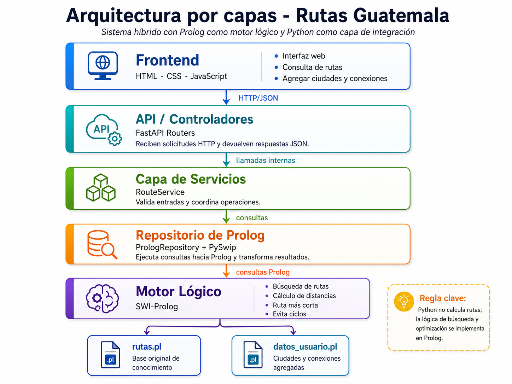
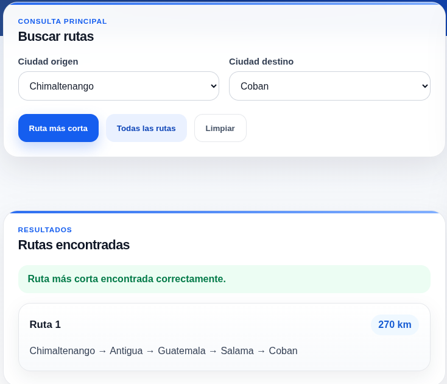
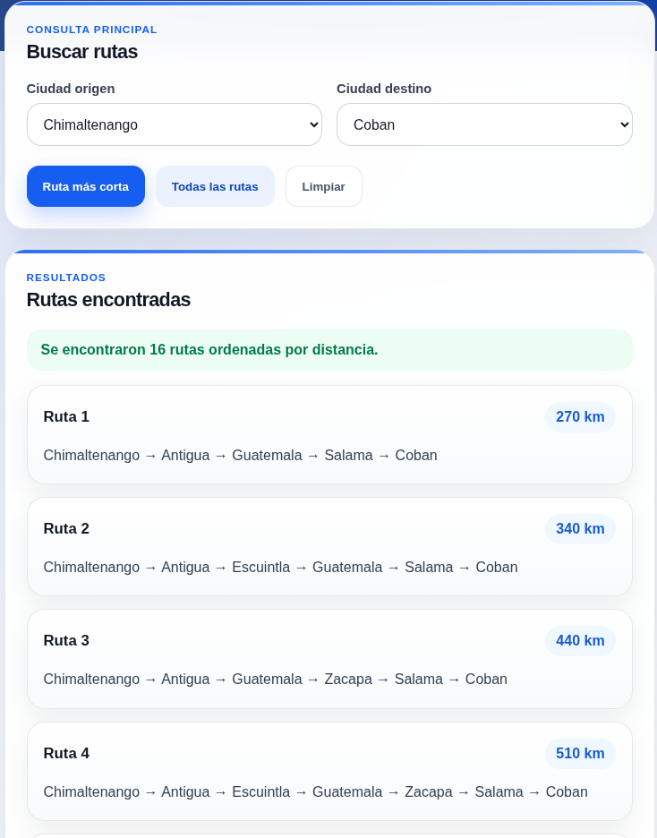
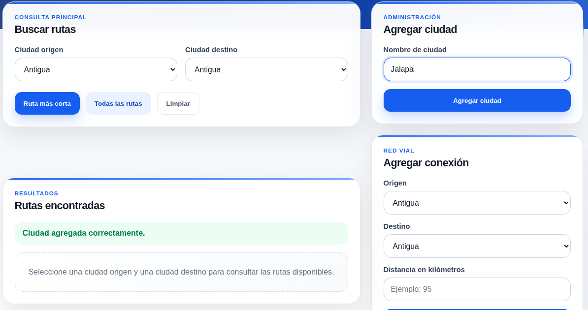
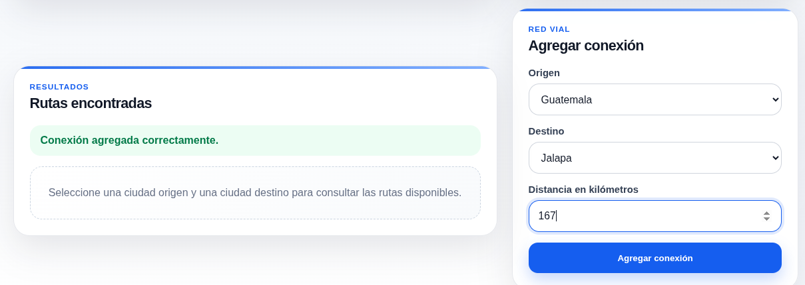
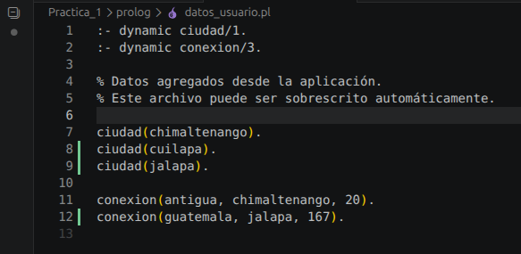

# Manual Técnico

## Sistema: Rutas Guatemala

---

## 1. Introducción

El sistema **Rutas Guatemala** es una aplicación desarrollada para calcular rutas entre ciudades utilizando programación lógica. La solución emplea **Prolog** como motor principal de inferencia para representar ciudades, conexiones, rutas y distancias; mientras que **Python** funciona como backend de integración para recibir solicitudes, consultar Prolog y devolver resultados al frontend.

La aplicación permite consultar la ruta más corta entre dos ciudades, visualizar todas las rutas posibles, agregar nuevas ciudades y registrar nuevas conexiones sin modificar directamente el archivo base original de Prolog.

---

## 2. Objetivos

### 2.1 Objetivo general

Desarrollar una aplicación que permita encontrar rutas entre ciudades de Guatemala, utilizando Prolog para la lógica de búsqueda y Python como capa de integración entre el frontend y la base de conocimiento.

### 2.2 Objetivos específicos

* Representar ciudades y conexiones mediante hechos en Prolog.
* Implementar reglas lógicas para encontrar rutas entre dos ciudades.
* Evitar ciclos en las rutas generadas.
* Calcular la distancia total de cada ruta encontrada.
* Determinar automáticamente la ruta más corta entre una ciudad origen y una ciudad destino.
* Integrar Prolog con Python mediante PySwip.
* Exponer servicios REST mediante FastAPI.
* Desarrollar una interfaz web funcional para consultar rutas y administrar datos.
* Separar los datos originales de los datos agregados desde la aplicación.
* Documentar la arquitectura, instalación, ejecución y funcionamiento del sistema.

---

## 3. Tecnologías utilizadas

| Tecnología   | Uso dentro del sistema                                                    |
| ------------ | ------------------------------------------------------------------------- |
| SWI-Prolog   | Motor lógico para búsqueda de rutas, cálculo de distancias y optimización |
| Python 3.12.3   | Backend de integración                                                    |
| FastAPI      | Framework para exponer endpoints REST                                     |
| PySwip       | Comunicación entre Python y Prolog                                        |
| HTML         | Estructura del frontend                                                   |
| CSS          | Diseño visual de la interfaz                                              |
| JavaScript   | Consumo de endpoints y actualización dinámica de la vista                 |
| Git / GitHub | Control de versiones y alojamiento del repositorio                        |

---

## 4. Arquitectura del sistema

El backend implementa una arquitectura por capas. Esta arquitectura separa responsabilidades y permite que cada parte del sistema tenga una función específica.



### 4.1 Descripción de capas

#### Frontend

Es la interfaz gráfica del sistema. Permite al usuario:

* Seleccionar ciudad origen.
* Seleccionar ciudad destino.
* Consultar la ruta más corta.
* Consultar todas las rutas posibles.
* Agregar nuevas ciudades.
* Agregar nuevas conexiones entre ciudades.

#### Routers

Contienen los endpoints HTTP del backend. Reciben las solicitudes del frontend y las redirigen hacia la capa de servicios.

#### Services

Contienen la lógica de aplicación del backend. Validan datos básicos y coordinan las operaciones solicitadas.

#### Prolog Repository

Es la capa encargada de comunicarse con Prolog mediante PySwip. Ejecuta consultas Prolog y transforma los resultados en estructuras que Python puede devolver como JSON.

#### SWI-Prolog

Contiene la lógica principal del sistema. En esta capa se definen:

* Ciudades.
* Conexiones.
* Distancias.
* Reglas para encontrar rutas.
* Reglas para ordenar rutas.
* Regla para determinar la ruta más corta.

---

## 5. Restricción principal de diseño

La lógica de búsqueda, cálculo de rutas y optimización se implementa exclusivamente en Prolog.

Python no calcula rutas, no ordena rutas y no determina la ruta más corta. Python únicamente:

* Recibe solicitudes.
* Valida entradas básicas.
* Ejecuta consultas hacia Prolog.
* Devuelve respuestas al frontend.

Esto permite cumplir con el enfoque de programación lógica solicitado para la práctica.

---

## 6. Estructura del proyecto

```text
[IA1]_VACASJUN2026_Nombre_Carnet/
│
├── backend/
│   ├── app/
│   │   ├── main.py
│   │   ├── routers/
│   │   │   ├── routes_router.py
│   │   │   └── cities_router.py
│   │   ├── services/
│   │   │   └── route_service.py
│   │   ├── repositories/
│   │   │   └── prolog_repository.py
│   │   └── schemas/
│   │       └── route_schema.py
│   └── requirements.txt
│
├── frontend/
│   ├── index.html
│   ├── styles.css
│   ├── app.js
│   └── assets/
│       └── mapa-guatemala.png
│
├── prolog/
│   ├── rutas.pl
│   └── datos_usuario.pl
│
├── docs/
│   ├── manual_tecnico.md
│   ├── manual_usuario.md
│   └── evidencias/
│
├── README.md
└── .gitignore
```

---

## 7. Archivos Prolog

### 7.1 Archivo base

```text
prolog/rutas.pl
```

Este archivo contiene la base original de conocimiento y las reglas principales del sistema.

Incluye:

* Hechos de ciudades.
* Hechos de conexiones.
* Reglas para conexiones bidireccionales.
* Reglas de búsqueda de rutas.
* Reglas de cálculo de distancia.
* Reglas para obtener todas las rutas.
* Regla para encontrar la ruta más corta.

### 7.2 Archivo de datos agregados por el usuario

```text
prolog/datos_usuario.pl
```

Este archivo almacena las ciudades y conexiones agregadas desde la aplicación.

El propósito de este archivo es evitar modificar directamente el archivo original `rutas.pl`. De esta forma, la base inicial de conocimiento se conserva intacta y los datos nuevos quedan separados.

---

## 8. Predicados principales de Prolog

| Predicado            | Descripción                                           |
| -------------------- | ----------------------------------------------------- |
| `ciudad/1`           | Define una ciudad existente                           |
| `conexion/3`         | Define una conexión entre dos ciudades y su distancia |
| `conectadas/3`       | Permite consultar conexiones en ambos sentidos        |
| `ruta/4`             | Encuentra una ruta entre origen y destino             |
| `camino/6`           | Construye rutas evitando ciclos                       |
| `ruta_ordenada/4`    | Devuelve rutas ordenadas por distancia                |
| `ruta_mas_corta/4`   | Devuelve la ruta de menor distancia                   |
| `agregar_ciudad/1`   | Agrega una nueva ciudad                               |
| `agregar_conexion/3` | Agrega una nueva conexión entre ciudades              |

---

## 9. Lógica de búsqueda de rutas

La búsqueda de rutas se realiza mediante recursividad en Prolog. Para evitar ciclos, se utiliza una lista de ciudades visitadas.

Cada vez que se evalúa una conexión hacia una nueva ciudad, Prolog verifica que dicha ciudad no haya sido visitada previamente. Esto evita rutas repetitivas y recorridos infinitos.

La distancia total se calcula acumulando la distancia de cada conexión recorrida.

---

## 10. Determinación de la ruta más corta

La ruta más corta se obtiene en Prolog generando las rutas posibles y ordenándolas por distancia. Luego se selecciona la primera ruta de la lista ordenada.

Esta operación se realiza en Prolog, respetando la restricción de que Python no debe implementar el algoritmo de búsqueda ni la optimización.

---

## 11. Integración Python-Prolog

La integración se realiza mediante la librería **PySwip**.

El backend consulta los archivos Prolog y ejecuta predicados como:

```prolog
ruta_mas_corta(Origen, Destino, Ruta, Distancia).
```

o:

```prolog
ruta_ordenada(Origen, Destino, Ruta, Distancia).
```

Luego Python convierte los resultados en respuestas JSON para que puedan ser consumidas por el frontend.

---

## 12. Endpoints del backend

### 12.1 Verificar estado del backend

```http
GET /
```

Respuesta esperada:

```json
{
  "status": "ok",
  "message": "Backend FastAPI conectado con Prolog"
}
```

---

### 12.2 Listar ciudades

```http
GET /api/cities
```

Respuesta esperada:

```json
{
  "cities": [
    "guatemala",
    "antigua",
    "escuintla"
  ]
}
```

---

### 12.3 Consultar ruta más corta

```http
POST /api/routes/shortest
```

Cuerpo de la solicitud:

```json
{
  "origin": "guatemala",
  "destination": "flores"
}
```

Respuesta esperada:

```json
{
  "route": ["guatemala", "zacapa", "chiquimula", "flores"],
  "distance": 460
}
```

---

### 12.4 Consultar todas las rutas

```http
POST /api/routes/all
```

Cuerpo de la solicitud:

```json
{
  "origin": "guatemala",
  "destination": "flores"
}
```

Respuesta esperada:

```json
{
  "total_routes": 3,
  "routes": [
    {
      "route": ["guatemala", "zacapa", "chiquimula", "flores"],
      "distance": 460
    }
  ]
}
```

---

### 12.5 Agregar ciudad

```http
POST /api/cities
```

Cuerpo de la solicitud:

```json
{
  "name": "jalapa"
}
```

Respuesta esperada:

```json
{
  "created": true,
  "message": "Ciudad agregada correctamente."
}
```

---

### 12.6 Agregar conexión

```http
POST /api/connections
```

Cuerpo de la solicitud:

```json
{
  "origin": "jalapa",
  "destination": "guatemala",
  "distance": 95
}
```

Respuesta esperada:

```json
{
  "created": true,
  "message": "Conexión agregada correctamente."
}
```

---

## 13. Validaciones implementadas

El sistema contempla las siguientes validaciones:

* La ciudad origen y destino no pueden ser iguales.
* La distancia de una conexión debe ser mayor a cero.
* El nombre de una ciudad debe tener un formato válido.
* No se permite agregar una conexión duplicada.
* No se permite agregar una conexión si una de las ciudades no existe.
* Se muestra un mensaje claro si no existe una ruta disponible.

---

## 14. Manejo de errores

El backend devuelve errores HTTP cuando una operación no puede completarse.

Ejemplos:

### Ciudad origen y destino iguales

```json
{
  "detail": "La ciudad origen y destino no pueden ser iguales."
}
```

### Ruta no disponible

```json
{
  "detail": "No existe una ruta disponible."
}
```

### Conexión duplicada

```json
{
  "message": "La conexión ya existe."
}
```

---

## 15. Instalación del proyecto

### 15.1 Instalar SWI-Prolog

En Ubuntu:

```bash
sudo apt update
sudo apt install swi-prolog -y
```

Verificar instalación:

```bash
swipl --version
```

---

### 15.2 Crear entorno virtual de Python

Desde la raíz del proyecto:

```bash
python3 -m venv venv
source venv/bin/activate
```

---

### 15.3 Instalar dependencias

```bash
pip install -r backend/requirements.txt
```

---

## 16. Ejecución del backend

Desde la raíz del proyecto:

```bash
cd backend
uvicorn app.main:app --reload
```

El backend estará disponible en:

```text
http://127.0.0.1:8000
```

La documentación automática de FastAPI estará disponible en:

```text
http://127.0.0.1:8000/docs
```

---

## 17. Ejecución del frontend

Desde la raíz del proyecto:

```bash
cd frontend
python3 -m http.server 5500
```

Luego abrir en el navegador:

```text
http://127.0.0.1:5500
```

---

## 18. Evidencias

### 18.1. Consulta de ruta más corta



### 18.2. Consulta de todas las rutas



### 18.3. Agregar ciudad y conexión





### 18.4. Cambio en el archivo Prolog de datos de usuario



---

## 20. Conclusiones

* Se logró representar ciudades y conexiones mediante hechos en Prolog, lo que permitió construir una base de conocimiento sólida para la aplicación.
* Se implementaron reglas lógicas en Prolog para encontrar rutas entre dos ciudades, lo que permitió generar soluciones de manera eficiente y sin ciclos.
* Se logró calcular la distancia total de cada ruta encontrada, lo que permitió ofrecer información valiosa al usuario sobre las rutas disponibles.
* Se determinó automáticamente la ruta más corta entre una ciudad origen y una ciudad destino, lo que mejoró la experiencia del usuario al ofrecer la opción más eficiente.
* Se integró Prolog con Python mediante PySwip, lo que permitió una comunicación fluida entre el backend y el motor lógico.
* Se expusieron servicios REST mediante FastAPI, lo que facilitó la interacción entre el frontend y el backend.
* Se desarrolló una interfaz web funcional para consultar rutas y administrar datos, lo que permitió a los usuarios interactuar de manera intuitiva con el sistema.
* Se separaron los datos originales de los datos agregados desde la aplicación, lo que permitió mantener la integridad de la base de conocimiento inicial y facilitar la gestión de datos nuevos.
* Se documentó la arquitectura, instalación, ejecución y funcionamiento del sistema, lo que facilitó la comprensión y uso del sistema por parte de otros desarrolladores y usuarios.

