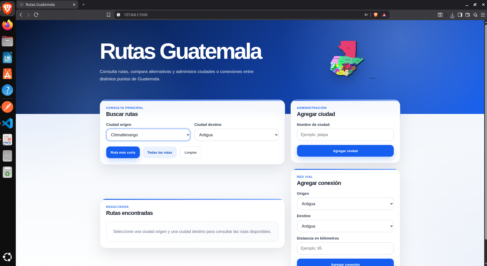
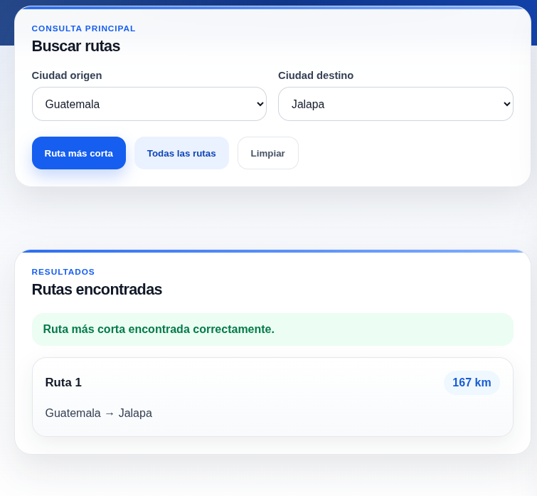

# Manual de Usuario

## Sistema: Rutas Guatemala

---

## 1. Introducción

**Rutas Guatemala** es una aplicación web que permite consultar rutas entre ciudades, encontrar la ruta más corta y administrar nuevas ciudades o conexiones. El sistema está diseñado para facilitar la búsqueda de recorridos entre distintos puntos de Guatemala de forma clara y sencilla.

La aplicación cuenta con una interfaz web donde el usuario puede seleccionar una ciudad origen y una ciudad destino. Como resultado, el sistema muestra la ruta recomendada y la distancia total recorrida. También permite consultar todas las rutas posibles entre dos ciudades.

---

## 2. Objetivos

### 2.1 Objetivo general

Permitir al usuario consultar rutas entre ciudades de Guatemala de forma rápida, visual e intuitiva.

### 2.2 Objetivos específicos

* Seleccionar una ciudad de origen.
* Seleccionar una ciudad de destino.
* Consultar la ruta más corta entre dos ciudades.
* Visualizar todas las rutas posibles entre dos ciudades.
* Agregar nuevas ciudades al sistema.
* Agregar nuevas conexiones entre ciudades existentes.
* Mostrar mensajes claros cuando una operación sea exitosa o cuando ocurra un error.

---

## 3. Requisitos para usar el sistema

Antes de utilizar la aplicación, se debe contar con:

* Python 3 instalado.
* SWI-Prolog instalado.
* Navegador web actualizado.
* Backend en ejecución.
* Frontend en ejecución.

---

## 4. Instalación

### 4.1 Instalar SWI-Prolog

En Ubuntu:

```bash
sudo apt update
sudo apt install swi-prolog -y
```

Verificar instalación:

```bash
swipl --version
```

---

### 4.2 Crear entorno virtual

Desde la raíz del proyecto:

```bash
python3 -m venv venv
source venv/bin/activate
```

---

### 4.3 Instalar dependencias del backend

```bash
pip install -r backend/requirements.txt
```

---

## 5. Ejecución del sistema

### 5.1 Ejecutar backend

Desde la raíz del proyecto:

```bash
cd backend
uvicorn app.main:app --reload
```

El backend quedará disponible en:

```text
http://127.0.0.1:8000
```

---

### 5.2 Ejecutar frontend

Abrir una nueva terminal y ejecutar:

```bash
cd frontend
python3 -m http.server 5500
```

Luego abrir en el navegador:

```text
http://127.0.0.1:5500
```

---

## 6. Pantalla principal

Al ingresar al sistema se muestra la pantalla principal de **Rutas Guatemala**. En esta vista se observan las secciones principales:

* Buscar rutas.
* Agregar ciudad.
* Agregar conexión.
* Resultados encontrados.

### Evidencia: pantalla principal



---

## 7. Buscar ruta más corta

Para consultar la ruta más corta:

1. Ubicarse en la sección **Buscar rutas**.
2. Seleccionar una ciudad en el campo **Ciudad origen**.
3. Seleccionar una ciudad en el campo **Ciudad destino**.
4. Presionar el botón **Ruta más corta**.
5. Revisar el resultado mostrado en la sección **Rutas encontradas**.

El sistema mostrará el recorrido recomendado y la distancia total en kilómetros.


---

## 8. Consultar todas las rutas

Para consultar todas las rutas posibles:

1. Seleccionar una ciudad en **Ciudad origen**.
2. Seleccionar una ciudad en **Ciudad destino**.
3. Presionar el botón **Todas las rutas**.
4. Revisar la lista de rutas disponibles.

El sistema mostrará las rutas encontradas ordenadas por distancia.


---

## 9. Limpiar resultados

Para limpiar la búsqueda actual:

1. Presionar el botón **Limpiar**.
2. La sección de resultados volverá a su estado inicial.

---

## 10. Agregar ciudad

Para agregar una nueva ciudad:

1. Ubicarse en la sección **Agregar ciudad**.
2. Escribir el nombre de la ciudad.
3. Presionar el botón **Agregar ciudad**.
4. Verificar el mensaje de confirmación.
5. Revisar que la nueva ciudad aparezca en los menús desplegables.


---

## 11. Agregar conexión

Para agregar una conexión entre dos ciudades:

1. Ubicarse en la sección **Agregar conexión**.
2. Seleccionar una ciudad en el campo **Origen**.
3. Seleccionar una ciudad en el campo **Destino**.
4. Ingresar la distancia en kilómetros.
5. Presionar el botón **Agregar conexión**.
6. Verificar el mensaje de confirmación.


---

## 12. Consultar ruta usando una ciudad agregada

Después de agregar una ciudad y su conexión, se puede consultar una ruta usando esa nueva ciudad.

Pasos:

1. Ir a **Buscar rutas**.
2. Seleccionar la ciudad agregada como origen o destino.
3. Seleccionar otra ciudad conectada.
4. Presionar **Ruta más corta** o **Todas las rutas**.
5. Revisar los resultados.



---

## 13. Mensajes del sistema

El sistema puede mostrar mensajes de éxito o error según la acción realizada.

### 13.1 Mensajes de éxito

Ejemplos:

```text
Ciudad agregada correctamente.
```

```text
Conexión agregada correctamente.
```

```text
Ruta más corta encontrada correctamente.
```

### 13.2 Mensajes de error

Ejemplos:

```text
La ciudad origen y destino no pueden ser iguales.
```

```text
No existe una ruta disponible.
```

```text
Ingrese una distancia válida mayor a 0.
```
---

## 14. Conclusiones
* Se logró representar ciudades y conexiones mediante hechos en Prolog, lo que permitió construir una base de conocimiento sólida para la aplicación.
* Se implementaron reglas lógicas en Prolog para encontrar rutas entre dos ciudades, lo que permitió generar soluciones de manera eficiente y sin ciclos.
* Se desarrolló una interfaz web intuitiva que facilita la interacción del usuario con el sistema, permitiendo consultas y administración de datos de manera sencilla.
* Se implementaron validaciones en el frontend para garantizar que los datos ingresados sean correctos, mejorando la experiencia del usuario y evitando errores comunes.
