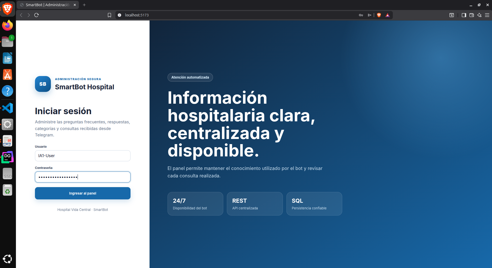
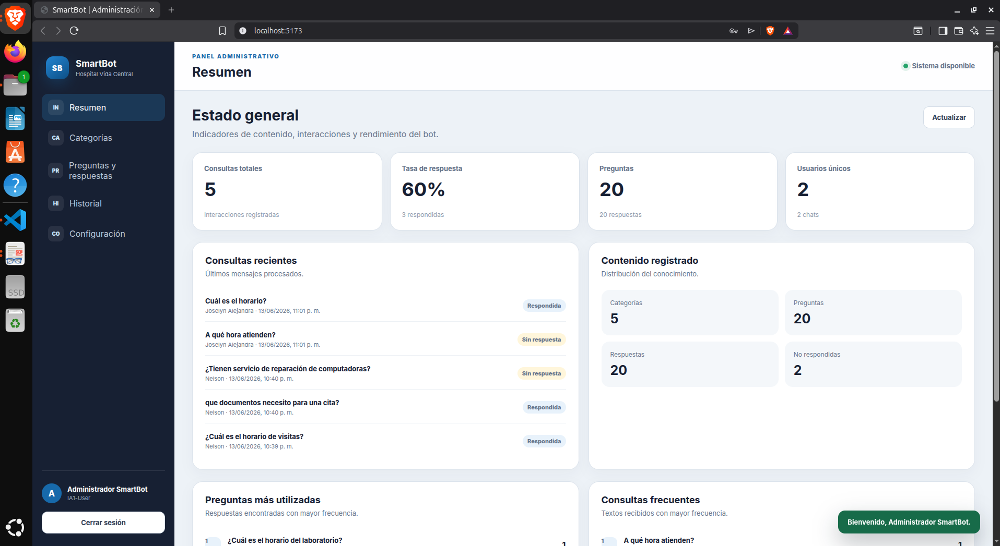
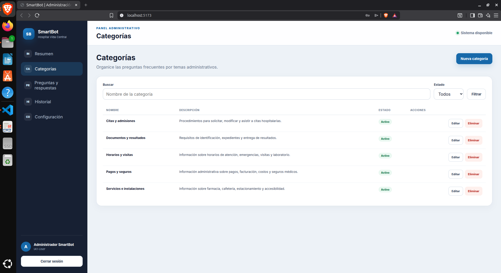
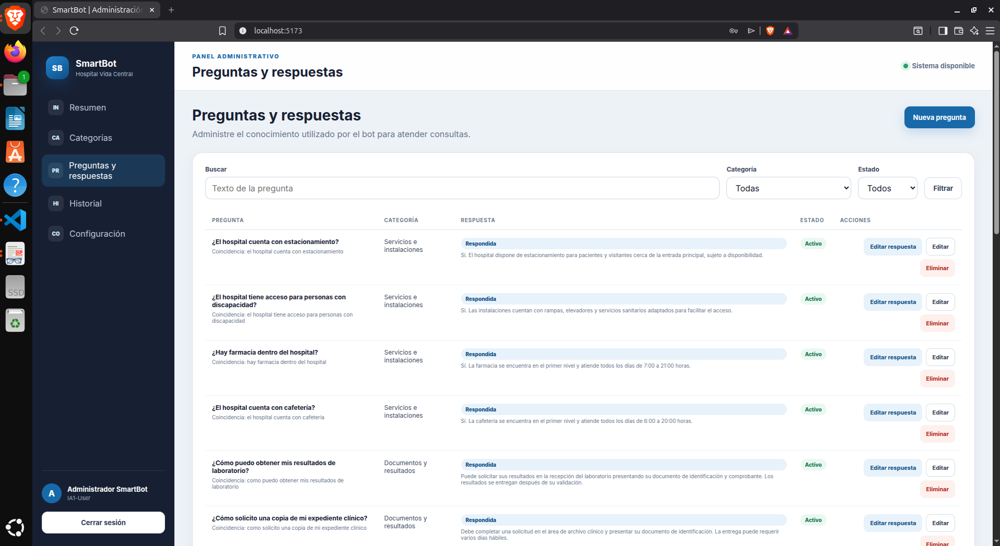
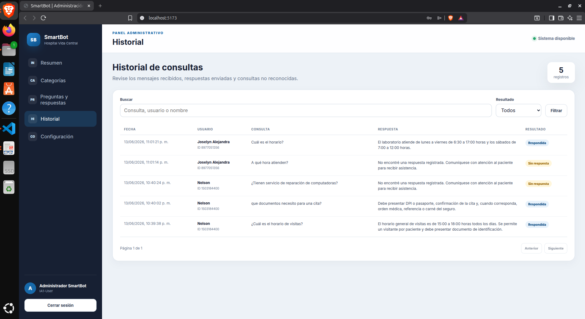
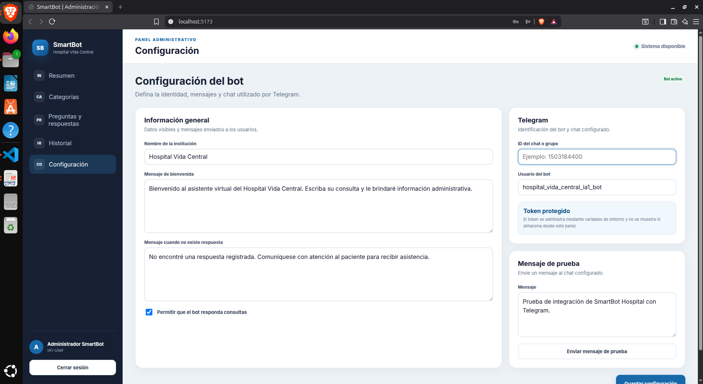
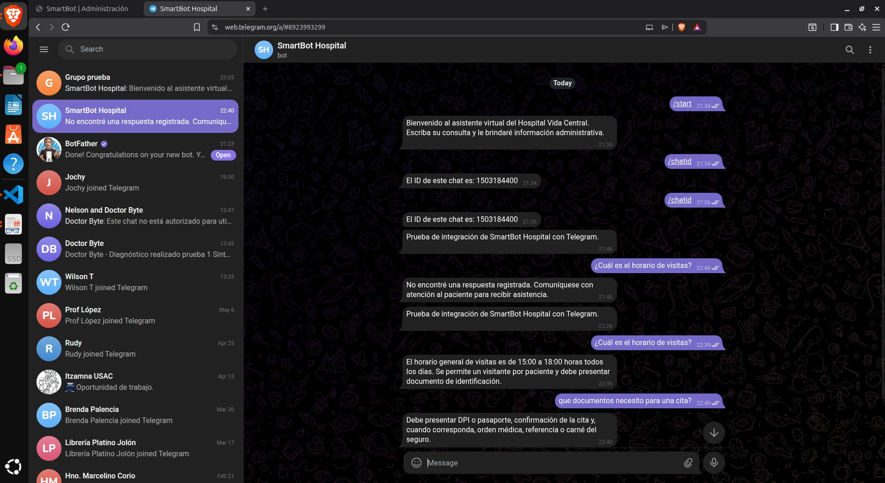
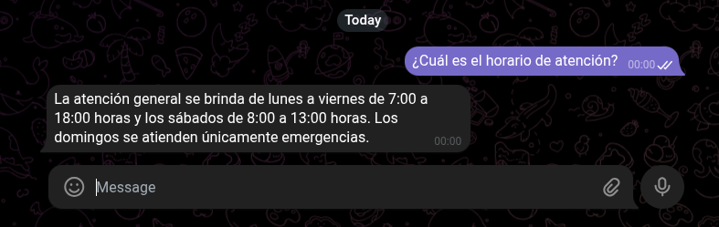

# Manual de usuario — SmartBot Hospital

## 1. Introducción

SmartBot Hospital es una plataforma de atención automatizada para el **Hospital Vida Central**.

El sistema permite:

* Consultar información administrativa mediante Telegram.
* Administrar categorías.
* Administrar preguntas frecuentes.
* Administrar respuestas.
* Revisar el historial de consultas.
* Consultar estadísticas de uso.
* Configurar el funcionamiento del bot.
* Enviar mensajes de prueba a Telegram.

Este manual explica el uso del panel administrativo y del bot de Telegram.

---

## 2. Requisitos para utilizar el sistema

Para utilizar SmartBot Hospital se necesita:

* Navegador web actualizado.
* Conexión a Internet.
* Servicios Docker en ejecución.
* Cuenta de Telegram.
* Bot de Telegram configurado.
* Credenciales administrativas.

El panel administrativo se encuentra disponible en:

```text
http://localhost:5173
```

---

## 3. Iniciar el sistema

Desde una terminal, ubicarse dentro de la carpeta `Practica_2`:

```bash
cd Practica_2
```

Iniciar los servicios:

```bash
docker compose up --build -d
```

Verificar que estén activos:

```bash
docker compose ps
```

Deben aparecer los siguientes contenedores:

```text
smartbot-db
smartbot-backend
smartbot-frontend
smartbot-telegram
```

---

## 4. Acceder al panel administrativo

Abrir el navegador y visitar:

```text
http://localhost:5173
```

Se mostrará la pantalla de inicio de sesión.

### Credenciales

```text
Usuario: IA1-User
Contraseña: IA1-password@_new
```

### Procedimiento

1. Escribir el usuario.
2. Escribir la contraseña.
3. Presionar **Ingresar al panel**.
4. Esperar la validación de la sesión.

Cuando las credenciales son correctas, el sistema muestra el resumen administrativo.

Cuando las credenciales son incorrectas, aparece un mensaje de error y no se permite el acceso.




---

## 5. Estructura del panel

El panel contiene un menú lateral con las siguientes opciones:

* **Resumen**
* **Categorías**
* **Preguntas y respuestas**
* **Historial**
* **Configuración**
* **Cerrar sesión**

En dispositivos pequeños, el menú puede abrirse mediante el botón ubicado en la parte superior izquierda.

---

## 6. Pantalla de resumen

La sección **Resumen** muestra el estado general del sistema.

### Indicadores disponibles

* Consultas totales.
* Tasa de respuesta.
* Cantidad de preguntas.
* Cantidad de respuestas.
* Usuarios únicos.
* Chats registrados.
* Consultas respondidas.
* Consultas no respondidas.

También se muestran:

* Consultas recientes.
* Preguntas más utilizadas.
* Consultas más frecuentes.
* Distribución del contenido registrado.

### Actualizar información

Presionar el botón **Actualizar** para volver a consultar los indicadores.

### Interpretación de la tasa de respuesta

La tasa de respuesta indica el porcentaje de consultas que encontraron una respuesta válida.

Ejemplo:

```text
Consultas totales: 10
Consultas respondidas: 8
Tasa de respuesta: 80 %
```



---

## 7. Gestión de categorías

Ingresar en la opción **Categorías**.

Esta sección permite organizar las preguntas por tema.

El sistema incluye inicialmente las siguientes categorías:

1. Horarios y visitas.
2. Citas y admisiones.
3. Pagos y seguros.
4. Documentos y resultados.
5. Servicios e instalaciones.

### 7.1 Crear una categoría

1. Presionar **Nueva categoría**.
2. Escribir el nombre.
3. Escribir una descripción.
4. Indicar si la categoría estará activa.
5. Presionar **Guardar categoría**.

El nombre debe ser claro y no debe duplicar una categoría existente.

### 7.2 Buscar categorías

Utilizar el campo **Buscar** para escribir parte del nombre.

También puede filtrarse por estado:

* Todas.
* Activas.
* Inactivas.

Presionar **Filtrar** para aplicar la búsqueda.

### 7.3 Editar una categoría

1. Localizar la categoría.
2. Presionar **Editar**.
3. Modificar los datos necesarios.
4. Presionar **Guardar categoría**.

### 7.4 Activar o desactivar una categoría

1. Abrir la categoría mediante **Editar**.
2. Marcar o desmarcar **Categoría activa**.
3. Guardar los cambios.

Una categoría inactiva no debe utilizarse para responder nuevas consultas.

### 7.5 Eliminar una categoría

1. Presionar **Eliminar**.
2. Confirmar la operación.

Cuando una categoría contiene preguntas relacionadas, la base de datos puede impedir su eliminación para proteger la integridad de la información.

En ese caso, primero deben eliminarse o trasladarse las preguntas asociadas.



---

## 8. Gestión de preguntas

Ingresar en **Preguntas y respuestas**.

Esta pantalla muestra:

* Texto de la pregunta.
* Categoría.
* Estado de la respuesta.
* Estado de la pregunta.
* Acciones disponibles.

### 8.1 Crear una pregunta

1. Presionar **Nueva pregunta**.
2. Seleccionar una categoría.
3. Escribir la pregunta.
4. Marcar **Pregunta activa**.
5. Presionar **Guardar pregunta**.

Ejemplo:

```text
¿Cuál es el horario de visitas?
```

El sistema genera automáticamente una versión normalizada para facilitar la búsqueda.

### 8.2 Buscar preguntas

Puede buscarse por texto utilizando el campo **Buscar**.

También se puede filtrar por:

* Categoría.
* Estado activo o inactivo.

Presionar **Filtrar** para actualizar el listado.

### 8.3 Editar una pregunta

1. Localizar la pregunta.
2. Presionar **Editar**.
3. Modificar la categoría o el texto.
4. Cambiar su estado cuando sea necesario.
5. Presionar **Guardar pregunta**.

### 8.4 Activar o desactivar una pregunta

1. Presionar **Editar**.
2. Marcar o desmarcar **Pregunta activa**.
3. Guardar.

Las preguntas inactivas no deben ser utilizadas por el bot.

### 8.5 Eliminar una pregunta

1. Presionar **Eliminar**.
2. Confirmar la operación.

Al eliminar una pregunta también se elimina su respuesta asociada.

---

## 9. Gestión de respuestas

Las respuestas se administran desde la misma pantalla de preguntas.

### 9.1 Agregar una respuesta

1. Localizar una pregunta sin respuesta.
2. Presionar **Agregar respuesta**.
3. Escribir el contenido.
4. Marcar **Respuesta activa**.
5. Presionar **Guardar respuesta**.

Ejemplo:

```text
El horario general de visitas es de 15:00 a 18:00 horas todos los días.
```

### 9.2 Editar una respuesta

1. Localizar la pregunta.
2. Presionar **Editar respuesta**.
3. Modificar el contenido.
4. Presionar **Guardar respuesta**.

### 9.3 Activar o desactivar una respuesta

1. Presionar **Editar respuesta**.
2. Marcar o desmarcar **Respuesta activa**.
3. Guardar.

Una respuesta inactiva no debe enviarse a los usuarios.

### 9.4 Eliminar una respuesta

1. Presionar **Editar respuesta**.
2. Presionar **Eliminar respuesta**.
3. Confirmar la operación.

La pregunta permanecerá registrada, pero quedará sin respuesta.




---

## 10. Historial de consultas

Ingresar en la opción **Historial**.

Esta sección registra las consultas procesadas por el sistema.

### Información disponible

* Fecha y hora.
* Nombre del usuario.
* Usuario de Telegram.
* Consulta recibida.
* Respuesta enviada.
* Estado de la consulta.

Los estados son:

* **Respondida:** se encontró una coincidencia válida.
* **Sin respuesta:** no se encontró una pregunta suficientemente similar.

### 10.1 Buscar en el historial

Utilizar el campo **Buscar** para localizar registros por:

* Texto de consulta.
* Nombre del usuario.
* Usuario de Telegram.

### 10.2 Filtrar por resultado

Seleccionar una de las opciones:

* Todos.
* Respondidas.
* Sin respuesta.

Presionar **Filtrar**.

### 10.3 Navegar entre páginas

Cuando existen varios registros, utilizar:

* **Anterior**
* **Siguiente**

La pantalla muestra el número de página actual y el total de páginas.



---

## 11. Configuración del bot

Ingresar en **Configuración**.

Esta pantalla permite modificar los datos generales utilizados por el bot.

### Campos disponibles

* Nombre de la institución.
* Mensaje de bienvenida.
* Mensaje para consultas desconocidas.
* ID del chat o grupo.
* Usuario del bot.
* Estado activo o inactivo.

### 11.1 Cambiar el nombre de la institución

1. Editar **Nombre de la institución**.
2. Presionar **Guardar configuración**.

El valor inicial es:

```text
Hospital Vida Central
```

### 11.2 Cambiar el mensaje de bienvenida

Editar el contenido que el bot utiliza al ejecutar `/start`.

Ejemplo:

```text
Bienvenido al asistente administrativo del Hospital Vida Central.
```

### 11.3 Cambiar el mensaje de consulta desconocida

Este mensaje se muestra cuando el sistema no encuentra una pregunta suficientemente similar.

Ejemplo:

```text
No encontré una respuesta registrada. Comuníquese con atención al paciente para recibir asistencia.
```

### 11.4 Configurar el chat ID

1. Abrir Telegram.
2. Iniciar conversación con el bot.
3. Ejecutar:

```text
/chatid
```

4. Copiar el identificador recibido.
5. Escribirlo en **ID del chat o grupo**.
6. Guardar la configuración.

### 11.5 Configurar el usuario del bot

Escribir el nombre de usuario sin necesidad de agregar información sensible.

Ejemplo:

```text
hospital_vida_central_ia1_bot
```

### 11.6 Activar o desactivar el bot

Utilizar la opción:

```text
Permitir que el bot responda consultas
```

Cuando está desactivada, el bot no debe procesar normalmente las preguntas de los usuarios.



---

## 12. Enviar un mensaje de prueba

La sección **Configuración** contiene un apartado para mensajes de prueba.

### Procedimiento

1. Verificar que el chat ID esté registrado.
2. Escribir el mensaje.
3. Presionar **Enviar mensaje de prueba**.
4. Revisar Telegram.
5. Confirmar que el mensaje fue recibido.

Ejemplo:

```text
Prueba de integración de SmartBot Hospital con Telegram.
```

Cuando la operación es correcta, el panel muestra una confirmación.



---

## 13. Uso del bot de Telegram

Abrir Telegram y buscar el bot configurado.

### 13.1 Iniciar el bot

Ejecutar:

```text
/start
```

El bot mostrará el mensaje de bienvenida.

### 13.2 Mostrar ayuda

Ejecutar:

```text
/help
```

Se mostrarán instrucciones básicas de uso.

### 13.3 Obtener el chat ID

Ejecutar:

```text
/chatid
```

El bot devolverá el identificador del chat actual.

---

## 14. Realizar una consulta conocida

Escribir una pregunta registrada.

Ejemplo:

```text
¿Cuál es el horario de visitas?
```

El bot debe responder con información similar a:

```text
El horario general de visitas es de 15:00 a 18:00 horas todos los días.
```

La interacción aparecerá posteriormente en el historial administrativo como respondida.



---

## 15. Realizar una consulta aproximada

El usuario no está obligado a escribir exactamente el texto registrado.

Ejemplo:

```text
que tengo que llevar para mi cita
```

El sistema puede relacionarla con:

```text
¿Qué documentos debo llevar a una cita?
```

Cuando la similitud supera el umbral configurado, el bot devuelve la respuesta correspondiente.

---

## 16. Realizar una consulta desconocida

Escribir una pregunta que no corresponda con el conocimiento hospitalario.

Ejemplo:

```text
¿El hospital vende computadoras?
```

El sistema responderá con el mensaje configurado para consultas desconocidas.

La interacción se registrará con el estado **Sin respuesta**.


---

## 17. Cerrar sesión

Para cerrar la sesión administrativa:

1. Localizar el botón **Cerrar sesión** en la parte inferior del menú.
2. Presionarlo.
3. Confirmar que el sistema regresa a la pantalla de ingreso.

El token guardado en el navegador será eliminado.

---

## 18. Persistencia de la sesión

Cuando el administrador recarga el navegador, la sesión puede mantenerse mientras el token JWT continúe siendo válido.

Cuando el token expira o es inválido, el sistema regresa automáticamente al inicio de sesión.

---

## 19. Detener el sistema

Para detener los contenedores sin borrar información:

```bash
docker compose down
```

Los datos permanecerán almacenados en el volumen de PostgreSQL.

Para iniciar nuevamente:

```bash
docker compose up -d
```

---

## 20. Reiniciar los servicios

Reiniciar todos los servicios:

```bash
docker compose restart
```

Reiniciar solamente el bot:

```bash
docker compose restart telegram-bot
```

Reiniciar solamente el backend:

```bash
docker compose restart backend
```

---

## 21. Solución de problemas

### 21.1 El panel no abre

Verificar los contenedores:

```bash
docker compose ps
```

Revisar el frontend:

```bash
docker compose logs --tail=100 frontend
```

Comprobar el puerto:

```bash
curl -I http://localhost:5173
```

---

### 21.2 No es posible iniciar sesión

Verificar:

* Que el usuario sea `IA1-User`.
* Que la contraseña sea `IA1-password@_new`.
* Que no existan espacios adicionales.
* Que el backend esté activo.
* Que PostgreSQL esté saludable.

Revisar:

```bash
docker compose logs --tail=100 backend
```

---

### 21.3 El bot no responde

Revisar:

```bash
docker compose logs --tail=100 telegram-bot
```

Comprobar:

* Token de Telegram correcto.
* Conexión a Internet.
* Backend activo.
* Bot iniciado mediante `/start`.
* Configuración activa.
* Pregunta y respuesta activas.

---

### 21.4 El mensaje de prueba no llega

Verificar:

* Chat ID correcto.
* Token correcto.
* Bot iniciado por el usuario.
* Bot agregado al grupo, cuando corresponda.
* Bot activo.
* Acceso a Internet.

---

### 21.5 No aparecen preguntas iniciales

Los scripts de PostgreSQL se ejecutan solamente al crear el volumen por primera vez.

Para reinicializar completamente:

```bash
docker compose down -v
docker compose up --build -d
```

> Esta operación elimina todos los datos actuales, incluyendo historial y configuraciones.

---

### 21.6 El bot responde que no encontró información

Revisar desde el panel:

* Que la categoría esté activa.
* Que la pregunta esté activa.
* Que exista una respuesta.
* Que la respuesta esté activa.
* Que la consulta sea suficientemente similar.

---

### 21.7 El dashboard no actualiza inmediatamente

Presionar:

```text
Actualizar
```

También se puede recargar el navegador.

---

## 22. Recomendaciones de uso

* No compartir las credenciales administrativas.
* No publicar el token de Telegram.
* No subir el archivo `.env` a GitHub.
* Mantener preguntas claras y específicas.
* Evitar preguntas duplicadas.
* Revisar periódicamente las consultas no respondidas.
* Crear nuevas preguntas a partir del historial.
* Mantener actualizados los horarios y servicios.
* Desactivar información que ya no sea válida.
* Realizar respaldos antes de eliminar el volumen de PostgreSQL.

---

## 23. Flujo recomendado para administrar conocimiento

1. Revisar el historial.
2. Identificar consultas sin respuesta.
3. Determinar la categoría correspondiente.
4. Crear una nueva pregunta.
5. Agregar su respuesta.
6. Verificar que pregunta y respuesta estén activas.
7. Probar la consulta desde Telegram.
8. Confirmar el registro en el historial.
9. Revisar el dashboard.