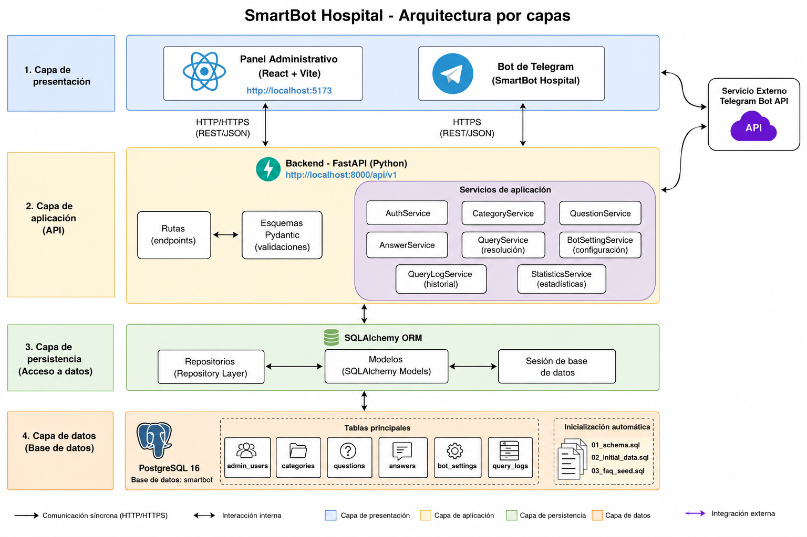

# Arquitectura del sistema — SmartBot Hospital

## 1. Introducción

SmartBot Hospital es una plataforma de atención automatizada para el Hospital Vida Central. Su propósito es responder consultas administrativas mediante Telegram y permitir la administración del conocimiento desde una aplicación web.

La solución está compuesta por cuatro servicios principales:

* Panel administrativo React.
* API REST FastAPI.
* Bot de Telegram.
* Base de datos PostgreSQL.

Los servicios se ejecutan mediante Docker Compose y se comunican por una red interna de Docker.

---

## 2. Objetivos arquitectónicos

La arquitectura fue diseñada para cumplir los siguientes objetivos:

* Separar la interfaz, la lógica de negocio y la persistencia.
* Evitar que el frontend acceda directamente a PostgreSQL.
* Evitar que el bot acceda directamente a PostgreSQL.
* Centralizar las reglas de negocio en el backend.
* Mantener preguntas y respuestas fuera del código del bot.
* Facilitar la ejecución en diferentes equipos.
* Proteger los endpoints administrativos.
* Mantener persistencia aunque los contenedores se reinicien.
* Permitir agregar nuevas preguntas sin modificar el código.
* Registrar todas las consultas para su análisis posterior.

---

## 3. Estilo arquitectónico

El sistema utiliza una **arquitectura en capas**.

Las capas principales son:

1. Presentación.
2. Aplicación.
3. Persistencia.
4. Datos.

---

## 4. Vista general



---

## 5. Capa de presentación

La capa de presentación contiene los componentes con los que interactúan los usuarios.

### 5.1 Panel administrativo

El panel está desarrollado con:

* React 18.
* Vite.
* JavaScript.
* CSS personalizado.
* API Fetch del navegador.

Responsabilidades:

* Mostrar el formulario de inicio de sesión.
* Mantener la sesión JWT.
* Mostrar estadísticas.
* Gestionar categorías.
* Gestionar preguntas.
* Gestionar respuestas.
* Mostrar el historial.
* Configurar Telegram.
* Enviar mensajes de prueba.
* Mostrar errores y confirmaciones.

El frontend no conoce las credenciales de PostgreSQL y no ejecuta consultas SQL.

### 5.2 Bot de Telegram

El bot está desarrollado con Python y `python-telegram-bot`.

Responsabilidades:

* Recibir actualizaciones mediante long polling.
* Responder a `/start`.
* Responder a `/help`.
* Responder a `/chatid`.
* Enviar preguntas al backend.
* Mostrar al usuario la respuesta devuelta por la API.
* Manejar temporalmente la falta de disponibilidad del backend.

El bot no contiene el catálogo de respuestas. Su función es actuar como cliente de la API.

---

## 6. Capa de aplicación

La capa de aplicación contiene los servicios.

Cada servicio implementa reglas relacionadas con un caso de uso.

### 6.1 Servicio de autenticación

Responsabilidades:

* Buscar el usuario administrativo.
* Verificar la contraseña.
* Comprobar el estado del usuario.
* Generar tokens JWT.
* Obtener el usuario autenticado.

### 6.2 Servicio de categorías

Responsabilidades:

* Crear categorías.
* Validar nombres duplicados.
* Buscar y filtrar categorías.
* Actualizar categorías.
* Eliminar categorías.
* Mantener reglas de integridad.

### 6.3 Servicio de preguntas

Responsabilidades:

* Crear preguntas.
* Normalizar el texto.
* Asociar preguntas con categorías.
* Detectar preguntas duplicadas.
* Actualizar preguntas.
* Eliminar preguntas.

### 6.4 Servicio de respuestas

Responsabilidades:

* Asociar una respuesta con una pregunta.
* Evitar más de una respuesta por pregunta.
* Actualizar respuestas.
* Activar o desactivar respuestas.
* Eliminar respuestas.

### 6.5 Servicio de consultas

Responsabilidades:

* Recibir una pregunta en lenguaje natural.
* Normalizar el texto.
* Buscar coincidencia exacta.
* Calcular coincidencia aproximada.
* Seleccionar la mejor pregunta.
* Obtener la respuesta activa.
* Aplicar el umbral mínimo.
* Utilizar el mensaje desconocido cuando corresponda.
* Registrar la interacción.

### 6.6 Servicio de configuración

Responsabilidades:

* Consultar la configuración actual.
* Actualizar el nombre del hospital.
* Actualizar el chat ID.
* Actualizar el nombre del bot.
* Actualizar mensajes.
* Activar o desactivar el bot.
* Enviar mensajes de prueba a Telegram.

### 6.7 Servicio de historial

Responsabilidades:

* Consultar registros.
* Aplicar búsqueda.
* Aplicar filtros.
* Paginar resultados.
* Obtener el detalle de una consulta.

### 6.8 Servicio de estadísticas

Responsabilidades:

* Contar consultas.
* Contar consultas respondidas.
* Contar consultas no respondidas.
* Calcular tasa de respuesta.
* Contar usuarios y chats únicos.
* Contar categorías, preguntas y respuestas.
* Obtener preguntas más utilizadas.
* Obtener consultas más frecuentes.
* Agrupar consultas por categoría.

### 6.9 API REST

La API está desarrollada con FastAPI.

El prefijo principal es:

```text
/api/v1
```

Sus responsabilidades son:

* Publicar endpoints HTTP.
* Recibir solicitudes JSON.
* Validar los datos de entrada.
* Verificar tokens JWT.
* Inyectar sesiones de base de datos.
* Invocar servicios de aplicación.
* Convertir resultados a respuestas JSON.
* Devolver códigos HTTP apropiados.

### Grupos de rutas

* Autenticación.
* Categorías.
* Preguntas.
* Respuestas.
* Resolución de consultas.
* Configuración del bot.
* Historial.
* Estadísticas.
* Health check.

### Endpoints públicos

Los endpoints públicos necesarios para la operación son:

* Inicio de sesión.
* Health check.
* Resolución de consultas.
* Configuración pública utilizada por el bot.

### Endpoints protegidos

Las operaciones administrativas requieren:

```http
Authorization: Bearer <token>
```

---

## 7. Capa de persistencia

La capa de persistencia utiliza repositorios.

Los repositorios encapsulan las operaciones realizadas mediante SQLAlchemy.

Responsabilidades:

* Crear registros.
* Consultar registros.
* Actualizar registros.
* Eliminar registros.
* Aplicar filtros.
* Ejecutar agregaciones.
* Mantener las consultas separadas de la lógica de negocio.

Los servicios no deben construir consultas SQL directamente.

Las rutas tampoco deben acceder directamente a los modelos.

---

## 9. Capa de datos

La capa de datos está formada por PostgreSQL y los modelos SQLAlchemy.

### Tablas principales

* `admin_users`
* `categories`
* `questions`
* `answers`
* `bot_settings`
* `query_logs`


### Integridad

La base de datos utiliza:

* Claves primarias.
* Claves foráneas.
* Restricciones únicas.
* Valores predeterminados.
* Restricciones de nulabilidad.
* Eliminación en cascada donde corresponde.
* Índices.
* Triggers para fechas de actualización.

---

## 10. Inicialización de PostgreSQL

La base de datos no se crea mediante `Base.metadata.create_all`.

La estructura se administra mediante scripts SQL nativos.

Los archivos son:

```text
database/init/01_schema.sql
database/init/02_initial_data.sql
database/init/03_faq_seed.sql
```

### 01_schema.sql

Responsable de crear:

* Extensiones.
* Tablas.
* Relaciones.
* Índices.
* Restricciones.
* Triggers.

### 02_initial_data.sql

Responsable de crear:

* Usuario administrativo.
* Contraseña cifrada.
* Configuración inicial del bot.

### 03_faq_seed.sql

Responsable de crear:

* 5 categorías.
* 20 preguntas.
* 20 respuestas.

PostgreSQL ejecuta estos archivos al crear el volumen por primera vez.

---

## 11. Flujo de autenticación

El proceso de autenticación es:

1. El administrador abre el panel.
2. Introduce usuario y contraseña.
3. React envía las credenciales a FastAPI.
4. FastAPI consulta el administrador.
5. El backend verifica la contraseña almacenada mediante hash.
6. El backend genera un JWT.
7. React guarda el token en `localStorage`.
8. Las solicitudes administrativas incluyen el token.
9. FastAPI valida el token antes de ejecutar la operación.
10. Cuando el token deja de ser válido, el panel elimina la sesión.

```text
Administrador
    │
    │ usuario y contraseña
    ▼
Frontend
    │
    │ POST /auth/login
    ▼
FastAPI
    │
    │ consulta y verificación
    ▼
PostgreSQL
    │
    │ usuario válido
    ▼
FastAPI
    │
    │ JWT
    ▼
Frontend
```

---

## 12. Flujo de resolución de consultas

Cuando un usuario envía una pregunta:

1. Telegram recibe el mensaje.
2. El bot obtiene la actualización mediante long polling.
3. El bot envía el texto al backend.
4. La API valida la solicitud.
5. El servicio normaliza la consulta.
6. Se busca una coincidencia exacta.
7. Si no existe, se comparan las preguntas activas.
8. Se calcula la similitud.
9. Se selecciona la mejor coincidencia.
10. Si la confianza es igual o superior a `0.68`, se obtiene la respuesta.
11. Si la confianza es inferior, se utiliza el mensaje desconocido.
12. La consulta se registra en `query_logs`.
13. La API devuelve el resultado.
14. El bot envía la respuesta a Telegram.
15. Telegram muestra la respuesta al usuario.

```text
Usuario
  │
  ▼
Telegram
  │
  ▼
Bot
  │ POST /queries/resolve
  ▼
FastAPI
  │
  ▼
QueryService
  │
  ├── Coincidencia exacta
  │
  ├── Coincidencia aproximada
  │
  └── Registro de historial
  │
  ▼
PostgreSQL
```

---

## 13. Normalización y búsqueda

La consulta recibida se normaliza mediante:

* Conversión a minúsculas.
* Eliminación de tildes.
* Eliminación de signos de puntuación.
* Reducción de espacios.

Ejemplo:

```text
¿Cuál es el horario de visitas?
```

Resultado:

```text
cual es el horario de visitas
```

### Coincidencia exacta

Se utiliza cuando el texto normalizado coincide completamente con una pregunta almacenada.

Confianza asignada:

```text
1.0
```

### Coincidencia aproximada

Se utiliza cuando no existe coincidencia exacta.

El cálculo considera:

* Similitud de secuencia.
* Intersección de palabras.
* Cobertura de términos compartidos.

Umbral mínimo:

```text
0.68
```

---

## 14. Arquitectura de seguridad

### Autenticación

* JWT para usuarios administrativos.
* Contraseñas almacenadas mediante hash.
* Endpoints protegidos mediante dependencias de FastAPI.

### Secretos

Los secretos se almacenan en `.env`.

Incluyen:

* Contraseña de PostgreSQL.
* Clave JWT.
* Token de Telegram.

El archivo `.env` está excluido mediante `.gitignore`.

### Token de Telegram

El token:

* No se almacena en PostgreSQL.
* No aparece en el frontend.
* No está escrito en el código.
* No debe subirse a GitHub.
* Se obtiene mediante una variable de entorno.
* No debe aparecer en los registros HTTP.

### Separación de acceso

* React solo accede a FastAPI.
* Telegram Bot solo accede a FastAPI.
* Solo FastAPI accede a PostgreSQL.
* PostgreSQL no publica un puerto al equipo anfitrión.

---

## 15. Arquitectura de despliegue

Docker Compose administra cuatro servicios.

### Servicio db

```text
Nombre: smartbot-db
Imagen: postgres:16-alpine
Puerto publicado: ninguno
```

Responsabilidades:

* Persistencia.
* Scripts iniciales.
* Health check.

### Servicio backend

```text
Nombre: smartbot-backend
Puerto publicado: 8000
```

Responsabilidades:

* API REST.
* Autenticación.
* Lógica de negocio.
* Acceso a datos.

### Servicio frontend

```text
Nombre: smartbot-frontend
Puerto publicado: 5173
```

Responsabilidades:

* Interfaz administrativa.
* Consumo de la API.

### Servicio telegram-bot

```text
Nombre: smartbot-telegram
Puerto publicado: ninguno
```

Responsabilidades:

* Long polling.
* Comandos.
* Comunicación con el backend.

---

## 16. Red de Docker

Los servicios se conectan mediante:

```text
smartbot-network
```

La red utiliza el controlador:

```text
bridge
```

Comunicación interna:

```text
telegram-bot ──> backend:8000
backend ───────> db:5432
frontend ──────> localhost:8000 desde el navegador
```

El nombre de cada servicio funciona como nombre DNS dentro de la red de Docker.

---

## 17. Persistencia

PostgreSQL utiliza el volumen:

```text
smartbot_postgres_data
```

Este volumen conserva:

* Usuarios.
* Configuración.
* Categorías.
* Preguntas.
* Respuestas.
* Historial.

El comando:

```bash
docker compose down
```

detiene los servicios sin eliminar los datos.

El comando:

```bash
docker compose down -v
```

elimina también el volumen y toda la información persistente.

---

## 18. Health check y dependencias

El servicio `db` utiliza `pg_isready` para verificar que PostgreSQL esté disponible.

El backend depende de que la base de datos se encuentre saludable.

Flujo de inicio:

```text
PostgreSQL inicia
        │
        ▼
Health check correcto
        │
        ▼
Backend inicia
        │
        ├── Frontend inicia
        │
        └── Telegram Bot inicia
```

Esto reduce errores provocados por intentos de conexión antes de que PostgreSQL esté disponible.

---

## 19. Manejo de errores

La arquitectura permite manejar errores en diferentes capas.

### Presentación

* Mensajes comprensibles.
* Estados de carga.
* Confirmaciones.
* Alertas.

### API

* Validaciones Pydantic.
* Códigos HTTP.
* Excepciones controladas.
* Protección de rutas.

### Servicios

* Reglas de negocio.
* Duplicados.
* Recursos inexistentes.
* Bot desactivado.
* Chat no configurado.

### Persistencia

* Restricciones únicas.
* Claves foráneas.
* Transacciones.
* Rollback ante errores.

### Bot

* Backend no disponible.
* Respuesta inválida.
* Fallos temporales de Telegram.

---

## 20. Escalabilidad y extensibilidad

La separación de responsabilidades permite incorporar:

* Más usuarios administrativos.
* Nuevas categorías.
* Más preguntas y respuestas.
* Nuevos canales de mensajería.
* Nuevos reportes.
* Auditoría de cambios.
* Webhooks de Telegram.
* Despliegue en la nube.
* Caché.
* Balanceo de carga.
* Réplicas de servicios.

El bot no necesita modificarse cuando se agrega nuevo conocimiento, porque las preguntas y respuestas se administran desde PostgreSQL.

---

## 21. Decisiones arquitectónicas

### DA-01 — API como punto central

Se decidió que toda operación pase por FastAPI.

**Motivo:** centralizar seguridad, validaciones y reglas de negocio.

### DA-02 — PostgreSQL como fuente de verdad

Las preguntas, respuestas y configuraciones se almacenan en PostgreSQL.

**Motivo:** persistencia, integridad y administración dinámica.

### DA-03 — Repository y Service

Se separó el acceso a datos de la lógica de negocio.

**Motivo:** mejorar mantenibilidad y pruebas.

### DA-04 — JWT

Se utilizó JWT para proteger el panel.

**Motivo:** autenticación sin mantener sesiones en memoria del servidor.

### DA-05 — Long polling

Se utilizó long polling para Telegram.

**Motivo:** simplificar la ejecución local y evitar configurar un dominio público con HTTPS.

### DA-06 — Docker Compose

Se utilizó Docker Compose para ejecutar todos los componentes.

**Motivo:** reproducibilidad y aislamiento.

### DA-07 — SQL nativo para inicialización

La estructura de PostgreSQL se crea con scripts SQL.

**Motivo:** control explícito del esquema, restricciones y datos iniciales.

### DA-08 — Coincidencia aproximada local

La similitud se calcula en el backend.

**Motivo:** resolver variaciones sencillas sin depender de servicios externos.

---

## 22. Limitaciones actuales

* El sistema utiliza un único administrador inicial.
* No existe recuperación de contraseña.
* La búsqueda aproximada no utiliza modelos semánticos.
* El bot utiliza long polling y no webhooks.
* No existe auditoría detallada de modificaciones.
* No existe exportación de reportes.
* La ejecución está preparada principalmente para entorno local.
* No existe HTTPS en la configuración actual.
* El chat ID se administra manualmente.

---

## 23. Conclusión

La arquitectura de SmartBot Hospital separa claramente la interfaz, la lógica de negocio y la persistencia.

FastAPI funciona como punto central de comunicación. React y Telegram actúan como clientes independientes, mientras PostgreSQL mantiene toda la información persistente.

Esta organización permite administrar el conocimiento sin modificar el bot, protege el acceso administrativo y facilita la ejecución completa mediante Docker Compose.
