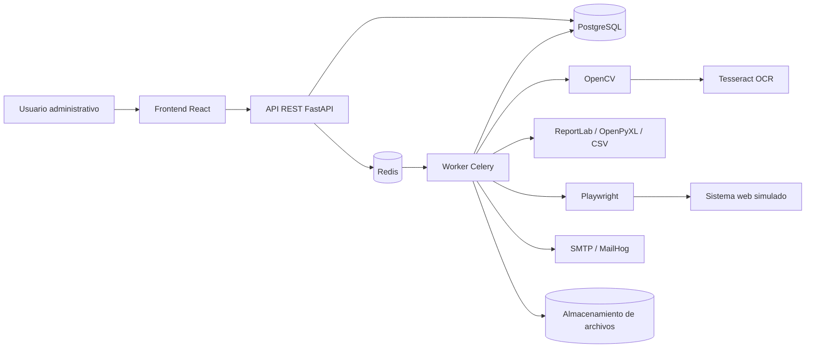

# SmartInvoice

Sistema inteligente para el procesamiento administrativo de facturas digitales mediante **Computer Vision**, **OCR** y **RPA**.

**Curso:** Inteligencia Artificial 1
**Estudiante:** Nelson Emanuel Cún Bálan  
**Carné:** 201222010

## Descripción

SmartInvoice permite cargar facturas en PDF, JPG, JPEG o PNG, preprocesarlas con OpenCV, extraer texto mediante Tesseract OCR, identificar campos administrativos, validar los resultados, almacenar la información en PostgreSQL y continuar el flujo con reportes, automatización RPA y envío de correos.

El sistema incluye:

- autenticación JWT;
- administración de proveedores;
- carga individual y masiva de facturas;
- procesamiento asíncrono con Celery y Redis;
- preprocesamiento de imágenes con OpenCV;
- OCR local con Tesseract;
- extracción y validación de datos;
- revisión manual de facturas rechazadas;
- detección de duplicados;
- dashboard administrativo;
- reportes PDF, XLSX y CSV;
- registro RPA con Playwright;
- evidencia gráfica de automatizaciones;
- envío SMTP de reportes;
- bitácoras de procesamiento;
- ejecución completa mediante Docker Compose.

## Estado de validación

El lote de evaluación incluido en `samples/batch_20/` obtuvo:

| Resultado | Valor |
|---|---:|
| Facturas del lote | 20 |
| Procesadas correctamente | 20 |
| Resultado del lote | 20/20 |
| Facturas procesadas en la base local | 23 |
| Duplicados registrados | 1 |
| Confianza OCR del lote | 90.26% a 94.37% |

## Arquitectura

El patrón principal es una **arquitectura en capas**, complementada por un flujo asíncrono basado en cola de tareas.



Consulte [Arquitectura](docs/Arquitectura.md) y [Manual técnico](docs/Manual_tecnico.md).

## Tecnologías principales

| Capa | Tecnologías |
|---|---|
| Frontend | React 19, Vite 8, Axios, React Router, Recharts, Lucide |
| Backend | Python 3.11, FastAPI, Pydantic |
| Base de datos | PostgreSQL 16, Psycopg 3 |
| Procesamiento asíncrono | Celery, Redis 7 |
| Computer Vision | OpenCV, NumPy, PyMuPDF |
| OCR | Tesseract, Pytesseract |
| Asociación de proveedor | RapidFuzz y coincidencia exacta de NIT |
| RPA | Playwright, Chromium |
| Reportes | ReportLab, OpenPyXL, CSV |
| Correo | SMTP, MailHog |
| Contenedores | Docker, Docker Compose |

## Requisitos

- Docker Engine.
- Docker Compose v2.
- Git.
- Aproximadamente 4 GB de RAM disponibles.
- Puertos locales libres: `5174`, `8001`, `8082`, `8025`, `1025`, `5433` y `6379`.

## Instalación local

```bash
git clone git@github.com:NelsonCun/-IA1-_VACASJUN2026_NelsonCun_201222010.git
cd ./-IA1-_VACASJUN2026_NelsonCun_201222010/Practica_3

cp .env.example .env
docker compose up -d --build
```

Comprobar servicios:

```bash
docker compose ps
curl -s http://localhost:8001/api/v1/health | python3 -m json.tool
```

## Accesos locales

| Servicio | URL |
|---|---|
| Frontend | http://localhost:5174 |
| API | http://localhost:8001 |
| Swagger | http://localhost:8001/docs |
| MailHog | http://localhost:8025 |
| Sistema RPA simulado | http://localhost:8082 |

Credenciales de desarrollo utilizadas durante la validación:

```text
Usuario: admin
Contraseña: Admin123*
```

Estas credenciales deben sustituirse en un despliegue real.

## Comandos útiles

Reconstruir la solución:

```bash
docker compose down
docker compose up -d --build
```

Ver registros:

```bash
docker compose logs -f backend worker
```

Compilar frontend:

```bash
docker compose exec frontend npm run build
```

Comprobar backend:

```bash
docker compose exec backend python -m compileall app
```

Detener sin eliminar datos:

```bash
docker compose down
```

Eliminar contenedores y volúmenes:

```bash
docker compose down -v
```

## Validación de 20 facturas

El lote ya está incluido en `samples/batch_20/`.

Verificar un lote previamente cargado:

```bash
python3 scripts/upload_verify_batch_20.py \
  --directory samples/batch_20 \
  --base-url http://localhost:8001 \
  --identifier admin \
  --password 'Admin123*' \
  --skip-upload
```

Para generar un lote nuevo con números diferentes:

```bash
docker compose run \
  --rm \
  --no-deps \
  --user "$(id -u):$(id -g)" \
  -v "$PWD:/workspace" \
  -w /workspace \
  backend \
  python scripts/generate_batch_20.py \
    --output samples/batch_20_b \
    --batch-code L20B \
    --clean
```

## Documentación

- [Manual técnico](docs/Manual_tecnico.md)
- [Requerimientos](docs/Requerimientos.md)
- [Arquitectura](docs/Arquitectura.md)
- [API REST](docs/API_REST.md)
- [Manual de usuario](docs/Manual_usuario.md)
- [Guía de demostración](docs/Guia_demostracion.md)
- [Guía de despliegue](docs/Guia_despliegue.md)
- [Checklist de entrega](docs/Checklist_entrega.md)

## Despliegue público

La aplicación local está validada. La URL pública debe completarse después de desplegar la solución:

```text
Frontend público: PENDIENTE_DE_DESPLIEGUE
API pública: PENDIENTE_DE_DESPLIEGUE
```

## Seguridad

- Las rutas administrativas requieren un token JWT.
- Las contraseñas se almacenan con bcrypt.
- Los archivos se validan por extensión, cabecera binaria y tamaño.
- Se utiliza SHA-256 para detectar duplicados físicos.
- La combinación proveedor y número de factura evita duplicados lógicos.
- `.env` no debe confirmarse en Git.
- `SECRET_KEY`, contraseñas y credenciales SMTP deben cambiarse en producción.

## Licencia y alcance

Proyecto académico desarrollado para el curso de Inteligencia Artificial 1 de la Facultad de Ingeniería de la Universidad de San Carlos de Guatemala.
