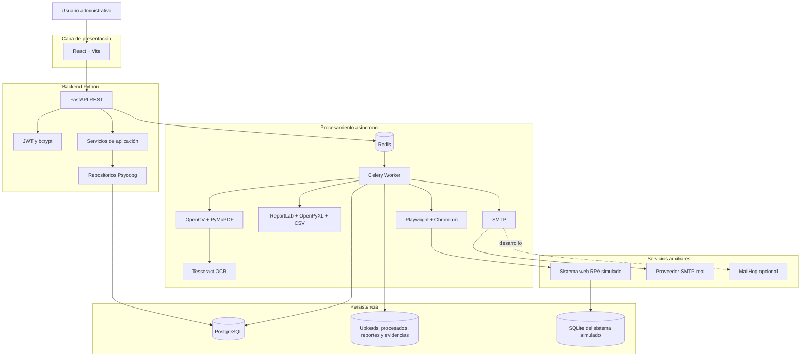
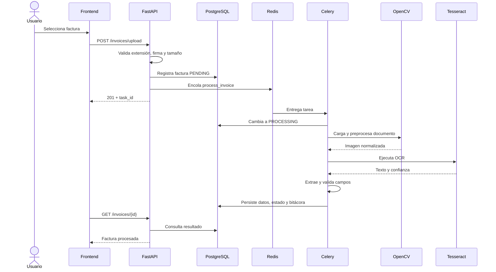

# Arquitectura de SmartInvoice

## 1. Patrón seleccionado

El patrón principal es una **arquitectura en capas**:

1. **Presentación:** React.
2. **API y controladores:** FastAPI.
3. **Aplicación y servicios:** lógica de carga, procesamiento, revisión, correo y RPA.
4. **Acceso a datos:** repositorios Psycopg.
5. **Persistencia:** PostgreSQL y sistema de archivos.

La arquitectura se complementa con un patrón de **procesamiento asíncrono por cola de tareas**. La API registra la solicitud y Celery ejecuta las operaciones costosas utilizando Redis como broker.

## 2. Justificación

La arquitectura en capas fue elegida porque:

- separa la interfaz de la lógica de negocio;
- permite probar y mantener los módulos por responsabilidad;
- evita que las consultas SQL se mezclen con los endpoints;
- facilita sustituir herramientas sin modificar toda la aplicación;
- centraliza validaciones y configuración;
- permite desplegar API y workers de forma independiente.

El procesamiento asíncrono es necesario porque OCR, Computer Vision, generación de archivos, RPA y SMTP pueden tardar varios segundos. Ejecutarlos dentro de la petición HTTP degradaría la experiencia del usuario y aumentaría el riesgo de timeout.

## 3. Diagrama general

## 4. Contenedores

| Servicio | Responsabilidad | Puerto local |
|---|---|---:|
| `frontend` | SPA administrativa React/Vite | 5174 |
| `backend` | API REST FastAPI | 8001 |
| `worker` | Tareas Celery | interno |
| `db` | PostgreSQL 16 | 5433 |
| `redis` | Broker y backend de resultados | 6379 |
| `rpa-target` | Formulario externo simulado | 8082 |
| `mailhog` | SMTP y buzón opcional de desarrollo | 1025 / 8025 |
| Proveedor SMTP externo | Entrega real de mensajes en producción | 587/TLS saliente |

Todos los contenedores internos comparten `smartinvoice-network`; el proveedor SMTP se consume como servicio externo.

## 5. Flujo principal

## 6. Capas del backend

### 6.1 API

`backend/app/api/v1/`

Define rutas, dependencias, códigos HTTP y serialización. No contiene SQL directo ni procesamiento OCR.

### 6.2 Esquemas

`backend/app/schemas/`

Modelos Pydantic de solicitudes y respuestas.

### 6.3 Servicios

`backend/app/services/`

Orquestan reglas de negocio:

- almacenamiento de archivos;
- procesamiento integral;
- validación de revisión manual;
- envío SMTP.

### 6.4 Repositorios

`backend/app/repositories/`

Encapsulan operaciones SQL y transacciones.

### 6.5 Módulos especializados

- `computer_vision/`: lectura y preprocesamiento;
- `ocr/`: extracción y parser;
- `reports/`: generación de archivos;
- `rpa/`: Playwright;
- `tasks/`: integración con Celery.

## 7. Persistencia

### 7.1 PostgreSQL

Almacena entidades administrativas, estados, resultados, bitácoras y relaciones.

### 7.2 Sistema de archivos

| Directorio | Contenido |
|---|---|
| `storage/uploads` | Documentos originales identificados por SHA-256 |
| `storage/processed` | Imágenes preprocesadas |
| `storage/reports` | Reportes generados |
| `storage/rpa` | Capturas de evidencia |

### 7.3 Redis

- Broker de Celery: base 0.
- Resultados de Celery: base 1.
- Persistencia AOF habilitada.

### 7.4 SQLite del RPA target

El sistema web simulado guarda registros externos en un volumen independiente.

## 8. Decisiones de diseño

### D-01: OCR local

Se utiliza Tesseract para cumplir la restricción de procesar localmente los documentos sin delegar la extracción completa a servicios generativos externos.

### D-02: SQL explícito

La aplicación usa Psycopg y repositorios SQL. Esto permite controlar consultas, restricciones, índices y transacciones.

### D-03: Duplicados en dos niveles

- duplicado físico: mismo SHA-256;
- duplicado lógico: mismo proveedor y número de factura.

### D-04: Revisión humana

Una factura con errores queda `REJECTED`, pero conserva OCR, imagen procesada y errores. El operador puede corregirla sin perder trazabilidad.

### D-05: RPA demostrable

Se incluye un sistema externo simulado. Playwright inicia sesión, llena el formulario, verifica el éxito y toma una captura.

### D-06: SMTP real en producción y MailHog en desarrollo

MailHog permite inspeccionar mensajes y adjuntos durante el desarrollo, pero no entrega a buzones externos. En producción el worker se conecta a un proveedor SMTP autenticado mediante STARTTLS y registra el resultado en PostgreSQL.

## 9. Escalabilidad

La arquitectura permite:

- ejecutar múltiples workers;
- separar PostgreSQL y Redis en servicios administrados;
- mover archivos a almacenamiento de objetos;
- servir el frontend como archivos estáticos;
- aplicar balanceo a la API;
- usar una cola específica para OCR, RPA o reportes.

## 10. Limitaciones actuales

- No existe CRUD web de usuarios.
- No hay scheduler funcional, aunque existe esquema de soporte.
- No hay pruebas unitarias automatizadas.
- El almacenamiento de documentos es local.
- El despliegue público por HTTP está operativo; HTTPS queda pendiente.
- MailHog no realiza entrega externa y se limita al entorno de desarrollo.
