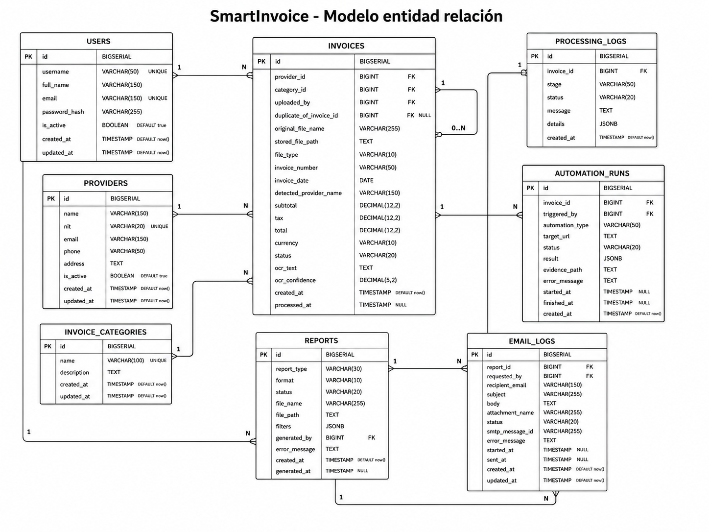

# Manual técnico de SmartInvoice

## 1. Información general

SmartInvoice es una plataforma web para automatizar el procesamiento administrativo de facturas. Integra Computer Vision, OCR, validaciones, almacenamiento estructurado, reportes, RPA y correo electrónico.

## 2. Objetivos técnicos

- Recibir documentos PDF e imágenes.
- Ejecutar OCR local y reproducible.
- estructurar datos administrativos;
- validar la consistencia de la información;
- conservar trazabilidad por etapa;
- ejecutar tareas pesadas sin bloquear la API;
- producir reportes descargables;
- demostrar una automatización RPA funcional;
- enviar reportes mediante SMTP;
- desplegar todos los componentes con contenedores.

## 3. Estructura del repositorio

```text
Practica_3/
├── backend/
│   ├── app/
│   │   ├── api/
│   │   ├── computer_vision/
│   │   ├── core/
│   │   ├── db/
│   │   ├── ocr/
│   │   ├── reports/
│   │   ├── repositories/
│   │   ├── rpa/
│   │   ├── schemas/
│   │   ├── services/
│   │   └── tasks/
│   ├── Dockerfile
│   └── requirements.txt
├── database/init/
├── frontend/
├── rpa-target/
├── samples/
├── scripts/
├── storage/
├── docker-compose.yml
└── .env.example
```

## 4. Tecnologías

### Backend

- Python 3.11.
- FastAPI.
- Uvicorn.
- Pydantic Settings.
- Psycopg 3.
- Celery.
- Redis.
- PyJWT.
- bcrypt.

### Inteligencia documental

- OpenCV.
- NumPy.
- PyMuPDF.
- Tesseract OCR.
- Pytesseract.
- RapidFuzz.

### Automatización y salidas

- Playwright y Chromium.
- ReportLab.
- OpenPyXL.
- biblioteca CSV.
- SMTP de Python.

### Frontend

- React.
- Vite.
- Axios.
- React Router.
- Recharts.
- Lucide React.

## 5. Arquitectura general


La descripción detallada del patrón y las responsabilidades se encuentra en [Patrón de arquitectura](Patron_arquitectura.md).

## 6. Configuración

La aplicación usa variables de entorno.

| Variable | Propósito | Valor de desarrollo |
|---|---|---|
| `PROJECT_NAME` | Nombre de aplicación | SmartInvoice |
| `ENVIRONMENT` | Entorno | development |
| `SECRET_KEY` | Firma de JWT | debe cambiarse |
| `ACCESS_TOKEN_EXPIRE_MINUTES` | Duración del token | 480 |
| `DATABASE_URL` | Conexión PostgreSQL | servicio `db` |
| `REDIS_URL` | Acceso general Redis | `redis://redis:6379/0` |
| `CELERY_BROKER_URL` | Broker | base 0 |
| `CELERY_RESULT_BACKEND` | Resultados | base 1 |
| `MAX_UPLOAD_SIZE_MB` | Tamaño máximo | 15 |
| `OCR_MIN_CONFIDENCE` | Confianza mínima | 60 |
| `OCR_DPI` | Renderizado PDF | 300 |
| `MAX_PDF_PAGES` | Máximo de páginas | 5 |
| `RPA_TARGET_URL` | Destino RPA | `http://rpa-target:8080` |
| `SMTP_HOST` | Servidor SMTP | `mailhog` en desarrollo; `smtp.gmail.com` en producción |
| `SMTP_PORT` | Puerto SMTP | `1025` en desarrollo; `587` con STARTTLS |
| `SMTP_USERNAME` | Usuario SMTP | vacío en MailHog; cuenta remitente en producción |
| `SMTP_PASSWORD` | Credencial SMTP | vacía en MailHog; contraseña de aplicación en producción |
| `SMTP_USE_TLS` | Habilita STARTTLS | `false` en desarrollo; `true` en producción |
| `SMTP_FROM_EMAIL` | Dirección remitente | dirección técnica o cuenta remitente |
| `SMTP_FROM_NAME` | Nombre visible | SmartInvoice |
| `VITE_API_URL` | URL de API para frontend | localhost en desarrollo |
| `CORS_ORIGINS` | Orígenes permitidos | frontend local o IP pública |

## 7. Autenticación y autorización

### 6.1 Contraseñas

Se verifican con bcrypt. La aplicación no almacena contraseñas en texto plano.

### 6.2 JWT

El token contiene:

- `sub`: identificador de usuario;
- `role`: rol;
- `type`: `access`;
- `iat`: fecha de emisión;
- `exp`: expiración.

El algoritmo configurado es HS256.

### 6.3 Roles

La base define:

- `ADMIN`;
- `OPERATOR`.

Las operaciones de modificación de proveedores requieren administrador. Las demás rutas administrativas requieren autenticación.

## 8. Carga de facturas

### 7.1 Validaciones

El servicio de carga:

1. normaliza el nombre;
2. comprueba extensión;
3. lee el archivo por bloques de 1 MB;
4. limita el tamaño;
5. calcula SHA-256;
6. verifica magic bytes;
7. compara extensión y contenido;
8. detecta duplicado físico;
9. persiste el registro;
10. crea bitácora `UPLOAD`;
11. encola el procesamiento.

### 7.2 Formatos

| Extensión | MIME |
|---|---|
| `.pdf` | `application/pdf` |
| `.jpg` | `image/jpeg` |
| `.jpeg` | `image/jpeg` |
| `.png` | `image/png` |

## 9. Computer Vision

### 8.1 Carga

- Los PDF se renderizan con PyMuPDF.
- Las imágenes se decodifican con OpenCV.
- Se procesan hasta cinco páginas por PDF de forma predeterminada.

### 8.2 Preprocesamiento

La secuencia es:

1. redimensionado hasta un ancho objetivo de 2200 px;
2. escala de grises;
3. detección y corrección de inclinación;
4. reducción de ruido;
5. umbral adaptativo gaussiano;
6. cierre morfológico;
7. guardado PNG.

Se registran ancho, alto y ángulo de corrección.

## 10. OCR

Tesseract se ejecuta con:

```text
--oem 3 --psm 6 -c preserve_interword_spaces=1
```

El motor devuelve:

- texto;
- confianza promedio;
- cantidad de palabras reconocidas.

## 11. Extracción estructurada

El parser normaliza saltos, guiones y espacios. Luego extrae:

- número de factura;
- fecha;
- proveedor;
- NIT;
- subtotal;
- IVA o impuestos;
- total;
- moneda GTQ.

Los montos toleran coma o punto decimal.

## 12. Asociación de proveedor

1. Busca coincidencia exacta por NIT.
2. Si no existe, aplica `partial_ratio` de RapidFuzz contra el texto OCR.
3. Acepta la mejor coincidencia con puntaje mínimo de 75.
4. Hereda la categoría del proveedor cuando no fue seleccionada.

## 13. Validaciones

Una factura queda rechazada cuando:

- falta un campo requerido;
- el NIT no es válido;
- la fecha está en el futuro;
- los montos no cuadran;
- la confianza está debajo del mínimo.

Una factura queda duplicada cuando existe otra no duplicada con igual proveedor y número.

## 14. Estados

### Factura

- `PENDING`
- `PROCESSING`
- `PROCESSED`
- `REJECTED`
- `ERROR`
- `DUPLICATE`

### Ejecución

- `PENDING`
- `RUNNING`
- `SUCCESS`
- `WARNING`
- `ERROR`

### Etapas

- `UPLOAD`
- `COMPUTER_VISION`
- `OCR`
- `EXTRACTION`
- `VALIDATION`
- `STORAGE`
- `RPA`
- `REPORT`
- `EMAIL`

## 15. Revisión manual

El operador puede corregir una factura no duplicada. El backend valida nuevamente:

- número;
- fecha;
- proveedor;
- categoría;
- NIT;
- montos;
- moneda.

La revisión se registra en `extracted_data.manual_review`, limpia errores y cambia el estado a `PROCESSED`.

## 16. Procesamiento asíncrono

Celery registra las tareas:

- `smartinvoice.health`;
- `smartinvoice.process_invoice`;
- `smartinvoice.generate_report`;
- `smartinvoice.register_invoice_rpa`;
- `smartinvoice.send_report_email`.

La tarea de facturas reintenta únicamente errores transitorios de conexión, no errores deterministas de validación.

## 17. Reportes

Tipos:

- detalle de facturas;
- administrativo;
- resumen;
- errores.

Formatos:

- PDF;
- XLSX;
- CSV.

Filtros:

- fecha inicial;
- fecha final;
- proveedor;
- estado.

El reporte se genera en segundo plano y solo puede descargarse en estado `SUCCESS`.

## 18. RPA

El worker usa Playwright con Chromium en modo headless.

Flujo:

1. consulta datos de una factura procesada;
2. abre `/login`;
3. ingresa credenciales;
4. espera `/form`;
5. llena ocho campos;
6. envía el formulario;
7. espera confirmación;
8. obtiene el ID externo;
9. guarda captura PNG;
10. persiste resultado y estado.

## 19. Correo

El correo se crea en estado `PENDING`. El worker:

1. verifica que el reporte esté listo;
2. marca el envío `RUNNING`;
3. construye un `EmailMessage`;
4. adjunta el reporte;
5. conecta por SMTP;
6. envía;
7. registra `Message-ID` y `SUCCESS`.

En desarrollo puede utilizarse MailHog para inspeccionar mensajes sin enviarlos a Internet. En producción se configuró un servidor SMTP real con autenticación y STARTTLS. Para Gmail se usan `smtp.gmail.com`, puerto `587`, la cuenta remitente y una contraseña de aplicación.

Las credenciales viven únicamente en `.env.production`, que está excluido del repositorio. El worker conserva el destinatario solicitado, adjunta el archivo del reporte y registra el `Message-ID`, estado, fecha y errores en `email_logs`.

## 20. Base de datos



Tablas funcionales principales:

| Tabla | Propósito |
|---|---|
| `users` | Usuarios, roles y acceso |
| `providers` | Proveedores |
| `invoice_categories` | Categorías |
| `invoices` | Documento, campos OCR, estado y resultados |
| `processing_logs` | Bitácora por etapas |
| `reports` | Solicitudes y archivos de reportes |
| `automation_runs` | Ejecuciones RPA |
| `email_logs` | Entregas SMTP |

Tablas preparadas para extensión:

- `invoice_items`;
- `external_api_logs`;
- `scheduled_tasks`;
- `system_settings`.

Vistas:

- `vw_dashboard_summary`;
- `vw_invoice_listing`;
- `vw_processing_performance`;
- `vw_provider_statistics`.

Índices relevantes:

- SHA-256 original único;
- proveedor y número único para facturas no duplicadas;
- estado y fechas;
- relaciones de reportes y correos.

## 21. API REST

La API expone Swagger en `/docs`. La especificación detallada de endpoints se encuentra en [API_REST.md](API_REST.md).

## 22. Frontend

Rutas:

| Ruta | Pantalla |
|---|---|
| `/login` | Inicio de sesión |
| `/` | Dashboard |
| `/providers` | Proveedores |
| `/invoices` | Facturas y OCR |
| `/reports` | Reportes |
| `/automations` | RPA |
| `/emails` | Historial de correos |

Axios agrega JWT automáticamente y elimina la sesión cuando recibe 401.

## 23. Docker Compose

Servicios:

```text
db
redis
backend
worker
rpa-target
frontend
mailhog
```

Volúmenes:

- `postgres_data`;
- `redis_data`;
- `frontend_node_modules`;
- `rpa_target_data`.

El directorio `storage` se monta en backend y worker.

## 24. Instalación

```bash
cp .env.example .env
docker compose up -d --build
docker compose ps
```

Validación:

```bash
curl -s http://localhost:8001/api/v1/health | python3 -m json.tool
docker compose exec frontend npm run build
docker compose exec backend python -m compileall app
```

## 25. Lote de 20 facturas

El lote `samples/batch_20` contiene 20 documentos y resultados esperados. La validación ejecutada produjo 20 estados `PROCESSED`.

## 26. Despliegue

La solución fue desplegada en una VM Linux con Docker Compose. La configuración productiva considera:

- variables de producción;
- `SECRET_KEY` fuerte;
- SMTP real con credenciales externas;
- URL pública de API;
- CORS público;
- almacenamiento persistente;
- firewall;
- proxy inverso;
- HTTPS cuando se disponga de dominio o certificado.

La infraestructura y el procedimiento aplicado se describen en [Guia_despliegue.md](Guia_despliegue.md).

## 27. Mejoras futuras

- CRUD de usuarios.
- pruebas unitarias e integración;
- almacenamiento S3 o compatible;
- scheduler Celery Beat;
- colas separadas;
- antivirus para cargas;
- OCR por regiones;
- extracción de líneas;
- soporte multimoneda;
- observabilidad con métricas;
- rotación de secretos;
- alta disponibilidad;
- servicio SMTP transaccional dedicado para mayor volumen;
- migraciones versionadas.
