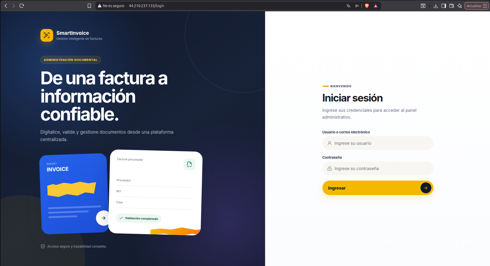
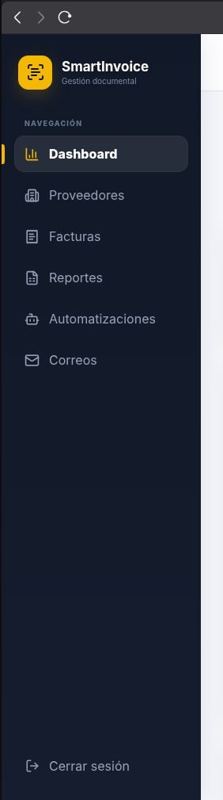
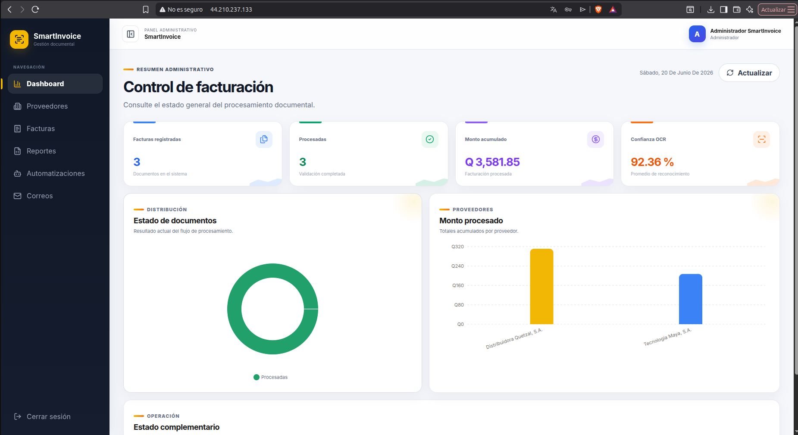
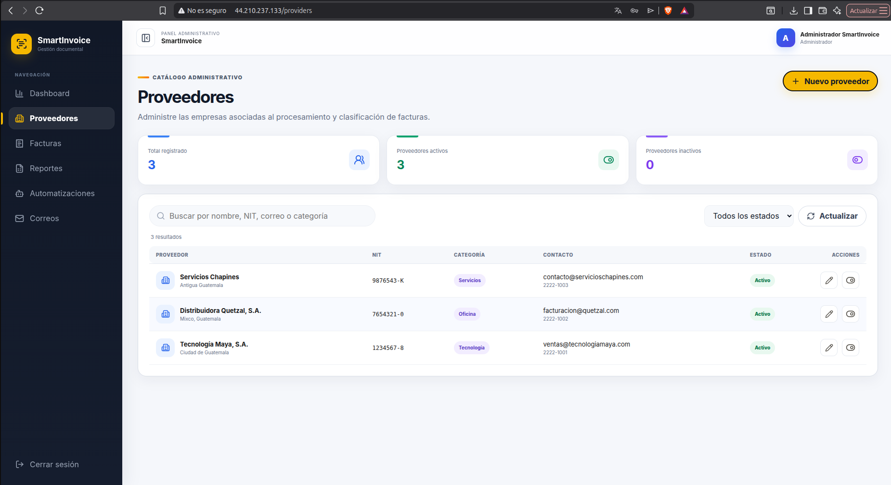
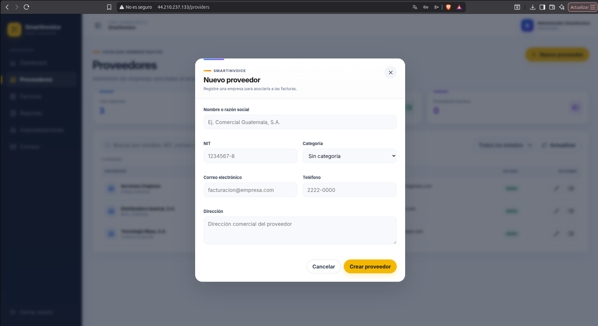
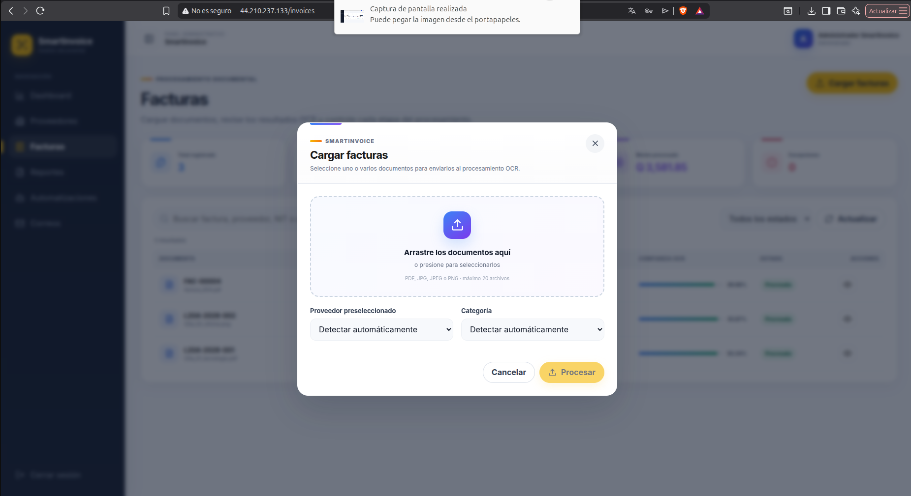
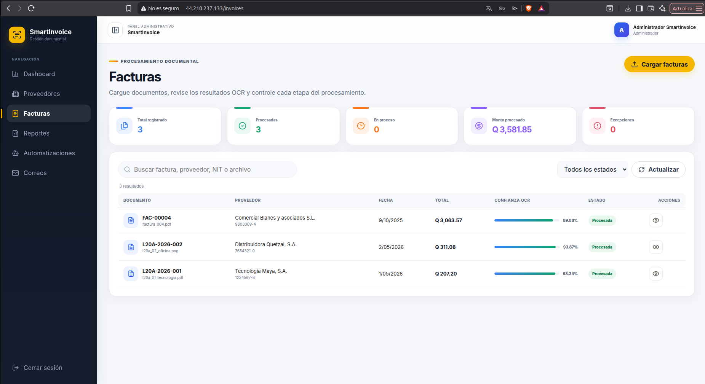
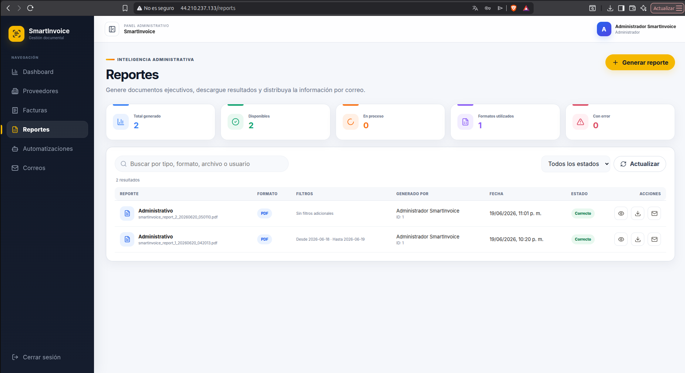
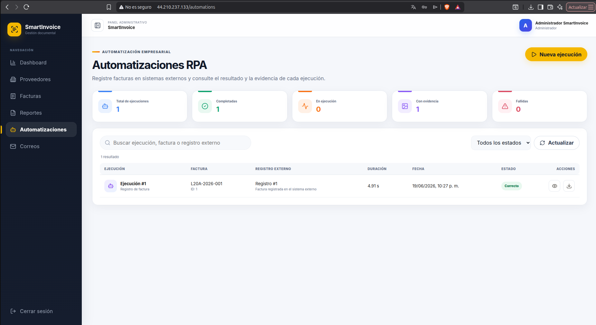
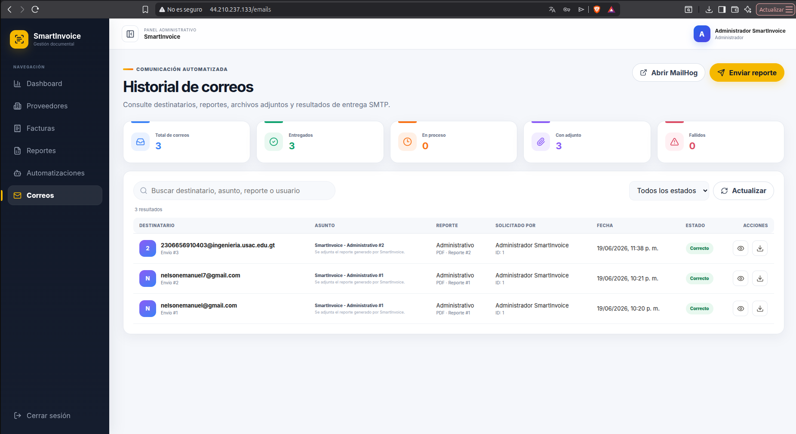

# Manual de usuario de SmartInvoice

## 1. Acceso

### Entorno público

```text
http://44.210.237.133
```

### Entorno local

```text
http://localhost:5174
```

Credenciales utilizadas durante la validación académica:

```text
Usuario: admin
Contraseña: Admin123*
```



## 2. Navegación

El menú principal contiene:

- Dashboard;
- Proveedores;
- Facturas;
- Reportes;
- Automatizaciones;
- Correos.



## 3. Dashboard

El dashboard presenta:

- total de facturas;
- cantidades por estado;
- monto e impuestos acumulados;
- confianza OCR promedio;
- distribución por estado;
- proveedores principales;
- comportamiento mensual.



## 4. Proveedores

### Registro

1. Acceder al módulo **Proveedores**.
2. Seleccionar **Nuevo proveedor**.
3. Completar nombre, NIT, correo, teléfono, dirección y categoría.
4. Guardar el registro.

### Edición

1. Localizar el proveedor en el listado.
2. Seleccionar la acción de edición.
3. Modificar los datos requeridos.
4. Guardar los cambios.

### Desactivación

La opción de estado permite desactivar un proveedor de forma lógica sin eliminar su historial.





## 5. Facturas

### Carga individual

1. Acceder al módulo **Facturas**.
2. Seleccionar la opción de carga.
3. Elegir un archivo PDF, JPG, JPEG o PNG.
4. Seleccionar proveedor y categoría cuando corresponda.
5. Confirmar la carga.
6. Esperar la actualización automática del estado.

### Carga masiva

1. Seleccionar un máximo de veinte archivos.
2. Confirmar la operación.
3. Consultar el resumen de recibidos, correctos, duplicados y fallidos.
4. Esperar la finalización del worker.

### Estados

| Estado | Significado |
|---|---|
| Pendiente | Documento almacenado y en cola. |
| Procesando | Worker ejecutando OCR y validaciones. |
| Procesada | Datos extraídos y validados. |
| Rechazada | Documento que requiere corrección manual. |
| Error | Fallo técnico durante el procesamiento. |
| Duplicada | Documento o factura registrada previamente. |

### Detalle

El detalle de una factura permite consultar:

- archivo original;
- imagen preprocesada;
- texto OCR;
- confianza;
- campos extraídos;
- proveedor asociado;
- errores de validación;
- bitácora de procesamiento.

### Revisión manual

1. Acceder al detalle de una factura rechazada.
2. Seleccionar **Revisar**.
3. Corregir número, fecha, proveedor, categoría, NIT y montos.
4. Verificar la igualdad entre subtotal, IVA y total.
5. Guardar la revisión.

La factura cambia a procesada cuando los datos corregidos cumplen las reglas de validación.





## 6. Reportes

1. Acceder al módulo **Reportes**.
2. Seleccionar **Nuevo reporte**.
3. Elegir el tipo de reporte.
4. Seleccionar PDF, XLSX o CSV.
5. Configurar los filtros requeridos.
6. Iniciar la generación.
7. Esperar el estado **Correcto**.
8. Descargar el archivo o enviarlo por correo.

Las fechas del formulario filtran por fecha de factura. Los campos vacíos incluyen todos los registros disponibles.



## 7. Automatizaciones RPA

1. Acceder a **Automatizaciones**.
2. Seleccionar **Nueva ejecución**.
3. Elegir una factura procesada.
4. Iniciar la automatización.
5. Esperar el estado **Correcto**.
6. Consultar el detalle.
7. Descargar la captura de evidencia.



## 8. Correos

1. Generar previamente un reporte con estado `SUCCESS`.
2. Seleccionar la opción **Enviar por correo**.
3. Registrar una dirección de destinatario válida.
4. Confirmar el envío.
5. Consultar destinatario, asunto, reporte y estado en el módulo **Correos**.
6. Abrir el detalle para visualizar cuerpo, adjunto y resultado SMTP.
7. Comprobar la recepción en el buzón del destinatario.

En producción, los mensajes se entregan mediante SMTP real. MailHog se utiliza únicamente en el entorno local de desarrollo.



## 9. Cierre de sesión

La opción **Cerrar sesión**, ubicada en el menú lateral, elimina la sesión activa del navegador.

## 10. Problemas frecuentes

### Falta de conexión con el servidor

```bash
docker compose ps
curl -s http://localhost:8001/api/v1/health
```

### Factura rechazada

El detalle OCR y `validation_errors` permiten identificar los datos que requieren revisión manual.

### Reporte sin registros

Los filtros de fecha, proveedor o estado pueden excluir todas las facturas. Un reporte general utiliza los filtros vacíos.

### Reporte no disponible

La descarga se habilita únicamente cuando el estado del reporte es `SUCCESS`.

### RPA no disponible

La ejecución requiere una factura en estado `PROCESSED` y un servicio `rpa-target` saludable.

### Correo no recibido

El historial de **Correos** indica si el envío fue correcto o fallido. Cuando el estado es correcto, también corresponde revisar la carpeta de spam y la validez de la dirección del destinatario.

Cuando el estado es error, las variables relevantes son:

```text
SMTP_HOST
SMTP_PORT
SMTP_USERNAME
SMTP_PASSWORD
SMTP_USE_TLS
```
