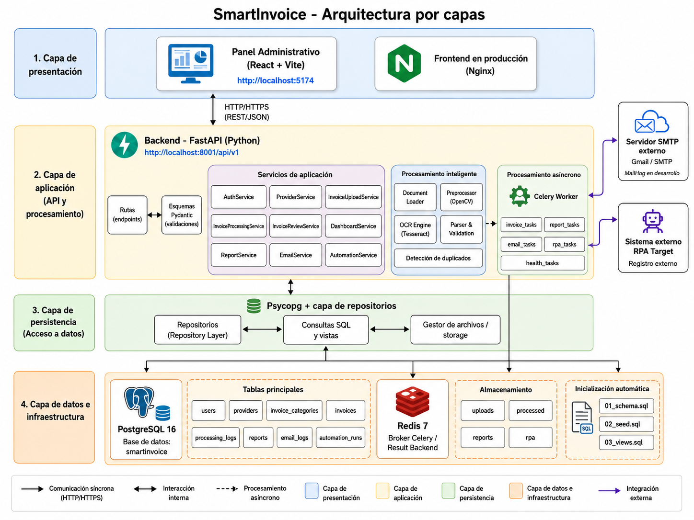
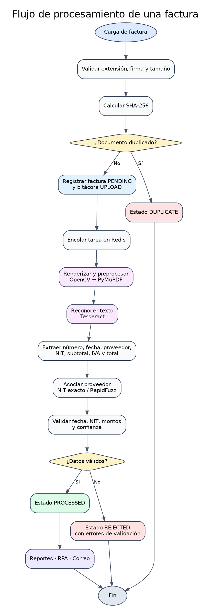

# Patrón de arquitectura — SmartInvoice

## 1. Introducción

SmartInvoice es una plataforma de procesamiento documental que transforma facturas digitales en información administrativa estructurada. La solución combina una aplicación web, una API REST, una base de datos relacional, un pipeline OCR, tareas asíncronas, automatización RPA y entrega de reportes por correo.

Los componentes se ejecutan mediante Docker Compose y, en producción, se alojan en una instancia AWS EC2 detrás de Nginx.

---

## 2. Objetivos arquitectónicos

La arquitectura fue diseñada para:

- separar presentación, aplicación y persistencia;
- impedir el acceso directo del frontend a PostgreSQL;
- mantener la API disponible durante operaciones intensivas;
- ejecutar OCR, reportes, RPA y correo de forma asíncrona;
- conservar trazabilidad por etapa;
- aislar los servicios internos en una red Docker;
- permitir ejecución reproducible en ambiente local y en nube;
- proteger credenciales mediante variables de entorno;
- conservar documentos y datos después de reinicios;
- facilitar la sustitución de servicios externos sin modificar la interfaz.

---

## 3. Estilo arquitectónico

El patrón principal es una **arquitectura en capas**, complementada por un **procesamiento asíncrono orientado a tareas**.

Las capas principales son:

1. presentación;
2. API y controladores;
3. aplicación y servicios;
4. acceso a datos;
5. persistencia;
6. procesamiento asíncrono;
7. integraciones externas.

El uso de Celery y Redis introduce un modelo productor-consumidor: FastAPI registra la solicitud y publica una tarea; el worker ejecuta el trabajo pesado y actualiza el estado persistido.

---

## 4. Vista general



---

## 5. Capa de presentación

### 5.1 Frontend React

El frontend utiliza React, Vite, Axios, React Router, Recharts y Lucide.

Responsabilidades:

- autenticación del usuario;
- almacenamiento temporal del token JWT;
- navegación protegida;
- dashboard administrativo;
- administración de proveedores;
- carga y consulta de facturas;
- revisión manual;
- generación y descarga de reportes;
- ejecución y consulta de RPA;
- envío y consulta de correos;
- presentación de errores, estados y confirmaciones.

El frontend se comunica exclusivamente con la API REST y no conoce credenciales de PostgreSQL, Redis ni SMTP.

### 5.2 Nginx

En producción, Nginx sirve los archivos estáticos compilados y actúa como reverse proxy:

- `/` entrega la aplicación React;
- `/api/` dirige solicitudes a FastAPI;
- `/docs` y `/openapi.json` publican la documentación de la API.

---

## 6. Capa de API

FastAPI expone los casos de uso mediante rutas REST.

Responsabilidades:

- recibir solicitudes HTTP;
- validar parámetros y cuerpos mediante Pydantic;
- autenticar tokens JWT;
- aplicar autorización por rol;
- invocar servicios de aplicación;
- publicar tareas en Celery;
- devolver respuestas JSON y archivos;
- traducir errores de negocio a códigos HTTP controlados.

El prefijo principal es:

```text
/api/v1
```

Los grupos funcionales incluyen autenticación, proveedores, categorías, facturas, dashboard, reportes, automatizaciones, correos y salud.

---

## 7. Capa de aplicación

### 7.1 Servicio de autenticación

- localiza usuarios por nombre o correo;
- verifica bcrypt;
- actualiza el último acceso;
- genera JWT;
- recupera el usuario autenticado.

### 7.2 Servicio de carga

- normaliza el nombre del archivo;
- verifica extensión y firma binaria;
- controla tamaño;
- calcula SHA-256;
- detecta duplicados físicos;
- persiste la factura y la bitácora inicial;
- encola el procesamiento.

### 7.3 Servicio de procesamiento

- coordina Computer Vision;
- ejecuta OCR;
- extrae campos;
- asocia proveedor;
- valida resultados;
- actualiza estado, rutas y metadatos;
- registra cada etapa.

### 7.4 Servicio de revisión

- recibe correcciones manuales;
- aplica las mismas reglas de validación;
- registra usuario y fecha de confirmación;
- cambia el estado cuando la información es consistente.

### 7.5 Servicio de reportes

- aplica filtros administrativos;
- construye PDF, XLSX o CSV;
- guarda el archivo;
- actualiza el estado del reporte.

### 7.6 Servicio RPA

- prepara los datos de una factura procesada;
- abre Chromium mediante Playwright;
- inicia sesión en el sistema externo simulado;
- completa y envía el formulario;
- conserva resultado y captura de evidencia.

### 7.7 Servicio de correo

- construye un mensaje MIME;
- adjunta el reporte;
- inicia STARTTLS cuando corresponde;
- autentica contra SMTP;
- registra resultado, identificador y error en `email_logs`.

---

## 8. Capa de acceso a datos

Los repositorios encapsulan las operaciones Psycopg sobre PostgreSQL.

Responsabilidades:

- ejecutar consultas parametrizadas;
- convertir filas a estructuras de aplicación;
- mantener transacciones;
- aplicar paginación y filtros;
- evitar SQL dentro de componentes de presentación;
- centralizar actualizaciones de estado.

---

## 9. Capa de persistencia

### 9.1 PostgreSQL

Conserva usuarios, proveedores, categorías, facturas, bitácoras, reportes, automatizaciones y correos.

La integridad se refuerza mediante:

- claves primarias y foráneas;
- restricciones `CHECK`;
- tipos enumerados;
- índices únicos;
- JSONB para metadatos variables;
- vistas administrativas.

### 9.2 Sistema de archivos

Conserva:

```text
storage/uploads
storage/processed
storage/reports
storage/rpa
```

### 9.3 Redis

Funciona como broker de Celery y backend de resultados. No se utiliza como fuente permanente de información administrativa.

---

## 10. Procesamiento asíncrono



La API retorna después de registrar la solicitud. El worker procesa la tarea y actualiza estados persistidos. Este diseño evita mantener conexiones HTTP abiertas durante OCR, generación de archivos, navegación RPA o comunicación SMTP.

La concurrencia puede ajustarse mediante la cantidad de workers y procesos sin modificar la API.

---

## 11. Integraciones externas

### 11.1 Tesseract OCR

Motor local que transforma imágenes en texto y produce valores de confianza.

### 11.2 Sistema RPA simulado

Aplicación web independiente con la que Playwright interactúa como lo haría un usuario.

### 11.3 SMTP

En desarrollo se utiliza MailHog. En producción se validó Gmail SMTP mediante STARTTLS y contraseña de aplicación.

---

## 12. Contenedores

| Servicio | Responsabilidad |
|---|---|
| `frontend` | Nginx y aplicación React compilada. |
| `backend` | API REST FastAPI. |
| `worker` | OCR, reportes, RPA y correo. |
| `db` | PostgreSQL 16. |
| `redis` | Broker y resultados Celery. |
| `rpa-target` | Sistema externo simulado. |
| `mailhog` | Captura SMTP de desarrollo. |

PostgreSQL, Redis, backend y RPA Target permanecen dentro de la red Docker. Solamente Nginx publica el puerto de la aplicación.

---

## 13. Despliegue AWS

La topología productiva utiliza una instancia EC2 Ubuntu 24.04 con 2 vCPU, 4 GiB de RAM, 30 GiB gp3 y 2 GiB de swap.

El Security Group publica:

- puerto 22 para administración SSH restringida;
- puerto 80 para la aplicación web.

La API, PostgreSQL, Redis, RPA Target y MailHog no se exponen directamente.

---

## 14. Seguridad

- JWT para rutas protegidas;
- bcrypt para contraseñas;
- validación de contenido y tamaño de archivos;
- SHA-256 para duplicados físicos;
- consultas SQL parametrizadas;
- red Docker privada;
- secretos fuera de Git;
- Deploy Key de solo lectura para EC2;
- SMTP autenticado con STARTTLS;
- puertos internos sin exposición pública.

---

## 15. Beneficios del patrón

- responsabilidades claramente separadas;
- menor acoplamiento entre interfaz y datos;
- procesamiento pesado desacoplado;
- facilidad de mantenimiento;
- posibilidad de escalar workers;
- trazabilidad completa;
- despliegue reproducible;
- sustitución controlada de integraciones externas.

---

## 16. Limitaciones y extensiones

La versión entregada opera sobre una instancia única. Un escenario de mayor escala podría incorporar almacenamiento de objetos, base de datos administrada, balanceador, HTTPS, múltiples workers y observabilidad centralizada.
