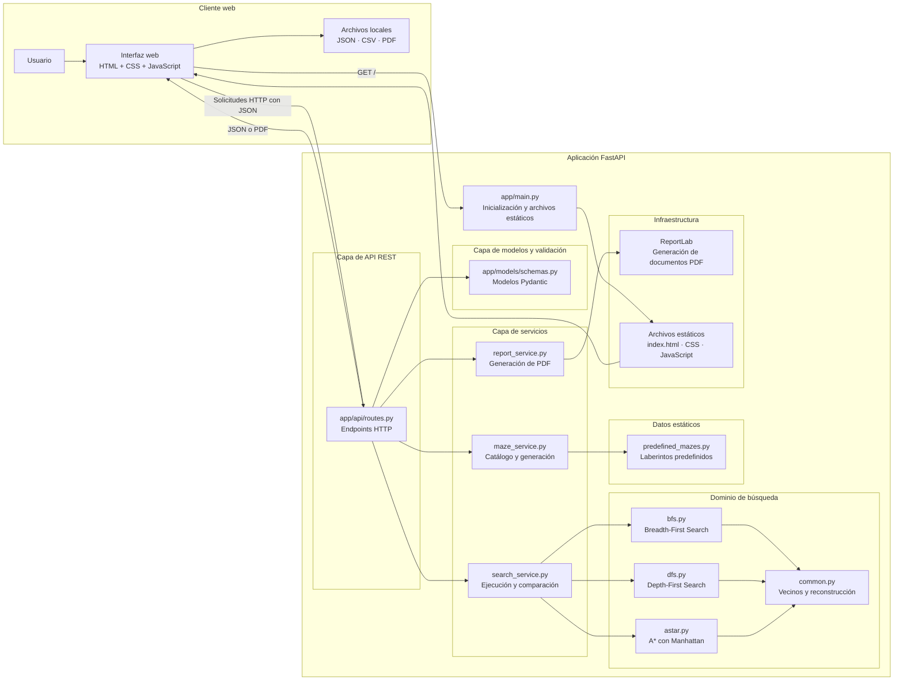

# Diagrama de Arquitectura de RoboMaze

## Descripción general

RoboMaze utiliza una **arquitectura monolítica en capas**. La aplicación se ejecuta como un único servicio FastAPI, pero sus responsabilidades se encuentran separadas en módulos independientes.

Las capas principales son:

1. Presentación.
2. API REST.
3. Modelos y validación.
4. Servicios de aplicación.
5. Dominio de búsqueda.
6. Datos estáticos e infraestructura.

## Diagrama



## Responsabilidad de cada capa

### Presentación

Ubicación:

```text
app/static/
```

Responsabilidades:

- Mostrar el laberinto.
- Recibir acciones del usuario.
- Construir solicitudes HTTP.
- Consumir la API REST.
- Animar la exploración y la ruta.
- Mostrar métricas.
- Gestionar archivos JSON.
- Descargar resultados CSV y PDF.

### API REST

Ubicación:

```text
app/api/routes.py
```

Responsabilidades:

- Exponer endpoints HTTP.
- Recibir solicitudes.
- Aplicar validaciones.
- Delegar los casos de uso.
- Devolver respuestas JSON o archivos PDF.

### Modelos y validación

Ubicación:

```text
app/models/schemas.py
```

Responsabilidades:

- Validar dimensiones.
- Validar coordenadas.
- Verificar inicio y destino.
- Detectar obstáculos repetidos.
- Definir contratos de entrada y salida.

### Servicios de aplicación

Ubicación:

```text
app/services/
```

Responsabilidades:

- Coordinar la ejecución de algoritmos.
- Comparar BFS, DFS y A*.
- Administrar laberintos predefinidos.
- Generar laberintos aleatorios.
- Construir reportes PDF.

### Dominio

Ubicación:

```text
app/algorithms/
```

Responsabilidades:

- Implementar BFS.
- Implementar DFS.
- Implementar A*.
- Obtener vecinos válidos.
- Reconstruir rutas.
- Estandarizar resultados.

### Datos estáticos

Ubicación:

```text
app/data/predefined_mazes.py
```

Responsabilidades:

- Definir el catálogo de laberintos.
- Almacenar metadatos y obstáculos.
- Evitar el uso de base de datos.

## Justificación

La arquitectura en capas permite:

- Separar la interfaz de los algoritmos.
- Probar los algoritmos de manera independiente.
- Agregar nuevos algoritmos sin reescribir la API.
- Sustituir la interfaz sin modificar el dominio.
- Mantener validaciones centralizadas.
- Incorporar nuevos formatos de exportación.
