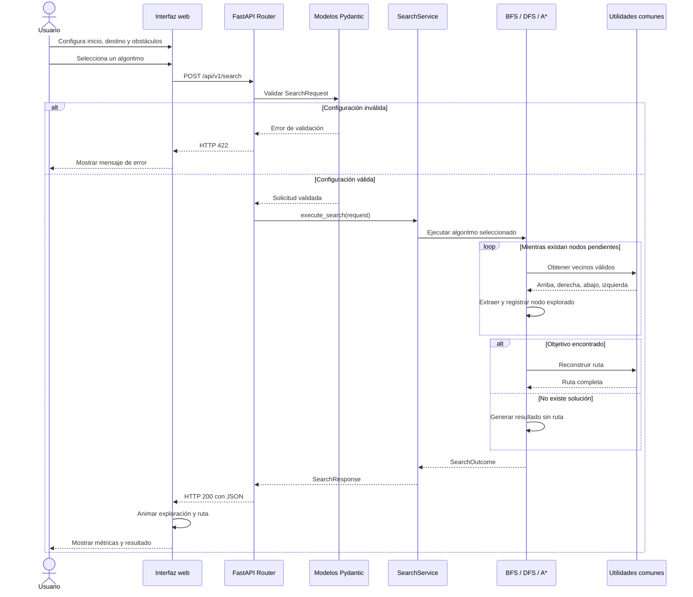

# Flujo de Ejecución de una Búsqueda

## Descripción

El siguiente diagrama representa el recorrido completo de una solicitud cuando el usuario ejecuta BFS, DFS o A*.



## Orden de expansión

Los algoritmos utilizan un orden determinista de vecinos:

1. Arriba.
2. Derecha.
3. Abajo.
4. Izquierda.

No se permiten movimientos diagonales.

## Criterio de nodo explorado

Un nodo se considera explorado cuando es extraído de la estructura de frontera para ser procesado:

- BFS: al retirarlo de la cola.
- DFS: al retirarlo de la pila.
- A*: al retirarlo de la cola de prioridad y aceptarlo como nodo no cerrado.

## Longitud de la ruta

La longitud se calcula como:

```text
longitud = cantidad de coordenadas de la ruta - 1
```

Ejemplo:

```text
(0, 0) → (0, 1) → (0, 2)
```

La ruta contiene tres coordenadas, pero representa dos movimientos.
