# Manual de Usuario de RoboMaze

Estudiante: Nelson Emanuel Cún Bálan

Carné: 201222010

---

## 1. Introducción

RoboMaze es una aplicación web que permite construir, editar y resolver laberintos bidimensionales mediante algoritmos de búsqueda.

La aplicación permite:

- Cargar escenarios predefinidos.
- Crear tableros con dimensiones personalizadas.
- Colocar obstáculos.
- Cambiar la posición inicial.
- Cambiar la posición objetivo.
- Ejecutar Breadth-First Search.
- Ejecutar Depth-First Search.
- Ejecutar A*.
- Comparar los tres algoritmos.
- Visualizar la exploración.
- Visualizar la ruta encontrada.
- Generar laberintos automáticamente.
- Guardar e importar laberintos en formato JSON.
- Descargar resultados en formato CSV.
- Descargar un reporte PDF.

Este manual explica el uso completo de la interfaz.

---

## 2. Requisitos para utilizar la aplicación

Antes de iniciar, verifique que el equipo tenga:

- Python 3 instalado.
- Las dependencias del proyecto instaladas.
- Un navegador web moderno.
- Acceso a la carpeta `Practica_4`.
- El entorno virtual del proyecto disponible.

---

## 3. Iniciar la aplicación

Abra una terminal y ubíquese dentro de `Practica_4`.

Active el entorno virtual:

```bash
source .venv/bin/activate
```

Inicie el servidor:

```bash
python -m uvicorn app.main:app \
  --host 127.0.0.1 \
  --port 8002 \
  --reload
```

Cuando el servidor esté activo, abra en el navegador:

```text
http://127.0.0.1:8002
```

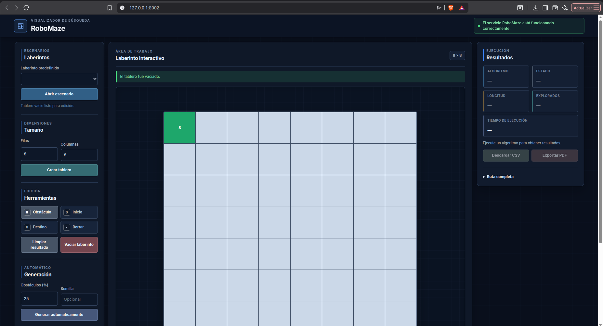

---

## 4. Distribución de la interfaz

La interfaz se divide en tres áreas principales.

### 4.1 Panel de configuración

Se encuentra en el lado izquierdo.

Contiene controles para:

- Seleccionar escenarios.
- Cambiar dimensiones.
- Seleccionar una herramienta.
- Limpiar resultados.
- Vaciar el laberinto.
- Generar laberintos.
- Guardar archivos JSON.
- Importar archivos JSON.
- Configurar la velocidad de animación.

### 4.2 Área del laberinto

Se encuentra en el centro.

Contiene:

- La cuadrícula.
- El estado actual de la aplicación.
- La leyenda de colores.
- Los botones de algoritmos.
- El botón de comparación.

### 4.3 Panel de resultados

Se encuentra en el lado derecho.

Muestra:

- Algoritmo ejecutado.
- Estado del resultado.
- Longitud de ruta.
- Nodos explorados.
- Tiempo de ejecución.
- Tabla comparativa.
- Gráficas.
- Ruta completa.
- Botones de exportación.

---

## 5. Interpretación de la cuadrícula

Cada celda representa una posición del laberinto.

### 5.1 Celda libre

Representa una posición por la que el robot puede desplazarse.

### 5.2 Obstáculo

Representa una celda bloqueada.

El robot no puede atravesarla.

### 5.3 Inicio

Representa la posición desde la que comienza la búsqueda.

Solo puede existir una posición inicial.

### 5.4 Destino

Representa la posición que debe alcanzar el algoritmo.

Solo puede existir un destino.

### 5.5 Nodo explorado

Representa una posición procesada durante la búsqueda.

### 5.6 Ruta

Representa las posiciones que forman la solución encontrada.

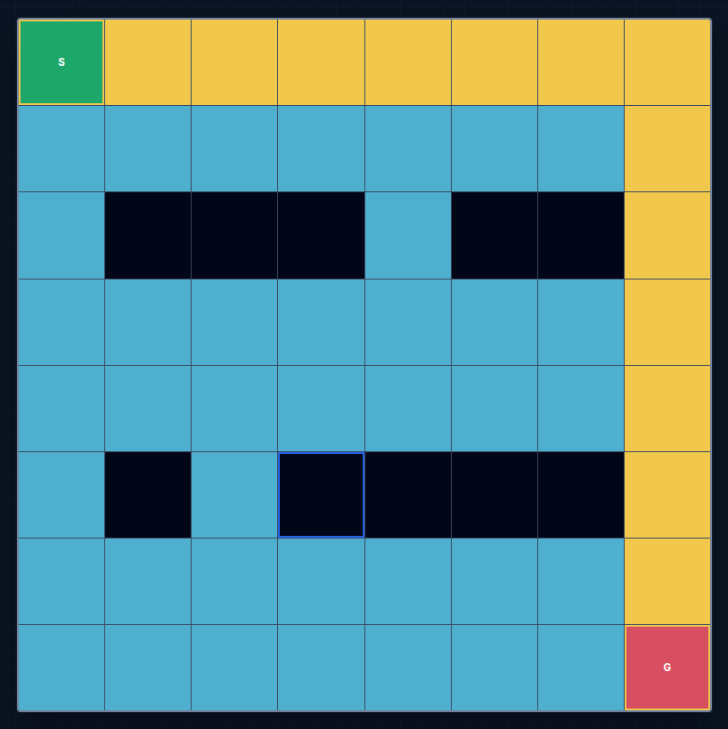

---

## 6. Comprobar el estado del backend

En la parte superior se muestra el estado del servicio.

Cuando el backend está disponible, el indicador muestra un estado activo.

Si el backend no está disponible:

1. Revise la terminal.
2. Confirme que Uvicorn continúa ejecutándose.
3. Verifique el puerto `8002`.
4. Recargue la página.

También puede consultar directamente:

```text
http://127.0.0.1:8002/api/v1/health
```

---

## 7. Cargar un escenario predefinido

RoboMaze incluye varios escenarios preparados.

Para abrir uno:

1. Ubique la sección de escenarios.
2. Abra la lista desplegable.
3. Seleccione un laberinto.
4. Presione **Abrir escenario**.
5. Espere a que la cuadrícula se actualice.

La descripción del escenario aparecerá debajo de la lista.

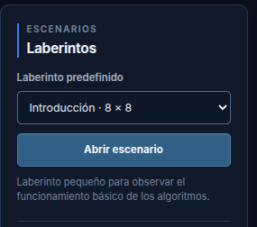

### Escenarios disponibles

| Escenario | Característica |
|---|---|
| Introducción | Laberinto básico |
| Desvío obligatorio | Obliga a rodear obstáculos |
| Corredores alternados | Contiene varios corredores |
| Múltiples rutas | Permite comparar recorridos |
| Exploración amplia | Utiliza una cuadrícula grande |
| Objetivo aislado | No contiene solución |

---

## 8. Crear un tablero personalizado

Para cambiar el tamaño:

1. Ingrese la cantidad de filas.
2. Ingrese la cantidad de columnas.
3. Presione **Crear tablero**.

La interfaz admite dimensiones entre 5 y 40.

Ejemplo:

```text
Filas: 12
Columnas: 16
```

Después de crear el tablero:

- Se reinicia la visualización.
- Se establece una posición inicial.
- Se establece un objetivo.
- Los obstáculos anteriores se eliminan.

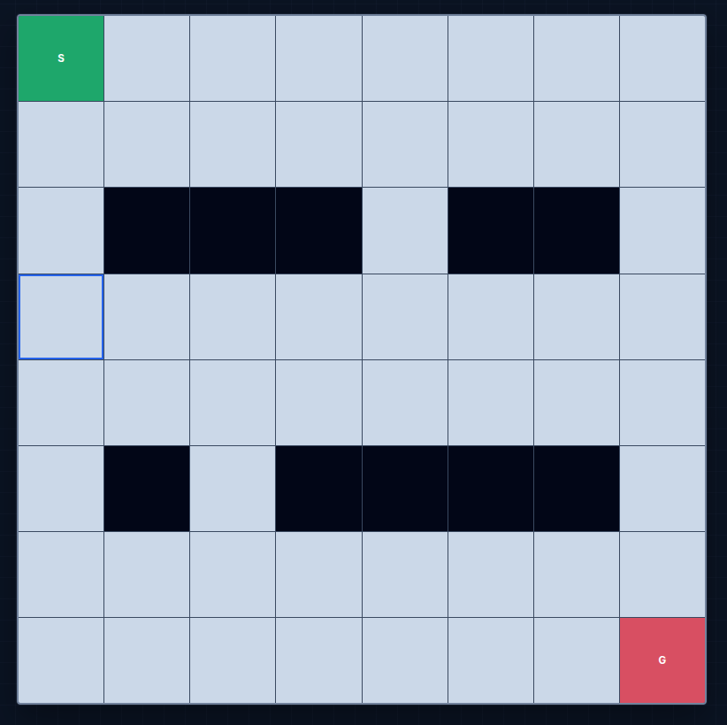

---

## 9. Herramientas de edición

Antes de editar una celda, seleccione una herramienta.

### 9.1 Obstáculo

Utilice esta herramienta para bloquear celdas.

Procedimiento:

1. Seleccione **Obstáculo**.
2. Presione una o varias celdas libres.
3. Confirme que cambien al estado de obstáculo.

No es posible colocar un obstáculo sobre el inicio o el destino.

### 9.2 Inicio

Utilice esta herramienta para mover la posición inicial.

Procedimiento:

1. Seleccione **Inicio**.
2. Presione una celda libre.
3. La posición inicial anterior será reemplazada.

### 9.3 Destino

Utilice esta herramienta para mover la meta.

Procedimiento:

1. Seleccione **Destino**.
2. Presione una celda libre.
3. El destino anterior será reemplazado.

### 9.4 Borrar

Utilice esta herramienta para liberar una celda.

Procedimiento:

1. Seleccione **Borrar**.
2. Presione una celda con obstáculo.
3. La celda quedará libre.

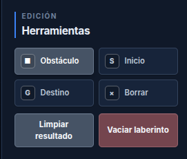

---

## 10. Limpiar el resultado

El botón **Limpiar resultado** elimina únicamente:

- Nodos explorados.
- Ruta.
- Métricas.
- Comparación.

El laberinto conserva:

- Dimensiones.
- Inicio.
- Destino.
- Obstáculos.

Utilice esta opción para ejecutar otro algoritmo sobre la misma configuración.

---

## 11. Vaciar el laberinto

El botón **Vaciar laberinto** elimina los obstáculos del tablero y reinicia la visualización.

Utilice esta opción cuando desee reconstruir el escenario manualmente.

Antes de vaciarlo, guarde el laberinto en JSON si desea conservarlo.

---

## 12. Velocidad de animación

La aplicación permite configurar la velocidad con la que se muestran los nodos explorados y la ruta.

Seleccione una opción de velocidad antes de ejecutar un algoritmo.

Una velocidad lenta permite observar con mayor detalle el comportamiento del algoritmo.

Una velocidad rápida permite obtener el resultado visual en menos tiempo.

---

## 13. Ejecutar Breadth-First Search

Breadth-First Search se identifica como BFS.

Para ejecutarlo:

1. Configure el laberinto.
2. Confirme que el inicio y el destino sean accesibles.
3. Seleccione una velocidad.
4. Presione **BFS**.
5. Espere a que finalice la animación.

La aplicación mostrará:

- Nodos explorados.
- Ruta.
- Longitud.
- Tiempo de ejecución.
- Mensaje final.

BFS busca por niveles y, en este tipo de laberinto, obtiene una ruta con la menor cantidad de movimientos.


---

## 14. Ejecutar Depth-First Search

Depth-First Search se identifica como DFS.

Para ejecutarlo:

1. Configure el laberinto.
2. Presione **Limpiar resultado** si existe una búsqueda anterior.
3. Presione **DFS**.
4. Espere a que termine.

DFS profundiza en una ruta antes de probar otras alternativas.

Puede encontrar una solución válida, pero no garantiza la ruta más corta.

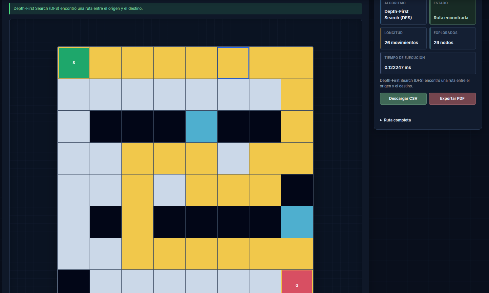

---

## 15. Ejecutar A*

Para ejecutar A*:

1. Configure el laberinto.
2. Presione **Limpiar resultado**.
3. Presione **A***.
4. Espere a que termine la animación.

A* utiliza la distancia Manhattan para orientar la búsqueda hacia el destino.

En muchos escenarios puede explorar menos nodos que BFS.

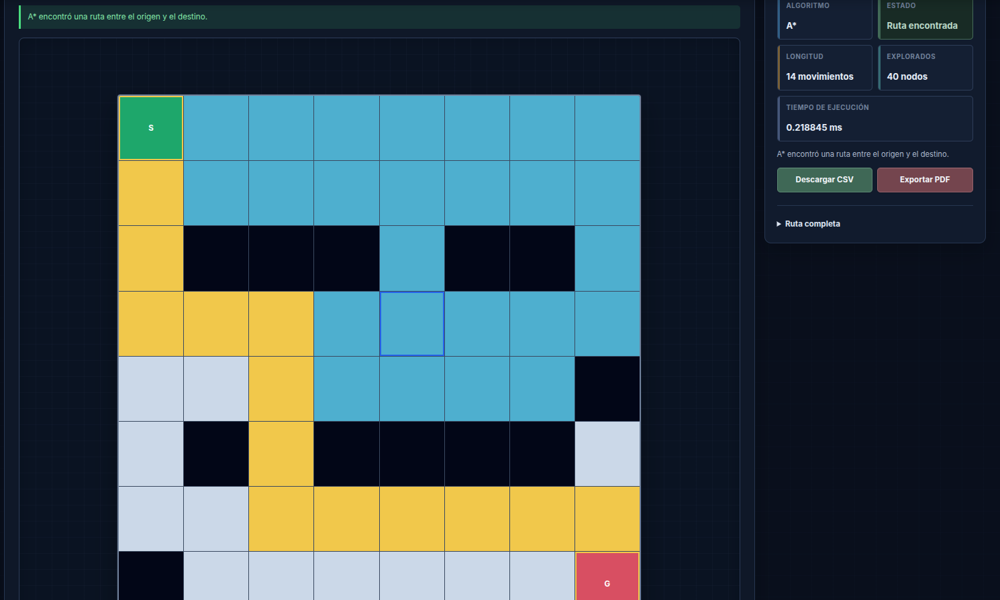

---

## 16. Comparar algoritmos

Para ejecutar la comparación:

1. Configure o cargue un laberinto.
2. Presione **Comparar**.
3. Espere a que finalice la operación.

La comparación ejecuta:

- BFS.
- DFS.
- A*.

Todos utilizan exactamente el mismo laberinto.

El panel derecho muestra:

- Longitud de ruta.
- Nodos explorados.
- Tiempo.
- Mejor valor de cada métrica.
- Gráficas comparativas.

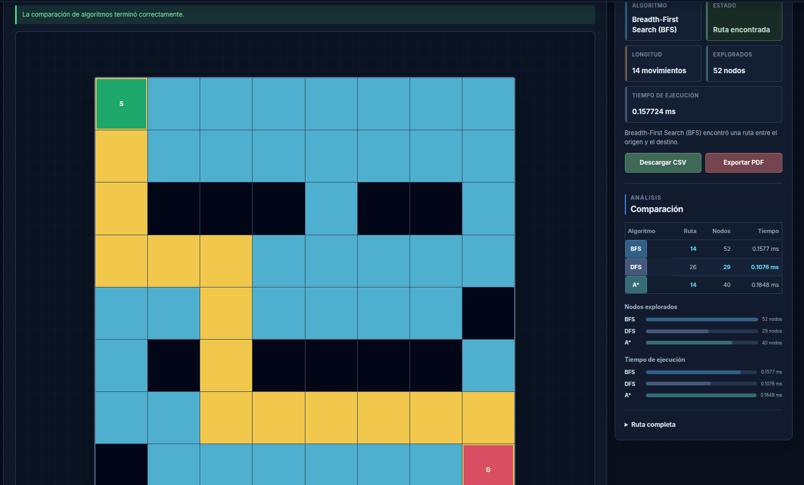

### Interpretación

#### Longitud

Indica la cantidad de movimientos de la ruta.

Un valor menor representa un recorrido más corto.

#### Nodos explorados

Indica cuántas posiciones fueron procesadas.

Un valor menor puede indicar una búsqueda más dirigida.

#### Tiempo

Indica el tiempo medido por el backend.

Puede variar entre ejecuciones debido al sistema operativo, carga del equipo y precisión del temporizador.

---

## 17. Ver la ruta completa

Después de una búsqueda exitosa, despliegue la sección de ruta completa.

Las coordenadas se presentan en el orden:

```text
(fila, columna)
```

La primera coordenada corresponde al inicio.

La última coordenada corresponde al destino.

Ejemplo:

```text
(0, 0) → (0, 1) → (1, 1)
```

---

## 18. Probar un laberinto sin solución

Para comprobar el manejo de errores:

1. Seleccione el escenario **Objetivo aislado**.
2. Presione **Abrir escenario**.
3. Ejecute BFS, DFS o A*.
4. Espere el resultado.

La aplicación deberá indicar:

```text
Sin solución
```

Además:

- La ruta quedará vacía.
- La longitud será cero.
- Se mantendrá el orden de exploración disponible.
- La interfaz no se bloqueará.

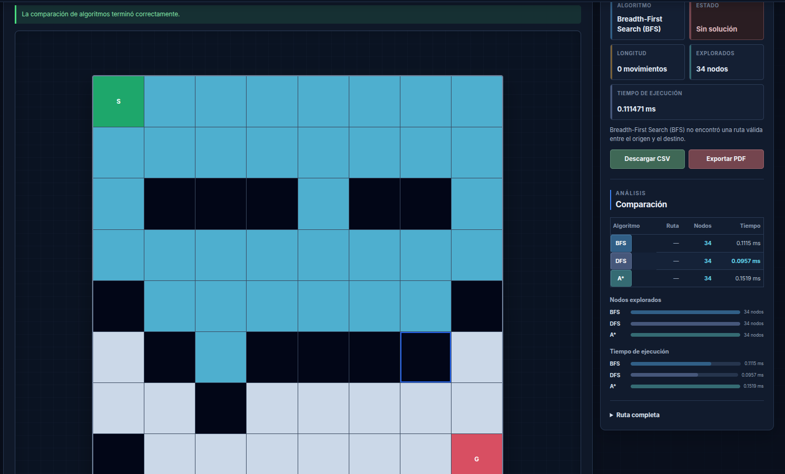

---

## 19. Generar un laberinto automáticamente

Para generar un laberinto:

1. Ingrese filas.
2. Ingrese columnas.
3. Seleccione la densidad de obstáculos.
4. Escriba una semilla opcional.
5. Presione **Generar automáticamente**.

Ejemplo recomendado:

```text
Filas: 15
Columnas: 20
Densidad: 25 %
Semilla: 2026
```

La aplicación genera un laberinto con una ruta garantizada.

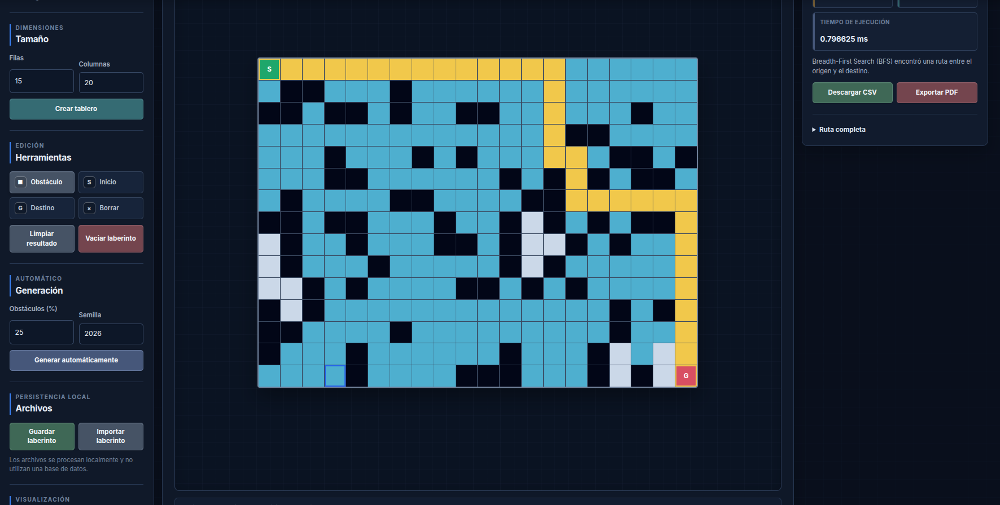

### Uso de la semilla

La semilla permite reproducir el mismo laberinto.

Al utilizar los mismos valores de:

- Filas.
- Columnas.
- Densidad.
- Semilla.

se obtiene la misma configuración.

---

## 20. Guardar un laberinto en JSON

Para guardar el laberinto actual:

1. Configure el tablero.
2. Presione **Guardar laberinto**.
3. Seleccione la carpeta de descarga si el navegador lo solicita.
4. Confirme que se genere un archivo `.json`.

El archivo contiene:

- Dimensiones.
- Inicio.
- Destino.
- Obstáculos.
- Versión del formato.
- Fecha de guardado.

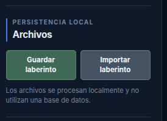

---

## 21. Importar un laberinto JSON

Para restaurar un archivo:

1. Presione **Importar laberinto**.
2. Seleccione un archivo JSON válido.
3. Confirme la selección.
4. Espere a que el tablero se actualice.

La aplicación valida:

- Dimensiones.
- Coordenadas.
- Inicio.
- Destino.
- Obstáculos.
- Duplicados.
- Límites.

Si el archivo es incorrecto, se mostrará un mensaje de error.

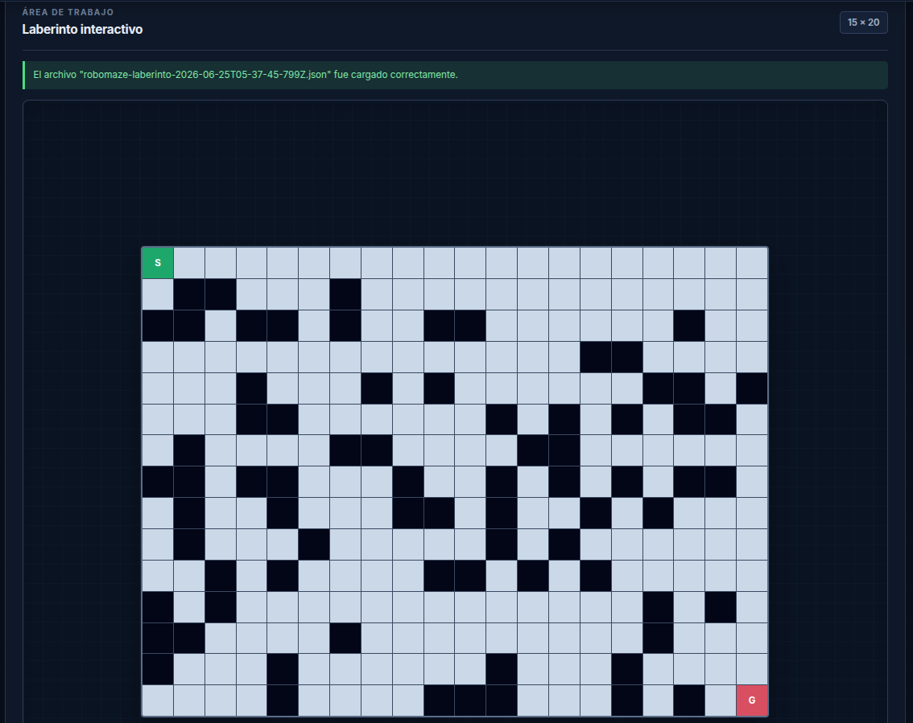

---

## 22. Descargar resultados CSV

La descarga CSV se habilita después de ejecutar una búsqueda o comparación.

Procedimiento:

1. Ejecute un algoritmo o una comparación.
2. Presione **Descargar CSV**.
3. Abra el archivo descargado.

El archivo contiene:

- Algoritmo.
- Estado.
- Longitud.
- Nodos explorados.
- Tiempo.
- Ruta completa.

Cuando se exporta una comparación, el archivo contiene una fila para cada algoritmo.

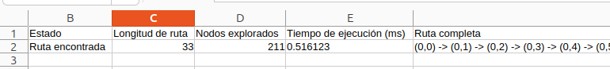

---

## 23. Descargar el reporte PDF

El PDF se genera en el backend.

Procedimiento:

1. Ejecute un algoritmo o una comparación.
2. Presione **Descargar PDF**.
3. Espere a que finalice la generación.
4. Abra el archivo descargado.

El reporte incluye:

- Configuración.
- Dimensiones.
- Inicio.
- Destino.
- Obstáculos.
- Resultado.
- Laberinto.
- Leyenda.
- Comparación.
- Ruta completa.
- Número de página.

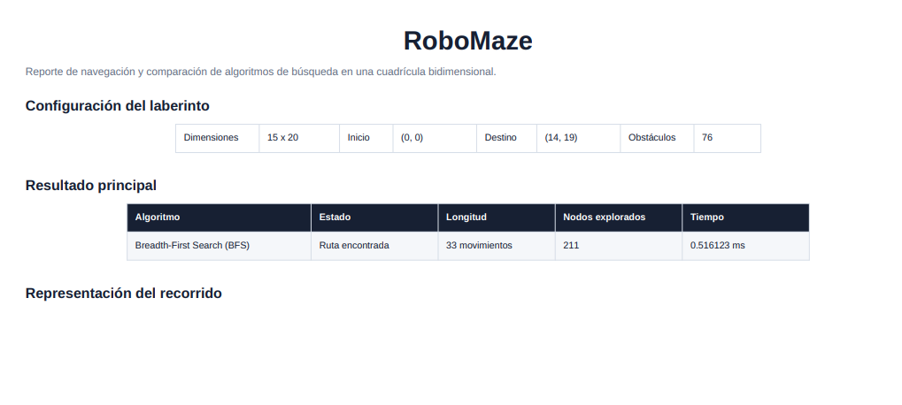

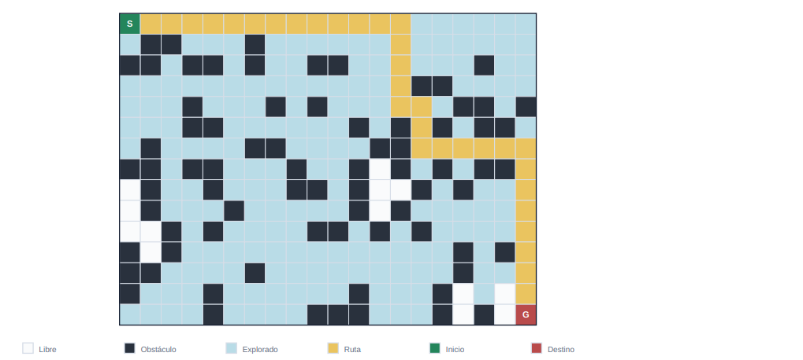

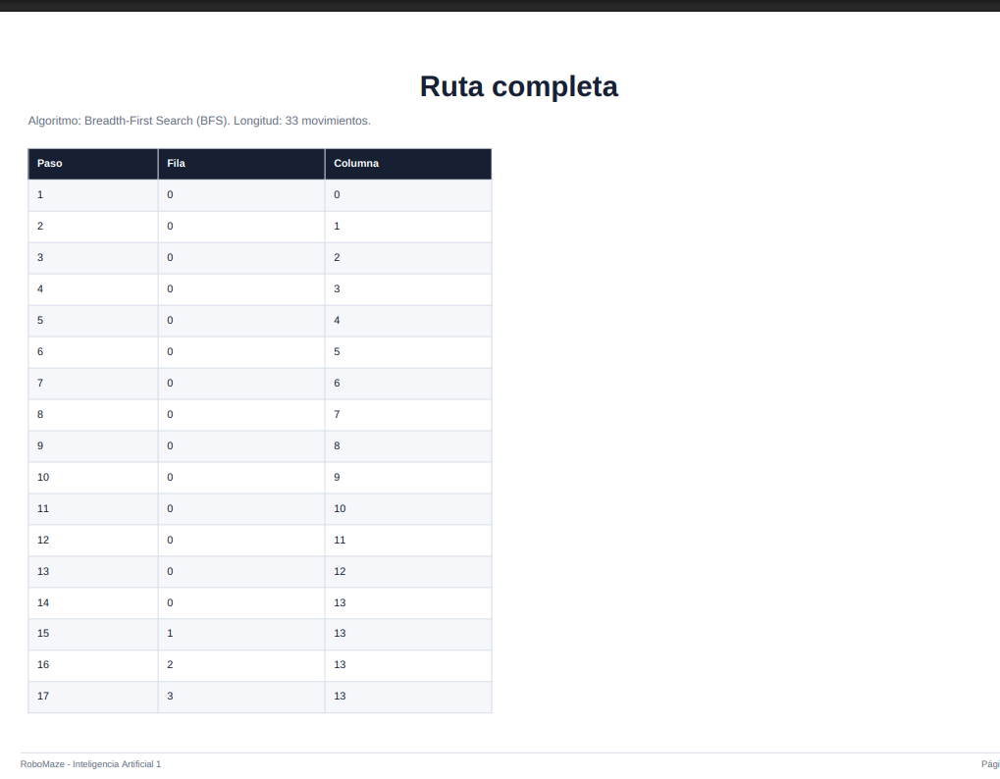

---

## 24. Mensajes frecuentes

### El backend no está disponible

Causa probable:

- Uvicorn no está ejecutándose.
- El puerto cambió.
- Ocurrió un error en la terminal.

Solución:

1. Revise la terminal.
2. Reinicie Uvicorn.
3. Abra nuevamente `http://127.0.0.1:8002`.

### El algoritmo indica que no existe solución

Causa probable:

- Los obstáculos separan completamente el inicio y el destino.

Solución:

- Elimine obstáculos.
- Cambie el inicio.
- Cambie el destino.
- Cargue otro escenario.

### No se puede colocar un obstáculo

Causa probable:

- La celda contiene el inicio o el destino.

Solución:

- Mueva primero el inicio o el destino.

### El archivo JSON no carga

Causa probable:

- El JSON tiene sintaxis inválida.
- Las coordenadas están fuera del tablero.
- Existen obstáculos repetidos.
- Un obstáculo ocupa el inicio o el destino.

Solución:

- Utilice un archivo generado por RoboMaze.
- Revise la estructura del archivo.

### El botón CSV o PDF está deshabilitado

Causa probable:

- Aún no se ejecutó una búsqueda.

Solución:

- Ejecute BFS, DFS, A* o una comparación.

### La animación tarda demasiado

Causa probable:

- La velocidad seleccionada es lenta.
- El tablero es grande.

Solución:

- Seleccione una velocidad mayor.
- Utilice un laberinto más pequeño.

---

## 25. Conclusiones
* El proyecto RoboMaze proporciona una plataforma interactiva para explorar y comparar algoritmos de búsqueda en laberintos bidimensionales, facilitando la comprensión de su funcionamiento y eficiencia.
* La interfaz de usuario es intuitiva y permite a los usuarios crear, editar y resolver laberintos de manera sencilla, lo que mejora la experiencia de aprendizaje.
* La implementación de algoritmos como BFS, DFS y A* permite a los usuarios observar las diferencias en la exploración y la eficiencia de cada algoritmo, destacando sus fortalezas y debilidades en distintos escenarios.
* La capacidad de generar laberintos automáticamente y guardar/importar configuraciones en formato JSON ofrece flexibilidad y conveniencia para los usuarios, permitiéndoles experimentar con diferentes configuraciones y escenarios.
* La funcionalidad de exportar resultados en formatos CSV y PDF proporciona una manera efectiva de documentar y analizar los resultados de las búsquedas, facilitando la comparación y el estudio de los algoritmos.
* La aplicación maneja adecuadamente los errores y situaciones sin solución, asegurando que los usuarios reciban retroalimentación clara y puedan tomar decisiones informadas sobre cómo modificar el laberinto o los parámetros de búsqueda.
* En general, RoboMaze es una herramienta educativa valiosa que combina teoría y práctica, permitiendo a los estudiantes y entusiastas de la inteligencia artificial explorar conceptos fundamentales de algoritmos de búsqueda de manera interactiva y visual, fomentando un aprendizaje más profundo y significativo.
