# Casos de prueba — Doctor Byte

## 1. Objetivo

Documentar los escenarios utilizados para validar la integración entre frontend, backend, Prolog, archivos operativos y Telegram.

## 2. Ambiente

- Sistema operativo: Ubuntu Linux.
- Backend: FastAPI en `http://127.0.0.1:8000`.
- Frontend: React en `http://localhost:5173`.
- Motor: SWI-Prolog.
- Telegram: Bot API mediante `requests`.
- Navegador: Chrome o equivalente.

## 3. Resumen

| Estado | Significado |
|---|---|
| Aprobado | El resultado observado coincide con el esperado |
| Pendiente de evidencia | Funcionalidad disponible; falta adjuntar captura final |

## 4. Casos ejecutados

### CP-01 — Carga dinámica de síntomas

- **Precondición:** backend activo.
- **Acción:** abrir la vista Diagnóstico.
- **Resultado esperado:** se muestran 18 síntomas agrupados por categoría.
- **Resultado obtenido:** 18 síntomas cargados desde Prolog.
- **Estado:** Aprobado.

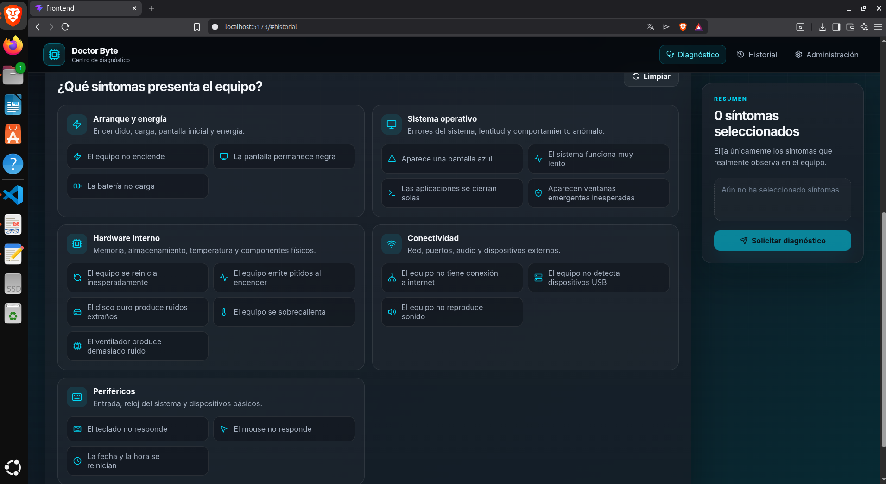

### CP-02 — Diagnóstico de memoria RAM

- **Entrada:** `pantalla_azul`, `reinicio_inesperado`, `pitidos_arranque`.
- **Resultado esperado:** falla de memoria RAM, 3 coincidencias y recomendación asociada.
- **Resultado obtenido:** coincide con lo esperado.
- **Estado:** Aprobado.

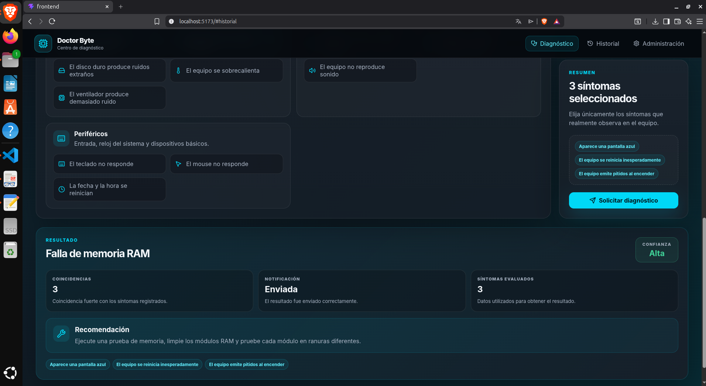

### CP-03 — Consulta directa en Prolog

- **Acción:** ejecutar `diagnostico_json/1` desde `swipl`.
- **Resultado esperado:** JSON válido con el diagnóstico.
- **Resultado obtenido:** JSON válido.
- **Estado:** Aprobado.

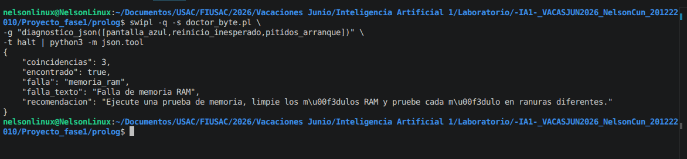

### CP-04 — Síntoma inexistente

- **Entrada:** `sintoma_inventado`.
- **Resultado esperado:** HTTP 422.
- **Resultado obtenido:** HTTP 422 con detalle de síntoma inexistente.
- **Estado:** Aprobado.

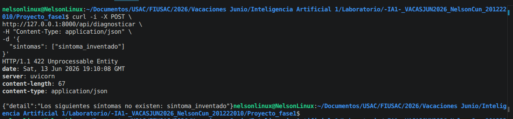

### CP-05 — Lista de síntomas vacía

- **Entrada:** `[]`.
- **Resultado esperado:** HTTP 422.
- **Resultado obtenido:** validación de longitud mínima.
- **Estado:** Aprobado.

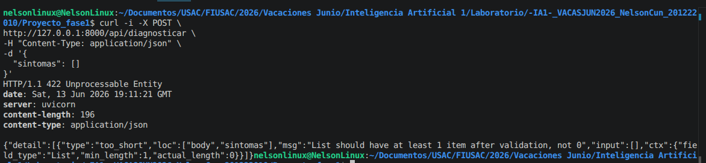

### CP-06 — Registro de historial desde web

- **Acción:** completar un diagnóstico desde React.
- **Resultado esperado:** el resultado se muestra y se agrega un registro.
- **Resultado obtenido:** registro persistido y visible.
- **Estado:** Aprobado.

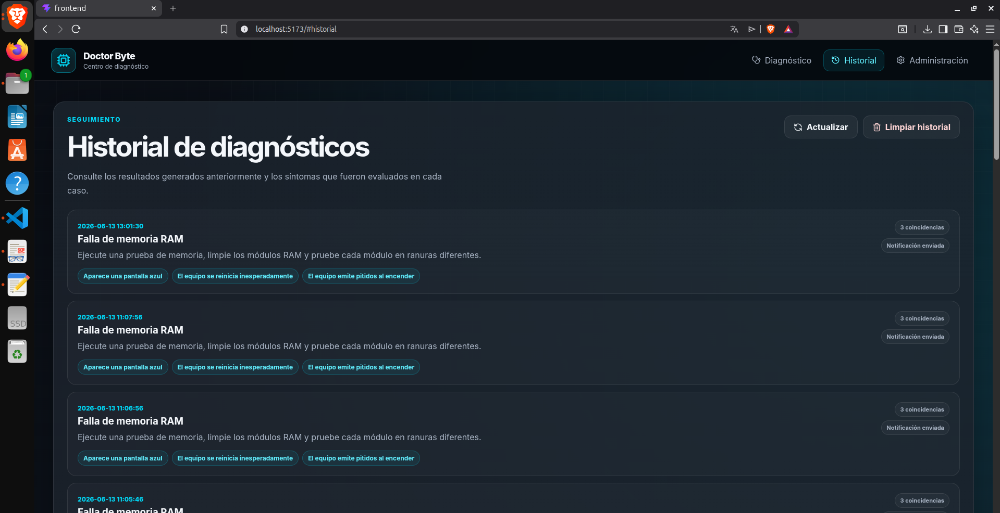

### CP-07 — Creación de síntoma

- **Entrada:** `prueba_temporal`.
- **Resultado esperado:** HTTP 201 y aparición en la lista.
- **Resultado obtenido:** recurso creado.
- **Estado:** Aprobado.

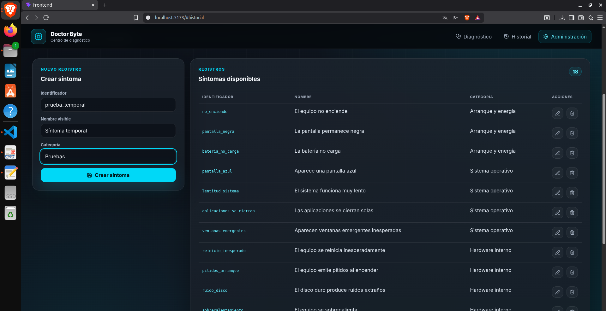

### CP-08 — Creación de falla

- **Entrada:** `falla_temporal`.
- **Resultado esperado:** HTTP 201.
- **Resultado obtenido:** recurso creado.
- **Estado:** Aprobado.

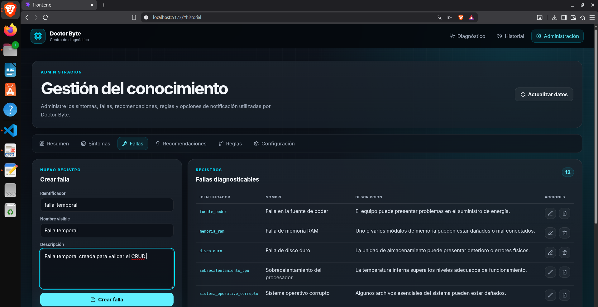

### CP-09 — Creación de recomendación

- **Entrada:** recomendación asociada a `falla_temporal`.
- **Resultado esperado:** HTTP 201.
- **Resultado obtenido:** recurso creado.
- **Estado:** Aprobado.

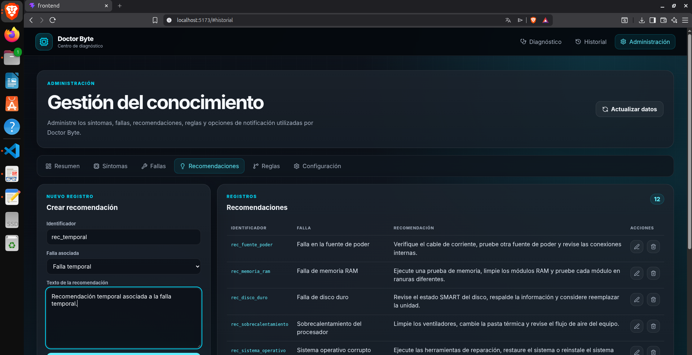

### CP-10 — Creación de regla

- **Entrada:** `regla_temporal`, falla temporal y síntoma temporal.
- **Resultado esperado:** HTTP 201.
- **Resultado obtenido:** regla creada y escrita en Prolog.
- **Estado:** Aprobado.

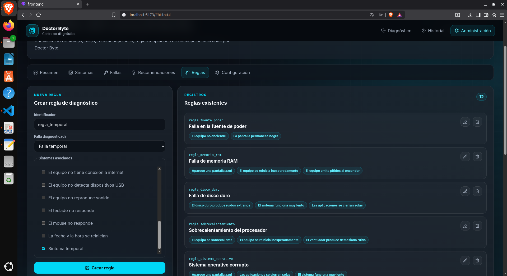

### CP-11 — Diagnóstico mediante conocimiento creado

- **Entrada:** `prueba_temporal`.
- **Resultado esperado:** `falla_temporal`.
- **Resultado obtenido:** diagnóstico dinámico generado por Prolog.
- **Estado:** Aprobado.

### CP-12 — Actualización de síntoma

- **Acción:** modificar nombre y categoría.
- **Resultado esperado:** lectura posterior con nuevos valores.
- **Resultado obtenido:** valores actualizados.
- **Estado:** Aprobado.

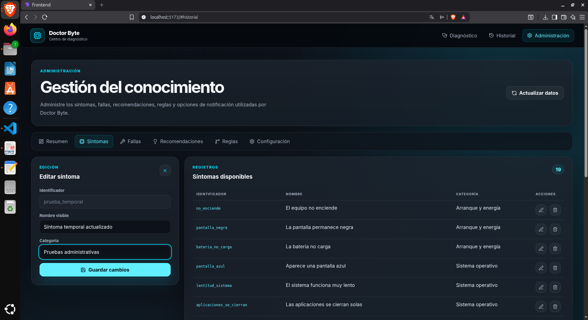

### CP-13 — Actualización de falla y recomendación

- **Acción:** modificar textos de ambos recursos.
- **Resultado esperado:** el diagnóstico posterior muestra los nuevos textos.
- **Resultado obtenido:** textos actualizados en el resultado.
- **Estado:** Aprobado.

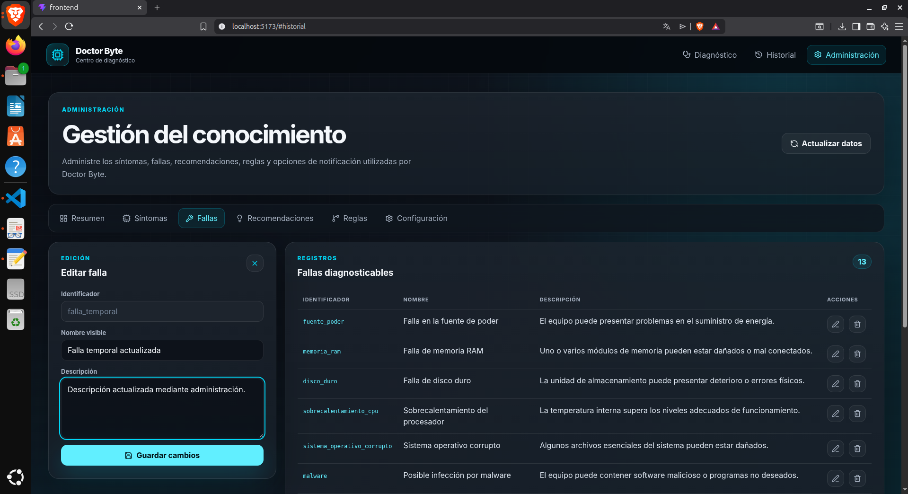
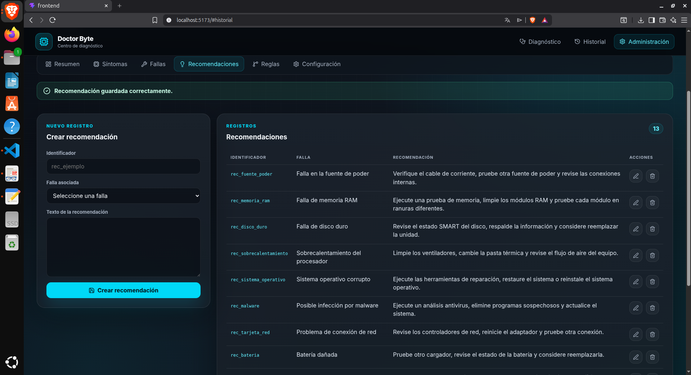

### CP-14 — Actualización de regla

- **Entrada nueva:** `prueba_temporal`, `pantalla_negra`.
- **Resultado esperado:** 2 coincidencias para la falla temporal.
- **Resultado obtenido:** 2 coincidencias.
- **Estado:** Aprobado.

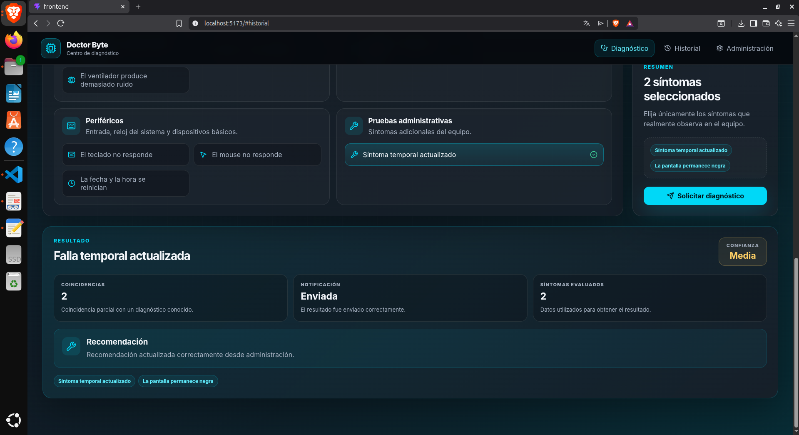

### CP-15 — Identificador duplicado

- **Acción:** crear nuevamente `prueba_temporal`.
- **Resultado esperado:** HTTP 409.
- **Resultado obtenido:** HTTP 409 Conflict.
- **Estado:** Aprobado.

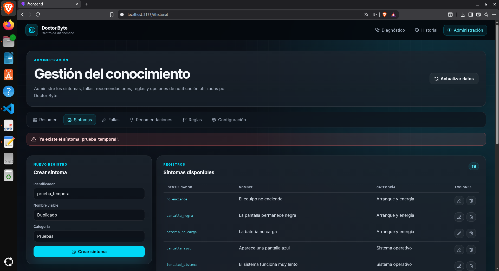

### CP-16 — Eliminar síntoma asociado

- **Acción:** eliminar el síntoma mientras una regla lo usa.
- **Resultado esperado:** HTTP 409.
- **Resultado obtenido:** conflicto con nombre de regla relacionada.
- **Estado:** Aprobado.

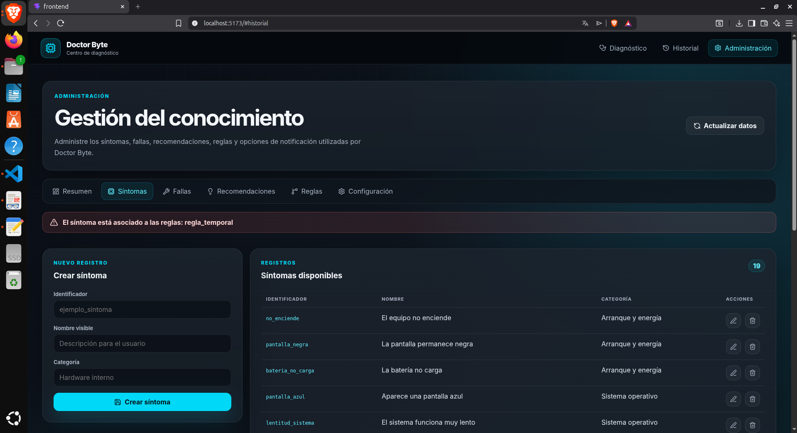

### CP-17 — Eliminar falla asociada

- **Acción:** eliminar falla con recomendación y regla.
- **Resultado esperado:** HTTP 409.
- **Resultado obtenido:** conflicto con asociaciones activas.
- **Estado:** Aprobado.

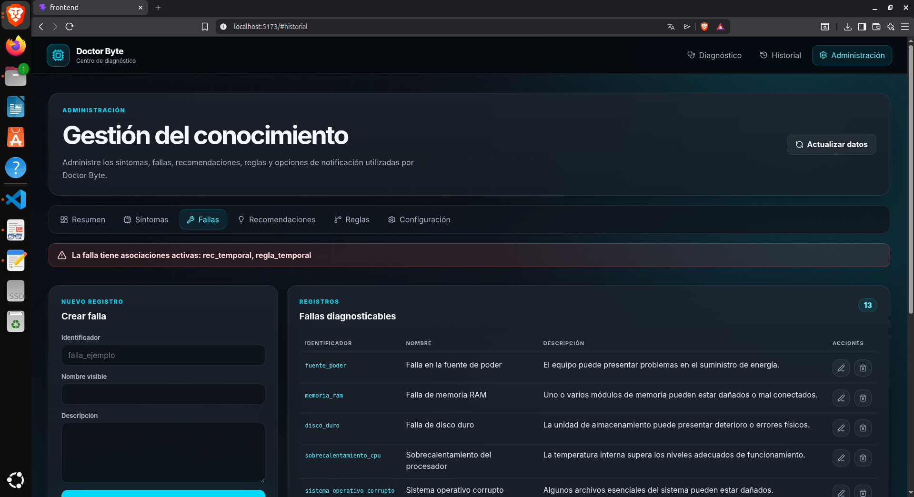

### CP-18 — Regla con síntoma inexistente

- **Entrada:** `sintoma_que_no_existe`.
- **Resultado esperado:** HTTP 404.
- **Resultado obtenido:** HTTP 404 Not Found.
- **Estado:** Aprobado.

### CP-19 — Eliminación ordenada

- **Acción:** eliminar regla, recomendación, falla y síntoma.
- **Resultado esperado:** eliminación exitosa de todos los temporales.
- **Resultado obtenido:** cuatro respuestas exitosas.
- **Estado:** Aprobado.

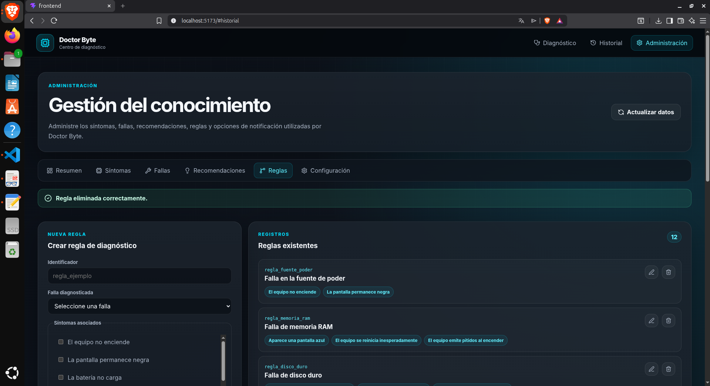
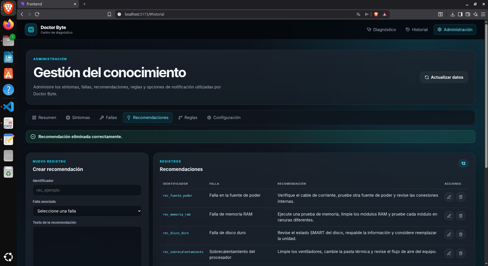
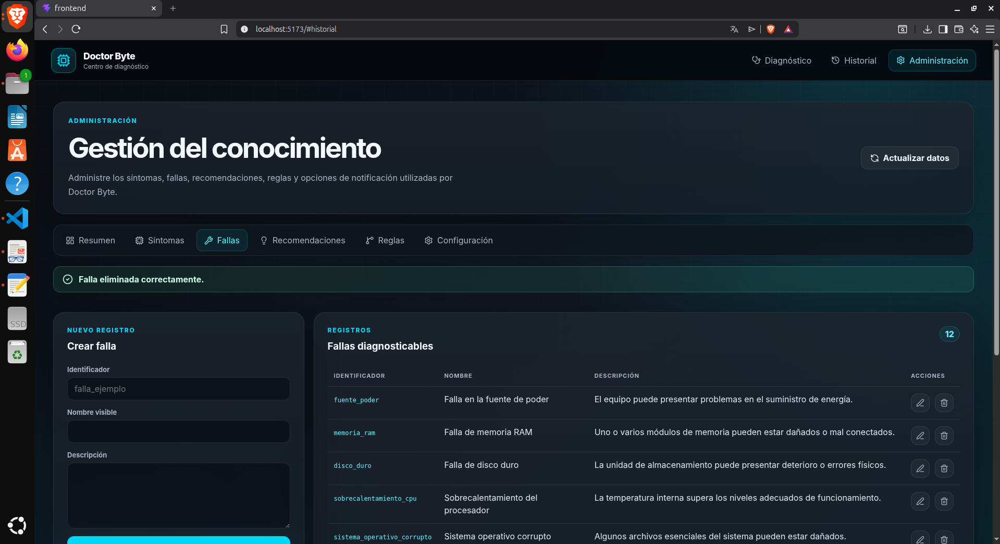
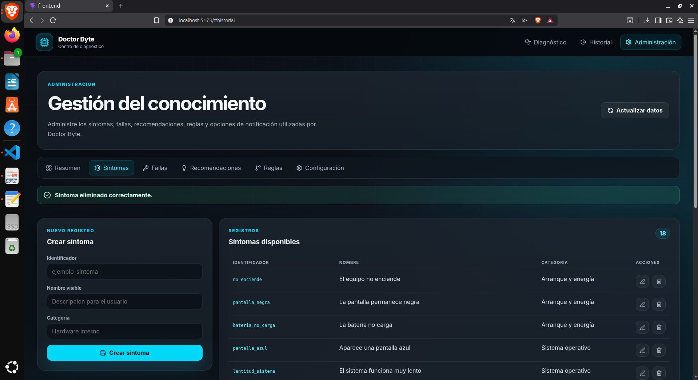

### CP-20 — Conservación de mínimos

- **Acción:** contar recursos después de las pruebas.
- **Resultado esperado:** 18 síntomas, 12 fallas, 12 recomendaciones y 12 reglas.
- **Resultado obtenido:** cantidades correctas y sin registros temporales.
- **Estado:** Aprobado.

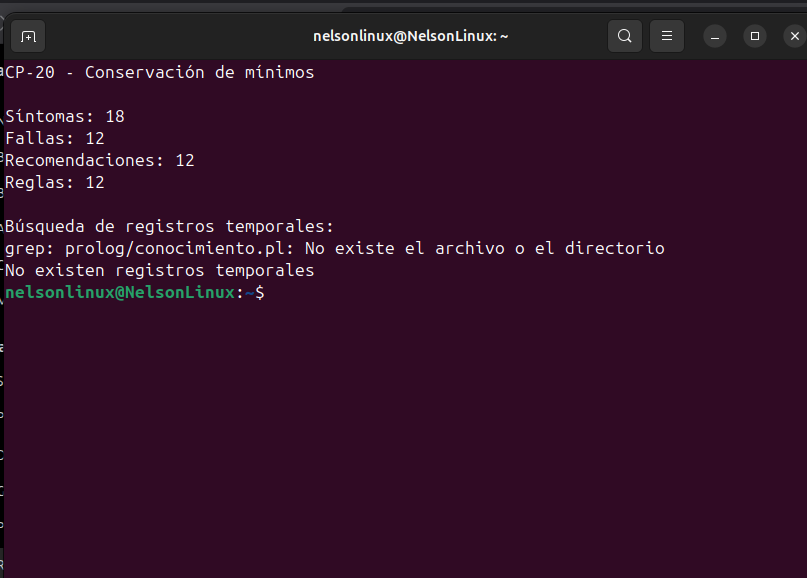

### CP-21 — Envío a Telegram desde web

- **Acción:** realizar diagnóstico con bot activo.
- **Resultado esperado:** mensaje con síntomas, falla y recomendación.
- **Resultado obtenido:** mensaje recibido.
- **Estado:** Aprobado.

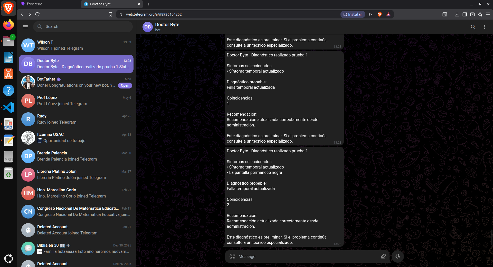

### CP-22 — Comando `/start`

- **Acción:** enviar `/start` al bot.
- **Resultado esperado:** bienvenida y comandos disponibles.
- **Resultado obtenido:** respuesta correcta.
- **Estado:** Aprobado.

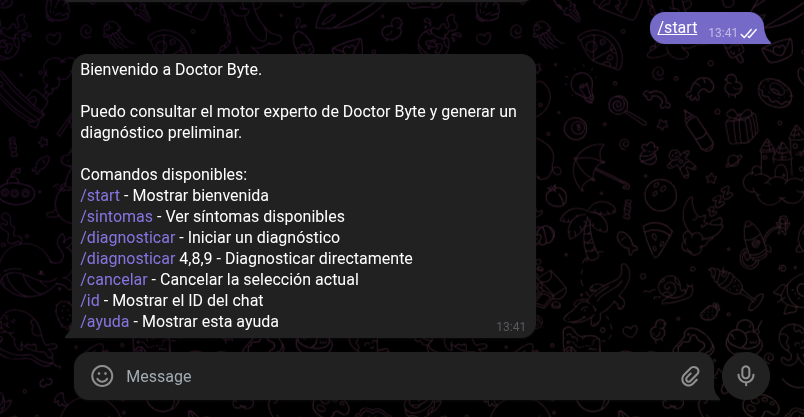

### CP-23 — Comando `/sintomas`

- **Acción:** enviar `/sintomas`.
- **Resultado esperado:** lista dinámica agrupada por categoría.
- **Resultado obtenido:** lista recibida.
- **Estado:** Aprobado.

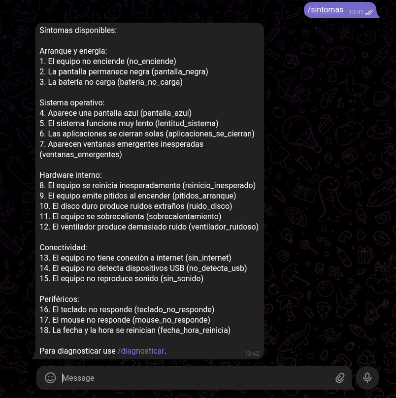

### CP-24 — Diagnóstico guiado desde Telegram

- **Acción:** enviar `/diagnosticar` y luego `4,8,9`.
- **Resultado esperado:** memoria RAM con 3 coincidencias.
- **Resultado obtenido:** diagnóstico correcto y guardado en historial.
- **Estado:** Aprobado.

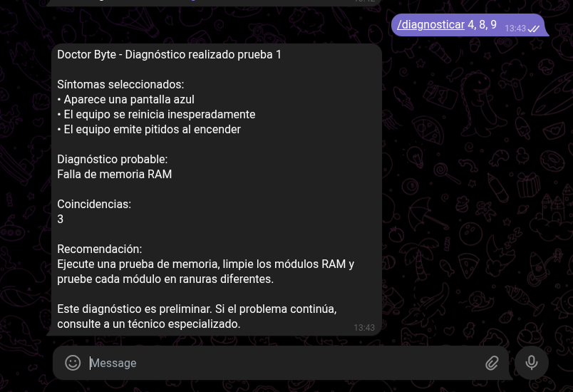

### CP-25 — Diagnóstico directo desde Telegram

- **Entrada:** `/diagnosticar pantalla_azul,reinicio_inesperado,pitidos_arranque`.
- **Resultado esperado:** memoria RAM.
- **Resultado obtenido:** respuesta correcta.
- **Estado:** Aprobado.

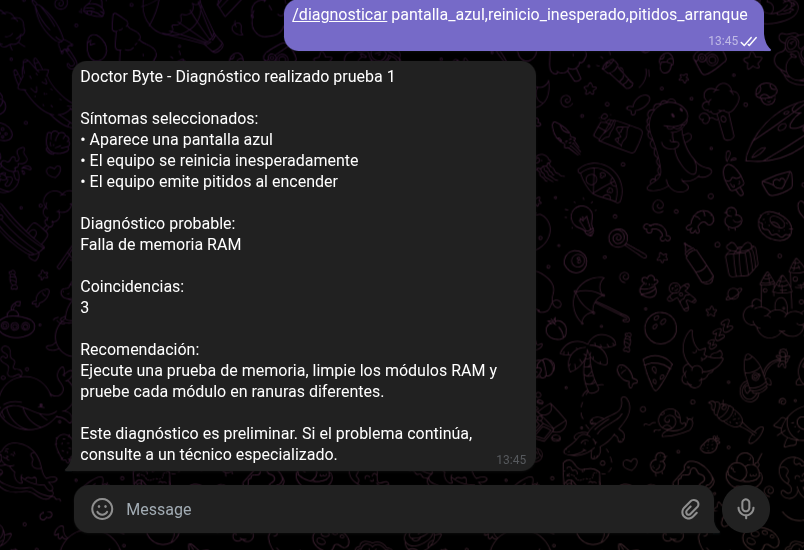

### CP-26 — Chat no autorizado

- **Precondición:** ID autorizado configurado.
- **Acción:** enviar un comando desde otro chat.
- **Resultado esperado:** mensaje de chat no autorizado.
- **Resultado obtenido:** respuesta de acceso denegado.

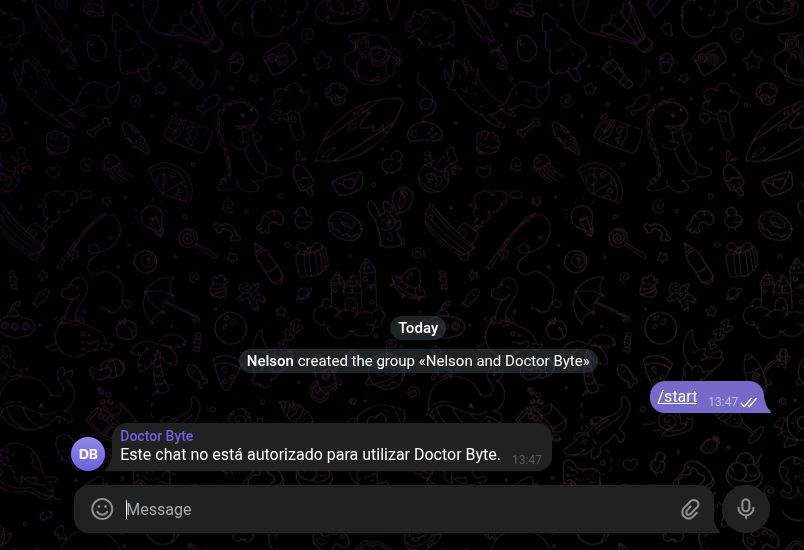

### CP-27 — Bot desactivado

- **Acción:** desactivar el bot desde administración y ejecutar diagnóstico web.
- **Resultado esperado:** diagnóstico funcional sin notificación.
- **Estado:** Pendiente de evidencia.

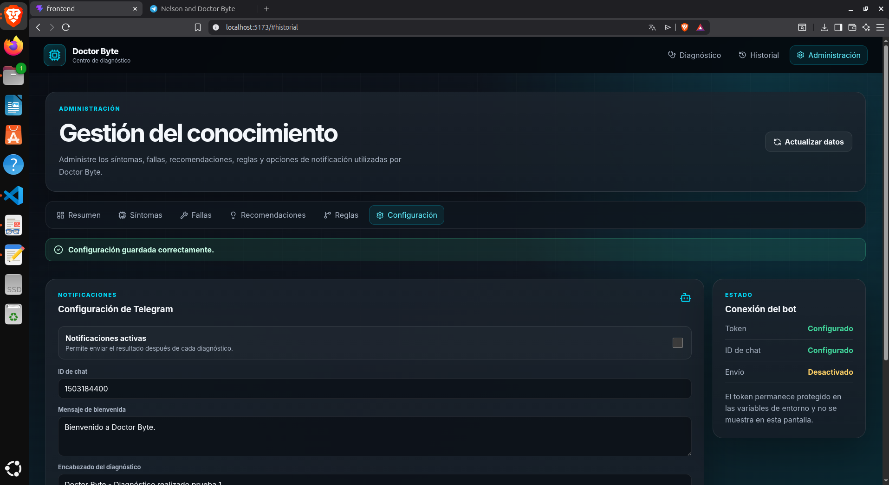
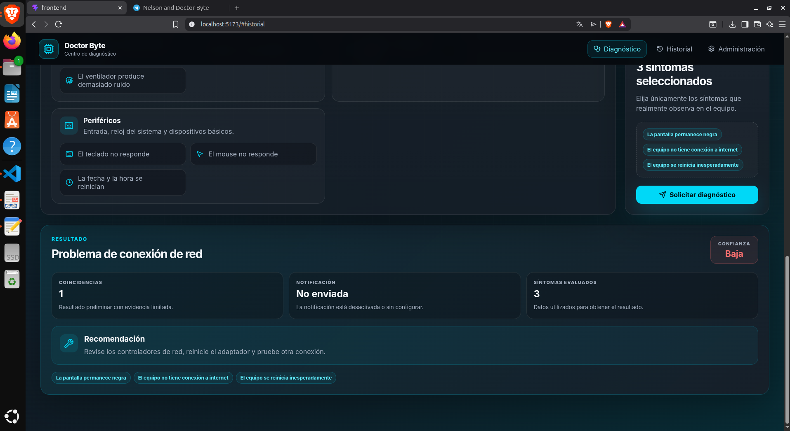
