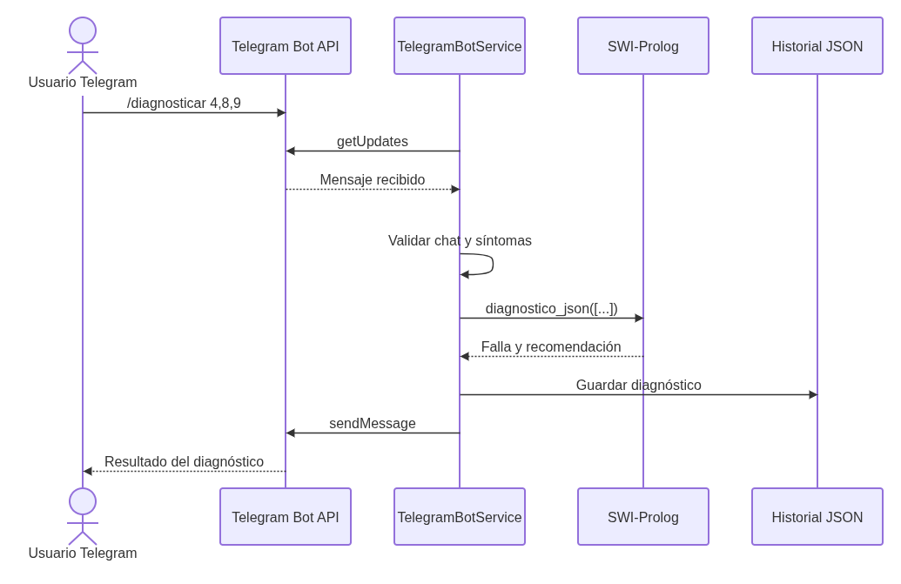

# Manual técnico — Doctor Byte


## 1. Introducción

Doctor Byte es un sistema experto que genera diagnósticos preliminares de fallas comunes en computadoras. La inferencia se realiza en SWI-Prolog a partir de síntomas seleccionados por el usuario. La solución integra una interfaz web, una API en Python, persistencia operativa en archivos JSON y comunicación bidireccional con Telegram.

El sistema no sustituye una revisión técnica profesional. Su propósito es demostrar el uso de lógica declarativa, hechos, reglas, unificación, listas, recursividad, consultas y cortes dentro de un sistema experto funcional.

## 2. Alcance implementado

La versión actual incluye:

- 18 síntomas.
- 12 fallas diagnosticables.
- 12 recomendaciones.
- 12 reglas de inferencia.
- Diagnóstico desde una interfaz web.
- Historial de diagnósticos.
- Administración de la base de conocimiento.
- Administración de reglas.
- Configuración operativa del bot.
- Envío de diagnósticos a Telegram.
- Recepción y procesamiento de comandos desde Telegram.

## 3. Objetivos
### 3.1 Objetivo general
Desarrollar un sistema experto de diagnóstico de fallas en computadoras utilizando SWI-Prolog, con una interfaz web en React y una API en FastAPI, que permita a los usuarios obtener diagnósticos preliminares basados en síntomas seleccionados, y que integre comunicación bidireccional con Telegram para consultas y notificaciones.

### 3.2 Objetivos específicos
1. Implementar una base de conocimiento en Prolog que contenga hechos sobre síntomas, fallas, recomendaciones y reglas de inferencia.
2. Desarrollar un motor de inferencia en Prolog que procese los síntomas seleccionados por el usuario y genere diagnósticos preliminares.
3. Crear una API REST en FastAPI que permita a la interfaz web interactuar con el motor de inferencia y gestionar el historial de diagnósticos.
4. Diseñar una interfaz web en React que permita a los usuarios seleccionar síntomas, visualizar diagnósticos y administrar la base de conocimiento.
5. Integrar un bot de Telegram que permita a los usuarios realizar consultas de diagnóstico y recibir notificaciones de resultados.
6. Implementar mecanismos de persistencia para el historial de diagnósticos y la configuración operativa del bot.

## 4. Arquitectura

La solución combina tres estilos:

1. **Cliente-servidor:** React consume la API FastAPI mediante HTTP y JSON.
2. **Arquitectura por capas:** rutas, modelos y servicios separan responsabilidades en el backend.
3. **Sistema experto basado en reglas:** Prolog mantiene el conocimiento y ejecuta la inferencia.


### 4.1 Componentes

| Componente | Responsabilidad |
|---|---|
| React + Vite | Interfaz de diagnóstico, historial y administración |
| Axios | Cliente HTTP del frontend |
| FastAPI | API REST, validación y coordinación |
| Pydantic | Validación de solicitudes y configuración |
| PrologService | Ejecuta consultas a SWI-Prolog |
| SWI-Prolog | Motor de inferencia |
| `conocimiento.pl` | Síntomas, fallas, recomendaciones y reglas |
| `doctor_byte.pl` | Algoritmo de inferencia y salidas JSON |
| HistorialService | Persistencia del historial |
| ConocimientoService | CRUD seguro sobre `conocimiento.pl` |
| ConfiguracionService | Persistencia de configuración operativa |
| TelegramService | Llamadas directas a Telegram Bot API |
| TelegramBotService | Long polling y procesamiento de comandos |

## 5. Flujo de diagnóstico web

1. React solicita `GET /api/sintomas`.
2. FastAPI llama a `obtener_sintomas_disponibles()`.
3. Python ejecuta SWI-Prolog mediante `subprocess`.
4. Prolog consulta `sintoma/3` y devuelve JSON.
5. El usuario selecciona síntomas.
6. React envía `POST /api/diagnosticar`.
7. Pydantic valida la lista.
8. Python valida que los identificadores existan.
9. Prolog evalúa las reglas y selecciona el diagnóstico con más coincidencias.
10. Python envía el resultado a Telegram cuando está habilitado.
11. El diagnóstico se guarda en `historial.json`.
12. FastAPI devuelve el resultado al frontend.


## 6. Flujo desde Telegram

1. FastAPI inicia un hilo de long polling durante su ciclo de vida.
2. El hilo llama directamente a `getUpdates` con `requests`.
3. Se identifica el comando recibido.
4. El chat se valida contra la configuración autorizada.
5. Para `/diagnosticar`, el bot interpreta números o identificadores.
6. Python consulta a Prolog usando el mismo servicio del frontend.
7. El resultado se guarda en el historial.
8. La respuesta se envía con `sendMessage`.



No se utiliza un SDK especializado de Telegram. La integración usa `requests`, `python-dotenv`, `getUpdates`, `getMe` y `sendMessage` directamente.

## 7. Modelo de conocimiento en Prolog

### 7.1 Hechos

```prolog
sintoma(Id, NombreVisible, Categoria).
falla(Id, NombreVisible, Descripcion).
recomendacion(Id, FallaId, Texto).
regla(Id, FallaId, ListaSintomas).
```

Ejemplo:

```prolog
sintoma(pantalla_azul, "Aparece una pantalla azul", "Sistema operativo").
falla(memoria_ram, "Falla de memoria RAM", "Uno o varios módulos...").
recomendacion(rec_memoria_ram, memoria_ram, "Ejecute una prueba...").
regla(regla_memoria_ram, memoria_ram,
      [pantalla_azul, reinicio_inesperado, pitidos_arranque]).
```

### 7.2 Uso de listas

Las reglas almacenan sus síntomas como listas. El motor recorre cada lista y cuenta cuántos elementos también están en la lista enviada por el usuario.

### 7.3 Recursividad

`contar_coincidencias/3` procesa la lista de síntomas de una regla. Posee un caso base para la lista vacía y dos casos recursivos: síntoma coincidente y síntoma no coincidente.

### 7.4 Predicados principales

- `coincide/2`: usa `member/2` para comprobar pertenencia.
- `contar_coincidencias/3`: calcula coincidencias.
- `diagnosticar/6`: genera candidatos con al menos una coincidencia.
- `mejor_diagnostico/5`: reúne candidatos, los ordena y selecciona el mejor.
- `diagnostico_json/1`: produce la salida consumida por Python.

### 7.5 Uso del corte

El corte en `mejor_diagnostico/5` evita retroceso después de seleccionar el resultado mejor ordenado. Con esto el backend obtiene un diagnóstico determinista por consulta.

### 7.6 Unificación y variables

Prolog unifica variables como `FallaId`, `FallaNombre`, `Recomendacion` y `Coincidencias` con los hechos que cumplen las reglas. Python no replica esa lógica; únicamente recibe el JSON final.

## 8. Comunicación Python–Prolog

`prolog_service.py` construye objetivos controlados y ejecuta:

```text
swipl -q -s prolog/doctor_byte.pl -g <objetivo> -t halt
```

La salida estándar debe contener JSON válido. El servicio controla:

- Ausencia de `swipl`.
- Tiempo de espera excedido.
- Código de salida distinto de cero.
- Respuesta vacía.
- JSON inválido.
- Identificadores con formato no permitido.

El patrón permitido para identificadores es:

```text
^[a-z][a-z0-9_]*$
```

Esto reduce el riesgo de inyección al construir listas de átomos para Prolog.

## 9. Backend por capas

### 9.1 Rutas

- `diagnostico_routes.py`: síntomas y diagnóstico.
- `historial_routes.py`: consulta y limpieza del historial.
- `admin_routes.py`: CRUD de conocimiento y configuración.

### 9.2 Modelos

- `schemas.py`: solicitudes y respuestas de diagnóstico.
- `admin_schemas.py`: validación de CRUD.
- `config_schemas.py`: configuración de Telegram.

### 9.3 Servicios

- `prolog_service.py`: integración con SWI-Prolog.
- `conocimiento_service.py`: serialización y persistencia de Prolog.
- `historial_service.py`: historial JSON.
- `configuracion_service.py`: configuración JSON.
- `telegram_service.py`: API HTTP de Telegram.
- `telegram_bot_service.py`: procesamiento de mensajes entrantes.

## 10. Persistencia

No se utiliza una base de datos adicional.

### 10.1 Conocimiento

Archivo:

```text
prolog/conocimiento.pl
```

El servicio administrativo lee los datos mediante Prolog y reescribe el archivo completo de forma controlada.

### 10.2 Historial

Archivo generado localmente:

```text
backend/app/data/historial.json
```

### 10.3 Configuración

Archivo generado localmente:

```text
backend/app/data/configuracion.json
```

### 10.4 Escritura atómica

Los servicios escriben primero a un archivo temporal, llaman a `fsync` y sustituyen el archivo final con `os.replace`. También usan bloqueos para evitar escrituras concurrentes dentro del proceso.

## 11. Reglas de integridad administrativa

- No se aceptan identificadores duplicados.
- Una recomendación debe referenciar una falla existente.
- Una regla debe referenciar una falla existente.
- Todos los síntomas de una regla deben existir.
- Una falla debe tener recomendación antes de utilizarse en una regla.
- No se elimina un síntoma usado por una regla.
- No se elimina una falla con recomendaciones o reglas activas.
- Se protegen los mínimos de 15 síntomas, 10 fallas, 10 recomendaciones y 10 reglas.

## 12. API REST

### 12.1 Diagnóstico e historial

| Método | Ruta | Respuesta exitosa |
|---|---|---:|
| GET | `/` | 200 |
| GET | `/api/sintomas` | 200 |
| POST | `/api/diagnosticar` | 200 |
| GET | `/api/historial` | 200 |
| DELETE | `/api/historial` | 200 |

### 12.2 Administración

| Recurso | GET | POST | PUT | DELETE |
|---|---|---|---|---|
| Síntomas | `/api/admin/sintomas` | `/api/admin/sintomas` | `/api/admin/sintomas/{id}` | `/api/admin/sintomas/{id}` |
| Fallas | `/api/admin/fallas` | `/api/admin/fallas` | `/api/admin/fallas/{id}` | `/api/admin/fallas/{id}` |
| Recomendaciones | `/api/admin/recomendaciones` | `/api/admin/recomendaciones` | `/api/admin/recomendaciones/{id}` | `/api/admin/recomendaciones/{id}` |
| Reglas | `/api/admin/reglas` | `/api/admin/reglas` | `/api/admin/reglas/{id}` | `/api/admin/reglas/{id}` |

Configuración:

| Método | Ruta |
|---|---|
| GET | `/api/admin/configuracion/telegram` |
| PUT | `/api/admin/configuracion/telegram` |

## 13. Códigos de estado y errores

| Código | Uso |
|---:|---|
| 200 | Consulta, actualización o eliminación exitosa |
| 201 | Creación exitosa |
| 404 | Recurso o asociación referenciada inexistente |
| 409 | Duplicado o conflicto de integridad |
| 422 | Entrada rechazada por validación |
| 500 | Error de persistencia local |
| 503 | SWI-Prolog no está disponible o falla la consulta |

## 14. Instalación técnica

### Backend

```bash
cd Proyecto_fase1/backend
python3 -m venv venv
source venv/bin/activate
pip install --upgrade pip
pip install -r requirements.txt
cp .env.example .env
```

Editar `.env`:

```dotenv
TELEGRAM_BOT_TOKEN=TOKEN_REAL
TELEGRAM_CHAT_ID=ID_REAL
TELEGRAM_POLLING_TIMEOUT=25
```

### Frontend

```bash
cd Proyecto_fase1/frontend
npm ci
```

## 15. Ejecución técnica

Terminal 1:

```bash
cd Proyecto_fase1/backend
source venv/bin/activate
uvicorn app.main:app
```

Terminal 2:

```bash
cd Proyecto_fase1/frontend
npm run dev
```

## 16. Pruebas directas

### Prolog

```bash
cd Proyecto_fase1
swipl -q -s prolog/doctor_byte.pl \
-g "listar_reglas_json" -t halt | python3 -m json.tool
```

```bash
swipl -q -s prolog/doctor_byte.pl \
-g "diagnostico_json([pantalla_azul,reinicio_inesperado,pitidos_arranque])" \
-t halt | python3 -m json.tool
```

### Backend

```bash
curl -s http://127.0.0.1:8000/api/sintomas | python3 -m json.tool
```

```bash
curl -s -X POST http://127.0.0.1:8000/api/diagnosticar \
-H "Content-Type: application/json" \
-d '{"sintomas":["pantalla_azul","reinicio_inesperado","pitidos_arranque"]}' \
| python3 -m json.tool
```

### Calidad estática

```bash
cd backend
source venv/bin/activate
python3 -m compileall app
```

```bash
cd frontend
npm run lint
npm run build
```

## 17. Telegram

La integración consume directamente:

```text
https://api.telegram.org/bot<TOKEN>/getMe
https://api.telegram.org/bot<TOKEN>/getUpdates
https://api.telegram.org/bot<TOKEN>/sendMessage
```

Comandos:

```text
/start
/sintomas
/diagnosticar
/diagnosticar 4,8,9
/cancelar
/id
/ayuda
```

El listener se inicia con FastAPI mediante `lifespan`. Para evitar múltiples consumidores de `getUpdates`, la demostración debe ejecutarse con una sola instancia del backend.

## 18. Seguridad

- Token e ID inicial mediante variables de entorno.
- `.env` excluido de Git.
- Token no expuesto al frontend.
- Identificadores validados antes de formar consultas.
- Chat autorizado configurable.
- Escrituras locales atómicas.
- Respuestas de error controladas.

## 19. Limitaciones

- El diagnóstico se basa en coincidencias, no en probabilidades o estadísticas.
- Cuando existe empate, el orden total de los términos de Prolog determina un resultado único.
- El historial y la configuración son locales a la instancia en ejecución.
- El listener de Telegram está diseñado para una sola instancia del backend.
- Las recomendaciones son preliminares.

## 20. Mantenimiento

Para agregar conocimiento desde código debe respetarse el formato de `conocimiento.pl`. Para operación normal se recomienda usar la vista administrativa, ya que valida dependencias y mínimos antes de escribir.

Después de modificar dependencias:

```bash
pip freeze > requirements.txt
```

o, para frontend:

```bash
npm install
npm ci
npm run build
```

## 21. Conclusiones
1. Se implementó una base de conocimiento en Prolog con hechos para síntomas, fallas, recomendaciones y reglas de inferencia, permitiendo una estructura clara y lógica para el sistema experto.
2. Se desarrolló un motor de inferencia en Prolog que procesa los síntomas seleccionados por el usuario y genera diagnósticos preliminares, utilizando un algoritmo de coincidencias para identificar la falla más probable.
3. Se creó una API REST en FastAPI que permite a la interfaz web interactuar con el motor de inferencia y gestionar el historial de diagnósticos, facilitando la comunicación entre el frontend y el backend.
4. Se diseñó una interfaz web en React que permite a los usuarios seleccionar síntomas, visualizar diagnósticos y administrar la base de conocimiento, proporcionando una experiencia de usuario intuitiva y funcional.
5. Se integró un bot de Telegram que permite a los usuarios realizar consultas de diagnóstico y recibir notificaciones de resultados, ampliando las formas de interacción con el sistema experto.
6. Se implementaron mecanismos de persistencia para el historial de diagnósticos y la configuración operativa del bot, asegurando que los datos importantes se mantengan entre sesiones y que la configuración del bot sea fácilmente modificable.