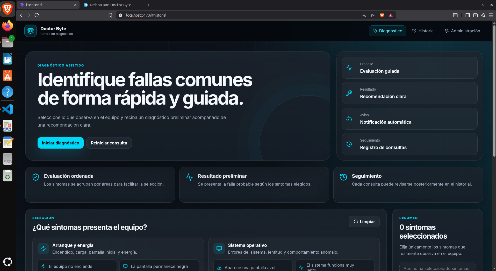

# Manual de usuario — Doctor Byte

## 1. Objetivo

Doctor Byte permite seleccionar síntomas de una computadora y obtener una falla probable con una recomendación preliminar. También cuenta con historial, administración del conocimiento y uso mediante Telegram.

## 2. Inicio del sistema

Antes de abrir la interfaz deben estar ejecutándose el backend y el frontend.

### Backend

```bash
cd Proyecto_fase1/backend
source venv/bin/activate
uvicorn app.main:app
```

### Frontend

```bash
cd Proyecto_fase1/frontend
npm run dev
```

Abrir en el navegador:

```text
http://localhost:5173
```

## 3. Navegación

La barra superior contiene tres vistas:

- **Diagnóstico:** selección de síntomas y generación de resultados.
- **Historial:** registros anteriores.
- **Administración:** mantenimiento del conocimiento y del bot.



## 4. Realizar un diagnóstico

1. Ingresar a **Diagnóstico**.
2. Revisar las categorías de síntomas.
3. Marcar uno o varios síntomas que describan el problema.
4. Confirmar la lista de síntomas seleccionados.
5. Presionar el botón de diagnóstico.
6. Esperar la respuesta del servidor.
7. Revisar:
   - falla probable;
   - cantidad de coincidencias;
   - recomendación;
   - estado del envío a Telegram.

Ejemplo para memoria RAM:

- Aparece una pantalla azul.
- El equipo se reinicia inesperadamente.
- El equipo emite pitidos al encender.

Resultado esperado:

```text
Falla de memoria RAM
3 coincidencias
```


## 5. Reiniciar la consulta

Use la opción de reinicio o limpieza de selección para retirar los síntomas y comenzar otra consulta. El resultado anterior no se elimina del historial.

## 6. Consultar el historial

1. Ir a **Historial**.
2. Revisar los registros ordenados del más reciente al más antiguo.
3. Cada registro muestra fecha, síntomas, falla, recomendación, coincidencias y estado de Telegram.
4. Use la opción de recarga para consultar registros generados desde Telegram.
5. Use **Limpiar historial** únicamente cuando desee eliminar todos los registros locales.


La limpieza del historial no modifica la base de conocimiento.

## 7. Administración

La vista **Administración** contiene:

- Resumen.
- Síntomas.
- Fallas.
- Recomendaciones.
- Reglas.
- Configuración.

### 7.1 Síntomas

Para crear un síntoma:

1. Abrir **Síntomas**.
2. Escribir un identificador en minúsculas, por ejemplo `pantalla_parpadea`.
3. Escribir el nombre visible.
4. Escribir la categoría.
5. Guardar.


El identificador no puede cambiarse después de crear el registro. El nombre y la categoría sí pueden editarse.

Un síntoma usado por una regla no puede eliminarse hasta retirar esa asociación.

### 7.2 Fallas

Cada falla requiere:

- identificador;
- nombre visible;
- descripción.


Una falla con recomendaciones o reglas asociadas no puede eliminarse directamente.

### 7.3 Recomendaciones

Cada recomendación se vincula con una falla. Antes de crearla, la falla debe existir. El sistema evita asociar más de una recomendación activa a la misma falla.


### 7.4 Reglas

Una regla une:

- una falla;
- uno o varios síntomas.

Antes de crearla deben existir la falla, su recomendación y todos los síntomas seleccionados.


Los cambios de una regla afectan inmediatamente los siguientes diagnósticos, porque el archivo Prolog se actualiza.

### 7.5 Orden correcto para eliminar un conjunto

Cuando una falla fue creada con todos sus elementos, elimine en este orden:

1. Regla.
2. Recomendación.
3. Falla.
4. Síntoma que ya no se utilice.

## 8. Configuración de Telegram

En **Administración → Configuración** puede:

- activar o desactivar el bot;
- cambiar el ID de chat autorizado;
- modificar el mensaje de bienvenida;
- modificar el encabezado del diagnóstico;
- modificar el mensaje de despedida.


El token no se administra desde la interfaz y permanece protegido en `backend/.env`.

Para obtener el ID del chat, escriba al bot:

```text
/id
```

## 9. Uso desde Telegram

### Comandos

```text
/start
/sintomas
/diagnosticar
/diagnosticar 4,8,9
/cancelar
/id
/ayuda
```


### Diagnóstico guiado

1. Enviar `/diagnosticar`.
2. El bot mostrará la lista.
3. Responder con números separados por comas, por ejemplo:

```text
4, 8, 9
```

### Diagnóstico directo

```text
/diagnosticar 4,8,9
```


También se aceptan identificadores:

```text
/diagnosticar pantalla_azul,reinicio_inesperado,pitidos_arranque
```


Los diagnósticos realizados por Telegram también se guardan en el historial web.

## 10. Mensajes de error comunes

### No se pudo cargar la información

Verifique que FastAPI esté ejecutándose en el puerto 8000.

### El motor de diagnóstico no está disponible

Verifique:

```bash
swipl --version
```

También revise la terminal del backend.

### No se recibió respuesta del servidor

Compruebe la dirección de `VITE_API_URL` y el estado del backend.

### Síntoma inexistente

Actualice la interfaz o seleccione solamente elementos cargados desde el sistema.

### Conflicto al eliminar

El recurso tiene asociaciones. Retire primero las reglas o recomendaciones relacionadas.

### Telegram no enviado

Revise:

- que el bot esté activo;
- que el token sea correcto;
- que el ID de chat sea correcto;
- que exista conexión a Internet.

## 11. Recomendación de uso

Los resultados son preliminares. Antes de reemplazar componentes o realizar reparaciones internas, se recomienda respaldar la información y consultar a un técnico cuando el problema continúe.